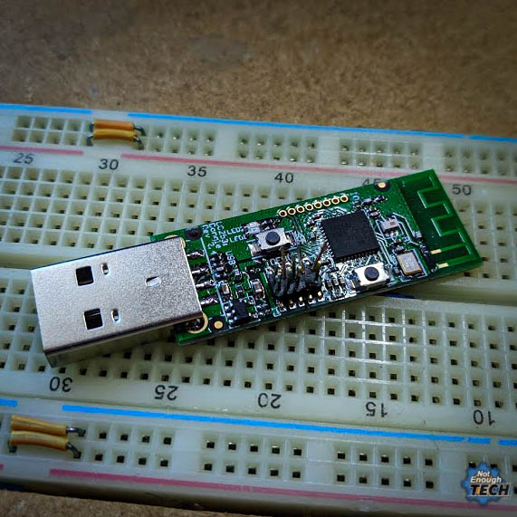

# CC2531 Zigbee Device

Product Page : <https://www.ti.com/product/CC2531>

Datasheet : <https://www.ti.com/lit/gpn/cc2531>

> Zigbee and IEEE 802.15.4 wireless MCU with up to 256kB Flash and 8kB RAM

## Programming CC2531 Zigbee Using Raspberry Pi

USB Zigbee stick CC2531

Video : <https://www.youtube.com/watch?v=RguRQUXWLCY>

- Process <https://notenoughtech.com/home-automation/flashing-cc2531-without-cc-debugger/>

- Wiring Pi Package: <https://wiringpi.com/download-and-install/>

- Repository for Tool <https://github.com/jmichault/flash_cc2531>

### Debugger Connection

| Raspberry Pi | CC2531 |
| ------------ | ------ |
| GND          | GDN    |
| Pin 38       | DD     |
| Pin 36       | DC     |
| Pin 35       | RST    |

### Artefact

- **[Repository of Flash_cc2531](./CC2531-Zigbee/flash_cc2531-master.zip)**

- **[PDF Article on the Process](./CC2531-Zigbee/Flashing%20CC2531%20without%20CC%20Debugger.pdf)**

----
<!-- Footer Begins Here -->
## Links

- [Back to IDEs, PCB, ECAD and Programming Tools Hub](../TOOLS/README.md)
- [Back to 8051 Hub](./README.md)
- [Back to Hardware Hub](../README.md)
- [Back to Root Document](../../README.md)
