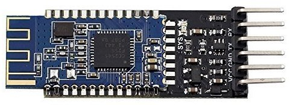

# CC2541 Bluetooth Chipset

Product Page : <https://www.ti.com/product/CC2541>

Datasheet : <https://www.ti.com/lit/gpn/cc2541>

> Bluetooth Low Energy and proprietary wireless MCU

## Programming CC2541 (HM-10) Using Arduino

We are going to Program the **CC2541** with new custom firmware. Typically this can be found on the **HM-10** Module.

This Requires the **CCLoader** but there is an Alternative now:

<https://github.com/RedBearLab/CCLoader>

### Repository

<https://github.com/RedBearLab/CCLoader>

[Archive - CCLoader-master-2ad8a4f.zip](./CC2541-Bluetooth/CCLoader-master-2ad8a4f.zip)

### Original Forum Post for Programming

<https://forum.arduino.cc/index.php?topic=393655.msg2709528#msg2709528>

## HM-10 Datasheet

[HM-10 Datasheet](./CC2541-Bluetooth/bluetooth40_en-HM-10-Datasheet.pdf)

**2020-06**
[Firmware HMSoft-10-2541-V709.zip](./CC2541-Bluetooth/HMSoft-10-2541-V709.zip)

## HM-10 Firmware

<http://www.jnhuamao.cn/download_rom_en.asp?id=66#>

## Video Firmware Loading Process

<https://www.youtube.com/watch?v=ez3491-v8Og>

## Alternative Modules

> HM-10 Exact - ₹490/-
> <https://robu.in/product/hm-10-ble-bluetooth-4-0-cc2541-wireless-module/>

> AT-09 Clone - ₹249/-
> <https://robu.in/product/at-09-bluetooth-4-0-uart-transceiver-module-cc2541-compatible-with-hm-10/>

## How to Use HM-10

<https://www.youtube.com/watch?v=itGgUTPLkz8>

<https://www.youtube.com/watch?v=1i-6cz4KHXE>

## Module MLT-BT05 a.k.a AT-09

[Commands Data Sheet **PDF**](./CC2541-Bluetooth/MLT-BT05-AT-commands-TRANSLATED.pdf)

`AT+HELP` - To print all the Commands
`AT+BAUD4` - To get Baud Rate at 9600
`AT+BAUD8` - To get Baud Rate at 115300

No Need to touch the `STATE` pin.

----
<!-- Footer Begins Here -->
## Links

- [Back to Bluetooth Serial Modules Article](../Modules-and-Devices/bluetooth-serial-modules.md)
- [Back to IDEs, PCB, ECAD and Programming Tools Hub](../TOOLS/README.md)
- [Back to 8051 Hub](./README.md)
- [Back to Hardware Hub](../README.md)
- [Back to Root Document](../../README.md)

