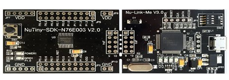

# Nuvoton `N76E003` or `MS51FB9AE`

Official Tools

<https://www.nuvoton.com/tool-and-software/software-development-tool/driver/>

## Development Board for `N76E003` = `NuTiny-N76E003`

Part No: `NuTiny-N76E003`

<https://direct.nuvoton.com/en/nutiny-n76e003>

[Schematics](./N76E003-or-MS51FB9AE/NUTINY-SDK-N76E003-V21.pdf)

[User Guide](./N76E003-or-MS51FB9AE/UM_NuTiny-SDK-N76E003_EN_Rev1.01.pdf)

## SDCC Based Development Template

Development Tutorials :

- Flashed Before My Eyes: Nuvoton `N76E003` CPU Part 1 of 2

    <https://cmheong.blogspot.com/2020/07/flashed-before-my-eyes-nuvoton-76n003.html>

- `N76E003AT20` – `MS51FB9AE` – Ví dụ đầu tiên (Vietnamese).

    <http://vidieukhien.org/n76e003at20-ms51fb9ae-vi-du-dau-tien.html>

    Gives a good Make file and Starting Template

    - Template File [N76E003AT20-MS51FB9AE-template.7z](./N76E003-or-MS51FB9AE/N76E003AT20-MS51FB9AE-template.7z)

## Programmer

- Programmer Software in Golang

    <https://github.com/erincandescent/nuvoprog>

- BSP for SDCC for N76E003

    <https://github.com/erincandescent/libn76>

- Nuvoton N76E003 BSP for SDCC (New)

    <https://github.com/danchouzhou/N76E003-SDCC>

- BSP for Keil

    <https://github.com/OpenNuvoton/N76E003-BSP>

- BSP for IAR

    <https://github.com/OpenNuvoton/N76E003_BSP_IAR_C51>

----
<!-- Footer Begins Here -->
## Links

- [Back to 8051 Hub](./README.md)
- [Back to Hardware Hub](../README.md)
- [Back to Root Document](../../README.md)
