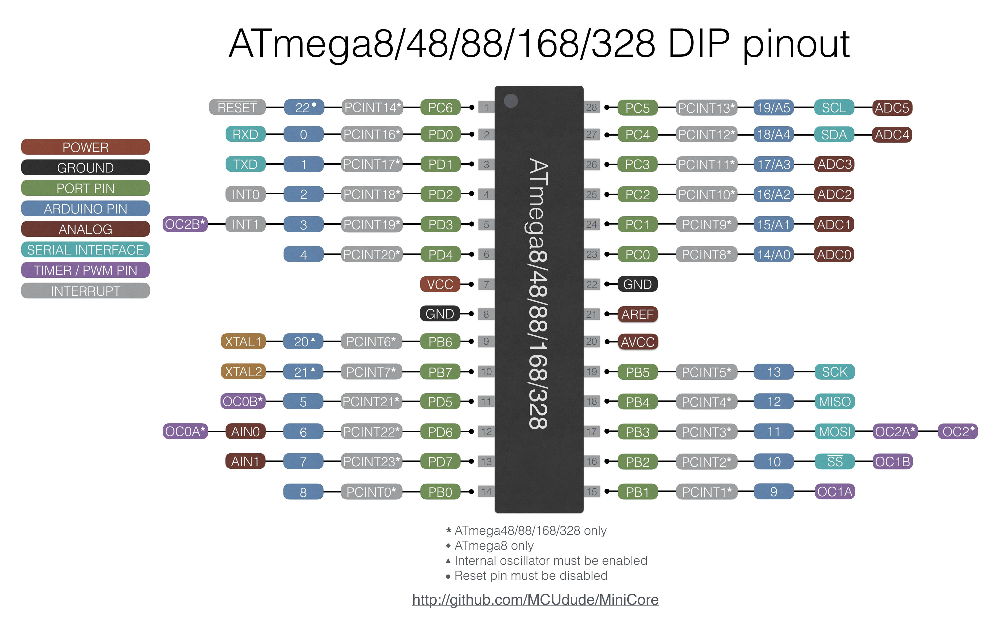
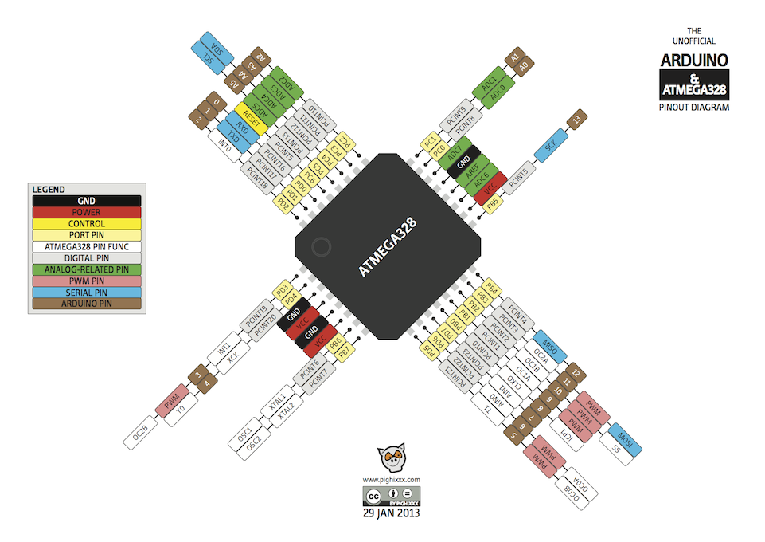
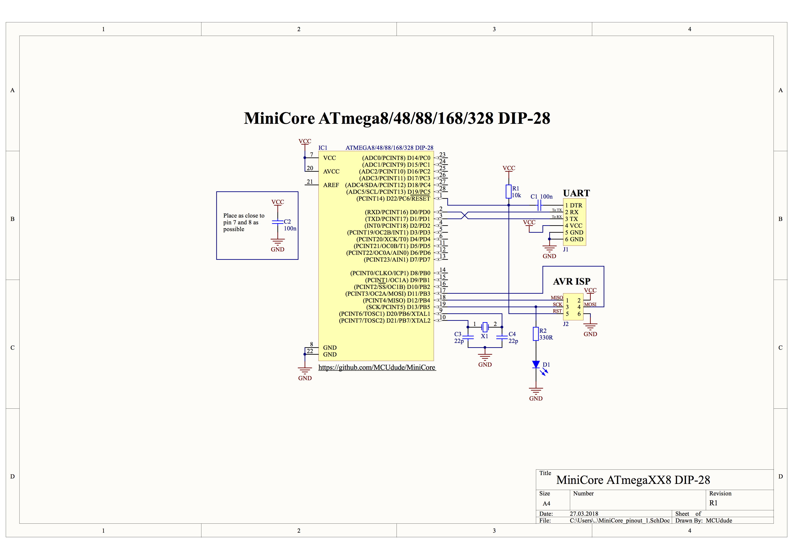

# AVR Hub

All about the AVR Microcontroller Architecture and tools.

## Topics

- **[Arduino as ISP](./arduino-as-isp.md)** - Doing ISP function the correct way using **Arduino Nano (Clone)**.
- **[ATtiny10](./attiny10.md)** - The really small SOT23-6 package AVR Microcontroller and its development.
- **[ATtiny85](./attiny85.md)** - Small 8-Pin AVR MCU.
- **[Flash Forth Programs](./flash-forth-programs.md)** - Forth Programs for AVR Microcontrollers.
- **[Arduino Nano](./arduino-nano.md)** - Board Details.
- **[Arduino Common Board Dimensions](./arduino-board-dimensions.md)** - Most popular Arduino Board Dimensions.

## Others

### MiniCore

An Arduino core for the `ATmega328`, `ATmega168`, `ATmega88`, `ATmega48` and `ATmega8`, all running a custom version of Optiboot for increased functionality. This core requires at least **Arduino IDE v1.6.2**, where **v1.8.13+** is recommended.

This core gives you two extra IO pins if you're using the **internal oscillator!** `PB6` and `PB7` is mapped to `Arduino pin 20 and 21`.

Source Repository : <https://github.com/MCUdude/MiniCore>

Function Reference : <https://github.com/MCUdude/MiniCore/blob/master/Wiring_reference.md>

This is already included in the [Arduino Configuration](../TOOLS/arduino-configuration.md#arduino-board-manager-urls).

??? note "DIP-28 Pinout for ATmega8/48/88/168/328"
    

??? note "LQFP-32 Pinout for ATmega328"
    

**More such pinout [here](https://github.com/MCUdude/MiniCore#pinout).**

??? note "Minimum Circuit for DIP-28 ATmega8/48/88/168/328"

    

**More such Circuits [here](https://github.com/MCUdude/MiniCore#minimal-setup).**

----
<!-- Footer Begins Here -->
## Links

- [Back to Hardware Hub](../README.md)
- [Back to Root Document](../../README.md)
