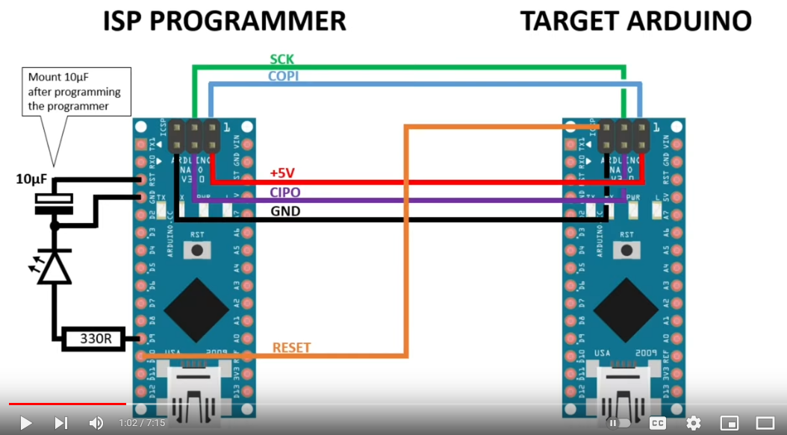
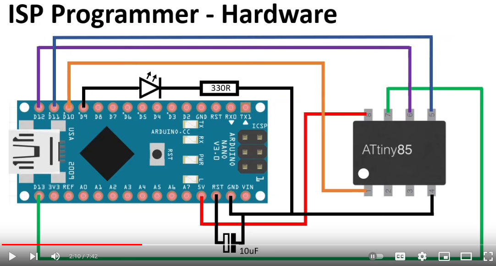
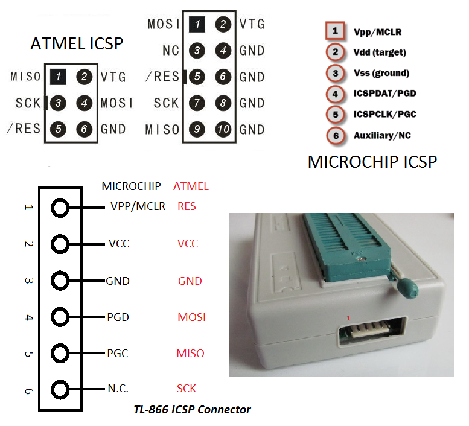

# Arduino as ISP - The correct way

Home Page <https://docs.arduino.cc/built-in-examples/arduino-isp/ArduinoISP>

## Corrected wiring for Arduino ISP

Here is an **Arduino Nano (Clone)** performing ISP on *another one*.

Video showing it the correct way - <https://www.youtube.com/watch?v=paDmCuFRx4c>

[More details about `avrdude` here](../TOOLS/avrdude-AVR-programming-utility.md)

## Programming ATtiny85 using Arduino as ISP

Here, we are using an **Arduino Nano (Clone)** to perform programming of **ATTiny85**:

Video with more details <https://www.youtube.com/watch?v=5__0aKdqlDQ>

## TL866II Programmer - ICSP connector

----
<!-- Footer Begins Here -->
## Links

- [Back to AVR Hub](./README.md)
- [Back to Hardware Hub](../README.md)
- [Back to Root Document](../../README.md)
