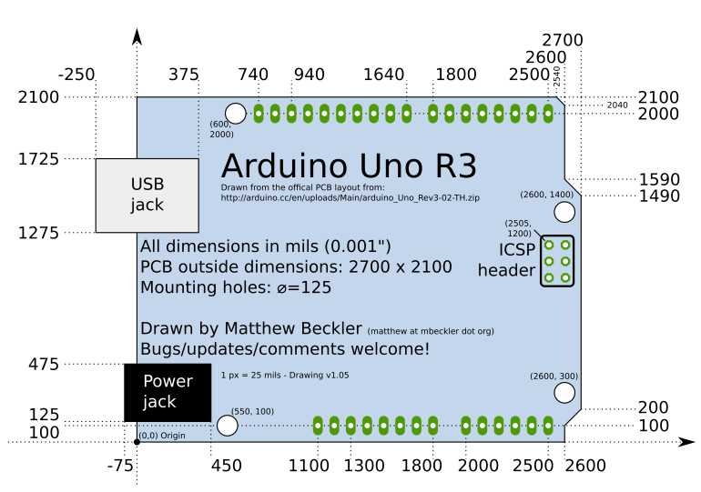
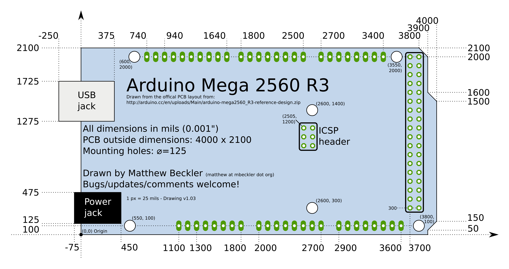
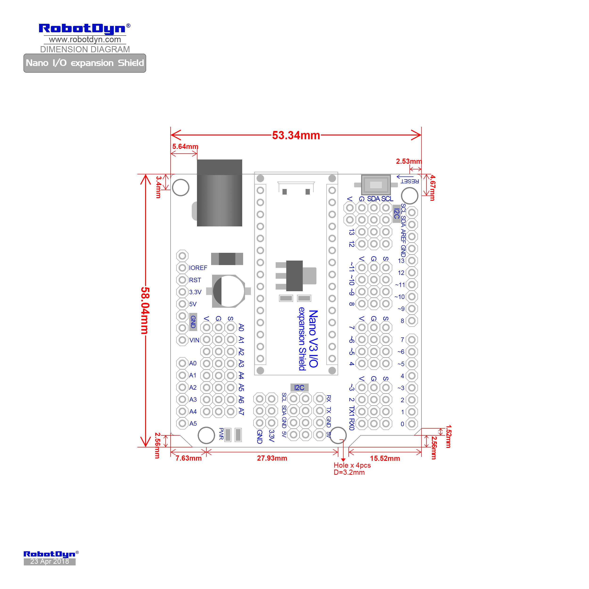

# Common Arduino Board Dimensions

## Arduino Uno Dimensions

**[SVG Format File](./arduino-board-dimensions/arduino_uno_drawing.svg)** for Quick Reference.

## Arduino Mega Dimensions

**[SVG Format File](./arduino-board-dimensions/arduino_mega_drawing.svg)** for Quick Reference.

## Arduino Nano I/O Shield Dimensions

----
<!-- Footer Begins Here -->
## Links

- [Back to AVR Hub](./README.md)
- [Back to Hardware Hub](../README.md)
- [Back to Root Document](../../README.md)
