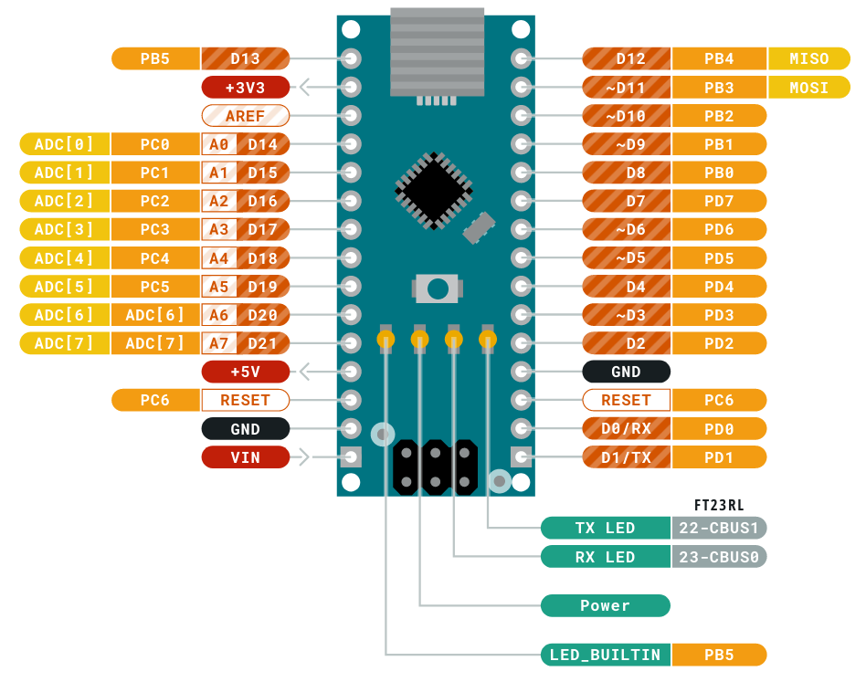
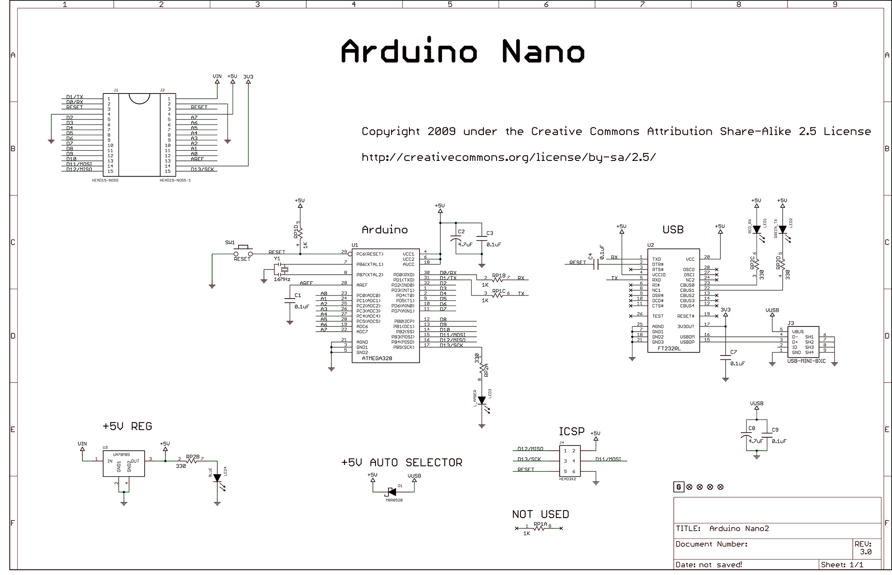
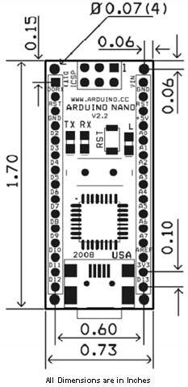

# Arduino Nano

This board contains the Serial to USB as well as a Header to program the `ATmega238P` chip.

## Pinout of Arduino Nano

**[PDF](./arduino-nano/Arduino-NANO-Pinout_latest.pdf)** Copy.

## Schematics for Arduino Nano

## Dimensions for Arduino Nano

All Dimensions in Inches.

----
<!-- Footer Begins Here -->
## Links

- [Back to AVR Hub](./README.md)
- [Back to Hardware Hub](../README.md)
- [Back to Root Document](../../README.md)
