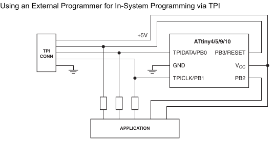
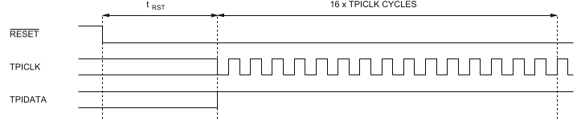
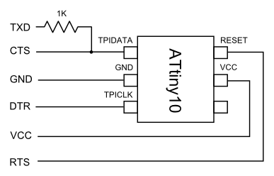
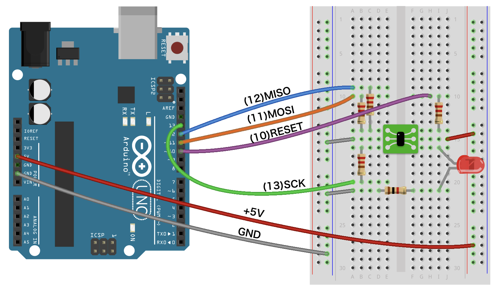
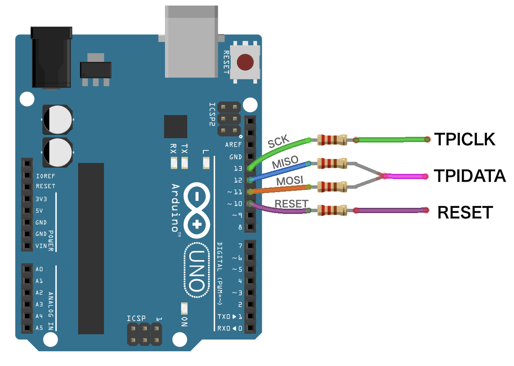
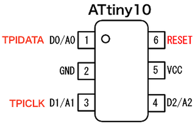

# `ATTINY10` Microcontroller

Datasheet :
<https://ww1.microchip.com/downloads/aemDocuments/documents/OTH/ProductDocuments/DataSheets/ATtiny4-5-9-10-Data-Sheet-DS40002060A.pdf>

Product Page :
<https://www.microchip.com/en-us/product/ATtiny10>

LCSC Purchase Page :
<https://lcsc.com/product-detail/MICROCHIP_Microchip-Tech-ATTINY10-TSHR_C128438.html>


## High Voltage Programming of `ATTINY10` Microcontroller

- Original `ATTINY10` Development Video
    <https://www.youtube.com/watch?v=ra7bT74EGUs>
- `fVripple` Project
    <https://hackaday.com/2022/02/28/hvtpi-primer-and-toolkit-equips-you-for-bom-substitutions/>
    - `fVripple` Video
        <https://www.youtube.com/watch?v=7YJOtHbnNDQ>
- Programming Interface Picture
    ATtiny10 Programming Interface
    

### Important Programming Notes

- **15.3.1 Enabling**
    The following sequence enables the Tiny Programming Interface:
    - Apply 5V between `VCC` and `GND`
    - Depending on the method of reset to be used:
        - Either: wait `tTOUT` (see Table 17-4 on page 127 of Datasheet) and then set the `RESET` pin low. This will reset the device and enable the `TPI` physical layer. The `RESET` pin must then be kept low for the entire programming session
        - Or: if the `RSTDISBL` configuration bit has been programmed, apply `12V` to the `RESET` pin. The `RESET` pin must be kept at `12V` for the entire programming session.
    - Wait `tRST` (see Table 17-4 on page 127 Datasheet)
    - Keep the `TPIDATA` pin high for `16 TPICLK cycles`
    - Plot for the Activation Sequence: (`tRST = 400nS @ 5V`)

#### Programming Activation Sequence



## ISP Programming of `ATtiny10`

### `ATtiny10` Programming using Bit-Bang FT232R in `avrdude`

Initial Article: <https://irq5.io/2010/07/15/programming-the-attiny10/>

Code excerpt from `avrdude.conf` file :

```bash
programmer
id    = "dasaftdi";
desc  = "FTDI serial port banging, reset=rts sck=dtr mosi=txd miso=cts";
type  = serbb;
reset = ~7; #RTS
sck   = ~4; #DTR
mosi  = ~3; #TXD
miso  = ~8; #CTS
;
```

### ATtiny10 FT232R USB-to-Serial Board Connection



### `avrdude` Programming Command
Hence the final Programming Command Becomes:
```sh
sudo avrdude -C ~\attiny10-prog\avrdude.conf -c dasaftdi \
     -P /dev/ttyUSB0 -p t10 -U flash:w:test.elf
```

**Note** that we load our custom Configuration Here for `avrdude` For [More Details on `avrdude` Refer to Tools document](../TOOLS/avrdude-AVR-programming-utility.md).

### `ATtiny10` Final Post with Serial Bit-Bang `dasa` Programmer

Final Article: <https://irq5.io/2017/09/09/writing-code-for-the-attiny10/>

This later became the `dasa` Programmer Interface.

There were multiple variants as shown in the `avrdude.conf` file:

```bash
# some ultra cheap programmers use bitbanging on the
# serialport.
#
# PC - DB9 - Pins for RS232:
#
# GND   5   -- |O
#              |   O| <-   9   RI
# DTR   4   <- |O   |
#              |   O| <-   8   CTS
# TXD   3   <- |O   |
#              |   O| ->   7   RTS
# RXD   2   -> |O   |
#              |   O| <-   6   DSR
# DCD   1   -> |O
#
# Using RXD is currently not supported.
# Using RI is not supported under Win32 but is supported under Posix.

# serial ponyprog design (dasa2 in uisp)
# reset=!txd sck=rts mosi=dtr miso=cts

programmer
  id    = "ponyser";
  desc  = "design ponyprog serial, reset=!txd sck=rts mosi=dtr miso=cts";
  type  = "serbb";
  connection_type = serial;
  reset = ~3;
  sck   = 7;
  mosi  = 4;
  miso  = 8;
;

# Same as above, different name
# reset=!txd sck=rts mosi=dtr miso=cts

programmer parent "ponyser"
  id    = "siprog";
  desc  = "Lancos SI-Prog <http://www.lancos.com/siprogsch.html>";
;

# unknown (dasa in uisp)
# reset=rts sck=dtr mosi=txd miso=cts

programmer
  id    = "dasa";
  desc  = "serial port banging, reset=rts sck=dtr mosi=txd miso=cts";
  type  = "serbb";
  connection_type = serial;
  reset = 7;
  sck   = 4;
  mosi  = 3;
  miso  = 8;
;

# unknown (dasa3 in uisp)
# reset=!dtr sck=rts mosi=txd miso=cts

programmer
  id    = "dasa3";
  desc  = "serial port banging, reset=!dtr sck=rts mosi=txd miso=cts";
  type  = "serbb";
  connection_type = serial;
  reset = ~4;
  sck   = 7;
  mosi  = 3;
  miso  = 8;
;

# C2N232i (jumper configuration "auto")
# reset=dtr sck=!rts mosi=!txd miso=!cts

programmer
  id    = "c2n232i";
  desc  = "serial port banging, reset=dtr sck=!rts mosi=!txd miso=!cts";
  type  = "serbb";
  connection_type = serial;
  reset = 4;
  sck   = ~7;
  mosi  = ~3;
  miso  = ~8;
;
```

The configuration give us the specific pins and the location of the Pins needed for ISP.
**Note** There are 3 variants based on how the programmer hardware is connected.

For [More Details on `avrdude` Refer to Tools document](../TOOLS/avrdude-AVR-programming-utility.md).

### `arduino-ft232r` Bit Bang `avrdude` Programmer **WORKING**

This was the one we have tested and worked great.

For [More Details on `avrdude` FT232 variants](../TOOLS/avrdude-FT232-Bit-Bang-Programmers.md).


## Linux Toolchain for `ATtiny10`

<http://www.herbert-dingfelder.de/?page_id=499>

Firmware: [`math_on_tiny4.c`](./attiny10/math_on_tiny4.c)

Makefile: [`math_on_tiny4.mk`](./attiny10/math_on_tiny4.mk)

## kosakalab way of programming `ATtiny10`

Video: <https://www.youtube.com/watch?v=71K1L3ZJR8g>

Website: <https://make.kosakalab.com/make/electronic-work/arduino_tpi_en/>

*[**PDF Version**](./attiny10/ATtiny10-Dev-Environment-on-Arduino-IDE-Make-kosakalab.pdf)*

[**Arduino as ISP for ATTINY10 in ZIP**](./attiny10/ATtiny4_5_9_10_20_40Programmer_2.zip)

### Connection Pictures







### `bitDuino10-arduinoTPI` configuration files for Arduino IDE

Code for the Programmer:

https://github.com/kimio-kosaka/bitDuino10-arduinoTPI

### `AVRBOY` control tool for the TPI programmer (Golang source)

`ATtiny4_5_9_10_20_40Programmer_2.ino` the TPI programmer sketch for Arduino UNO etc.

<https://github.com/kimio-kosaka/avrboy>

[**Respository Archive - `kimio-kosaka_avrboy-master.zip`**](./attiny10/kimio-kosaka_avrboy-master.zip)

----
<!-- Footer Begins Here -->
## Links

- [Back to AVR Hub](./README.md)
- [Back to Hardware Hub](../README.md)
- [Back to Root Document](../../README.md)
