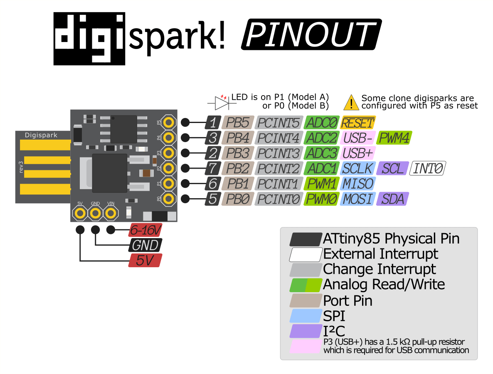

# `ATtiny85` Microcontroller

Product Page : <https://www.microchip.com/en-us/product/ATtiny85>

Datasheet :  <https://ww1.microchip.com/downloads/en/DeviceDoc/Atmel-2586-AVR-8-bit-Microcontroller-ATtiny25-ATtiny45-ATtiny85_Datasheet.pdf>

> The high-performance, low-power Microchip 8-bit AVR® RISC-based microcontroller combines `8 KB` **ISP Flash memory**, `512B` **EEPROM**, `512B` **SRAM**, six general purpose I/O lines, 32 general purpose working registers, one 8-bit timer/counter with compare modes, one 8-bit high-speed timer/counter, USI, internal and external Interrupts, 4-channel 10-bit A/D converter, programmable watchdog timer with internal oscillator, three software selectable power saving modes, and debugWIRE for on-chip debugging. The device achieves a throughput of **20 MIPS** at **20 MHz** and operates between `2.7-5.5` volts.

The `ATtiny85` chip of 8 pins, some of which we can use both analog and digital purposes.

!!! note "`ATtiny85` Pinout **SOIC8** and **DIP-8** Packages"

    

## [DigiStump DigiSpark Board](http://digistump.com/products/1)

This was the original board that helped with `ATtiny85` development.

!!! note "Pinout of DigiSpark Board"

    

Here is the [original listing](http://digistump.com/products/1) of the board.

Though now many clones have come out, brining down the cost.

**[PDF Board Schematics](./attiny85/DigisparkSchematic.pdf)**

!!! note "Confusion about On-Board LED"

    In some boards `P1` is the LED while in others `P0` is connected to LED.

### [DigStump Arduino](https://github.com/digistump/DigistumpArduino)

Accompanying the successful *DigiSpark Board* was the **[DigStump Arduino package](https://github.com/digistump/DigistumpArduino)**.
That enabled a **USB Bootloader** right on the `ATtiny85` chip.

The *Board support URL* is already part of the [Arduino Configuration](../TOOLS/arduino-configuration.md#arduino-board-manager-urls).

The only additional step is installing the **Windows Driver** :

<https://github.com/digistump/DigistumpArduino/releases/download/1.6.7/Digistump.Drivers.zip>

----
<!-- Footer Begins Here -->
## Links

- [Back to AVR Hub](./README.md)
- [Back to Hardware Hub](../README.md)
- [Back to Root Document](../../README.md)
