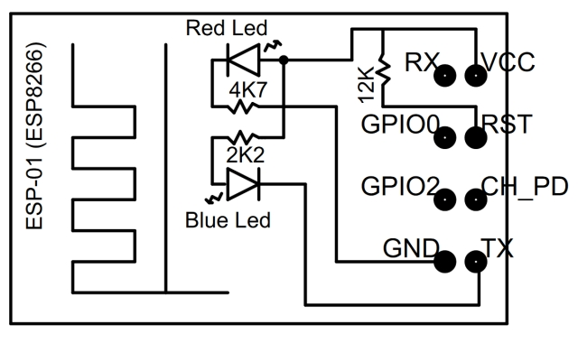
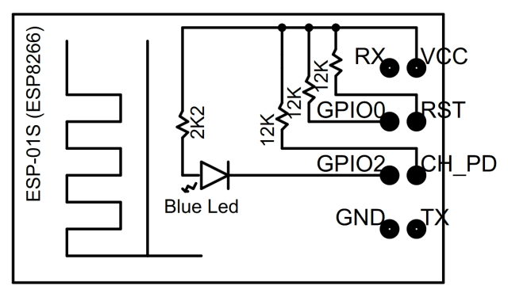
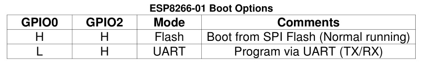
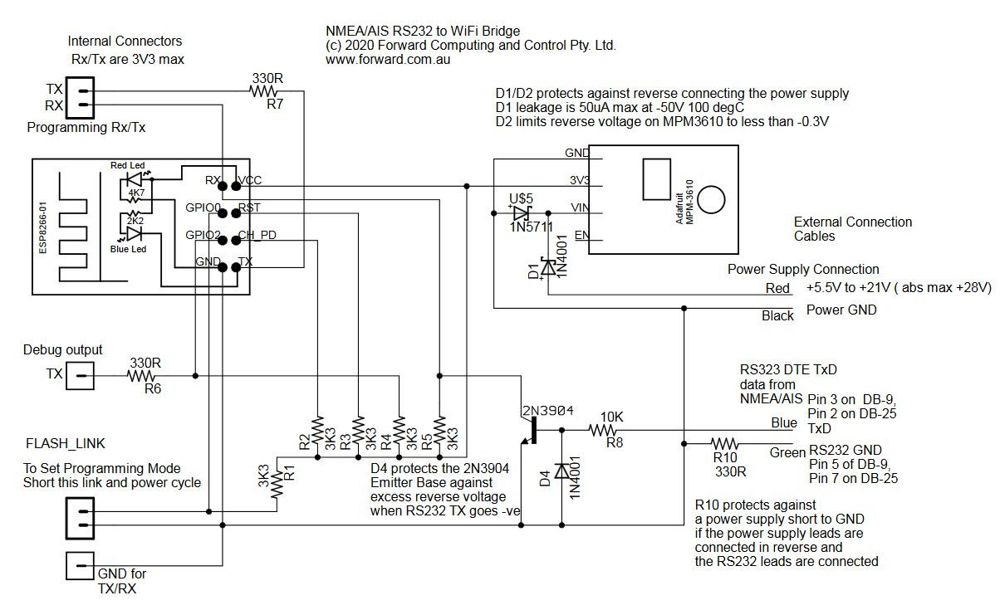
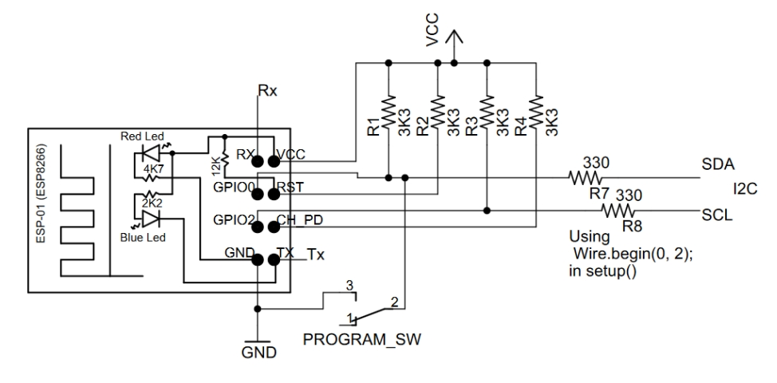
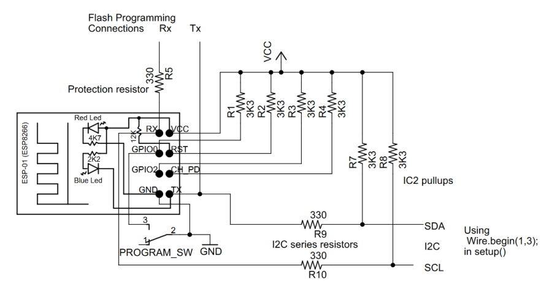
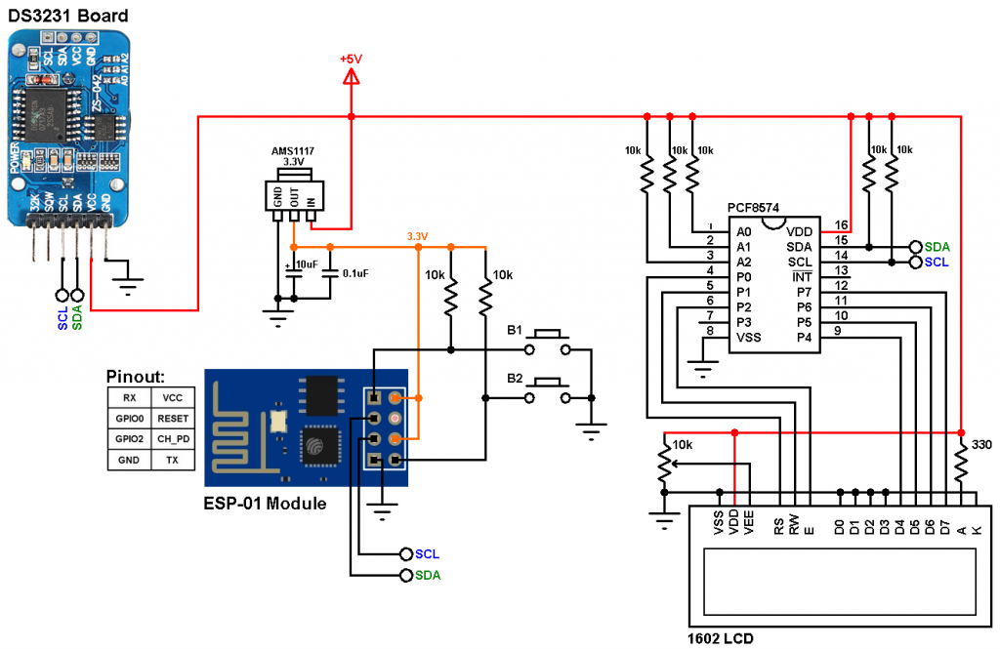
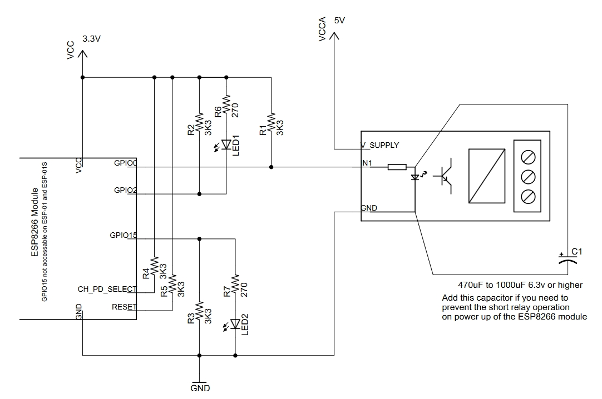
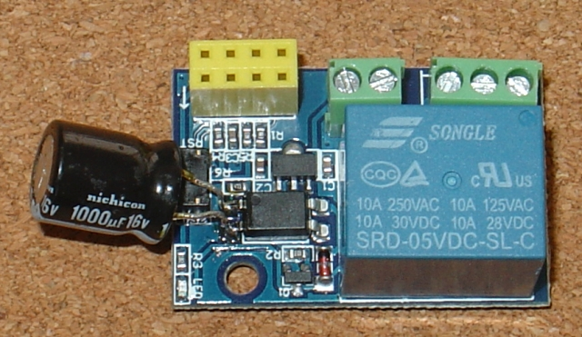

# Using All pins of `ESP-01` Module

Reference:

- ESP-01 and ESP-01S Pins and Uses : <https://www.forward.com.au/pfod/ESP8266/GPIOpins/ESP8266_01_pin_magic.html>
    - [PDF Version](./ESP-01-Using-All-pins/ESP-01-and-ESP-01S-How-program-and-use-the-Pins-and-Leds.pdf)

## `ESP-01` and `ESP-01S` Pins

??? info "`ESP-01` Module Pin and Circuit:"
    

??? info "`ESP-01S` Module Pin and Circuit:"
    

The `ESP-01` and `ESP-01S` are the smallest `ESP8266` modules and only have 8 pins. Of these `VCC`, `GND`, `RST` (reset) and `CH_PD` (chip select) are not I/O pins but are needed the operation of the module. This leaves `GPIO0`, `GPIO2`, `TX` and `RX` available as possible I/O pins, but even these have pre-assigned functions. The `GPIO0` and `GPIO2` determine what mode the module starts up in and the `TX`/`RX` pins are used to program the module and for Serial I/O, commonly used for debugging.

`GPIO0` and `GPIO2` need to have pull-up resistors connected to ensure the module starts up correctly. The `ESP-01S` has `12K` resistors on the board for `GPIO0`, `RST` and `CH_PD` (see the schematic above and also [here](https://docs.ai-thinker.com/_media/esp8266/docs/esp-01s_product_specification_zh_v1.0.pdf), [local copy here](./ESP-01-Using-All-pins/esp-01s_product_specification_zh_v1.0.pdf))

??? info "`ESP8266` Boot Options:"
    

## Using the ESP-01S and ESP-01 LEDs

The `ESP-01S` only has one led, a Blue led connected to `GPIO2`. It turns on when `GPIO2` is output `LOW`.

```c
// In setup
pinMode(2, OUTPUT);

// In Loop
digitalWrite(2, LOW); // Turn ON
delay(200);
digitalWrite(2, OFF); // Turn OFF
delay(200);
```

For the `ESP-01` things are a bit more difficult. There is a Red led that comes on when the `3v3/GND` is applied. If you see a Red led, you have an `ESP-01`. The Blue led on the `ESP-01` is driven by the `TX (GPIO1)` pin and normally just flickers when your are *sending data on the Serial connection*.

## Using TX/RX as normal GPIO pins

While using `GPIO1 (TX)` to drive the led, that leaves `GPIO3 (RX)` available as a normal I/O.

### Using `GPIO3 RX` Only freeing `GPIO1 (TX)`

```c
Serial.begin(115200,SERIAL_8N1,SERIAL_RX_ONLY);
// which allows you to receive Serial input but not send output,
// but leaves GPIO1 available for general I/O use.
```
Setting `GPIO3 (RX)` as **an OUTPUT is NOT recommended**. If you can avoid it *because it is easy to short out when next re-programming*.

**Note carefully:** If you are using `GPIO3 (RX)` *as an output*, add a *small resistor say `330R` in series* to **prevent accidentally shorting it out when you attach your programming leads**.

***However, if you plug out your `ESP-01` for programming no need to worry.***

### Using `GPIO1 TX` Only freeing `GPIO3 (RX)`

```c
Serial.begin(115200,SERIAL_8N1,SERIAL_TX_ONLY);
// This allows you to transmit but not receive input.
// Frees up the GPIO3 for I/O use.
```

Remember the `ESP8266` ALWAYS outputs a *start up message* on `GPIO1`, so for that short time `GPIO1` is **ALWAYS an output**. So be sure to add a series **`330R resistor`** between `GPIO1` and whatever output is driving that input - to **prevent shorting things out during the startup message**.

### Example Circuit utilizing the `GPIO1` and `GPIO3`

??? info "Circuit using Both GPIO1 and GPIO3 + Programmer connection:"
    

Reference: <https://www.forward.com.au/pfod/CheapWifiShield/NMEAbridge/index.html>

## Best Pin Trick – Use I2C

The best trick to get extra inputs into the `ESP-01` is to use an I2C interface.

### Using `GPIO0` and `GPIO2` as the I2C bus

??? info  "One choice is to use `GPIO0` and `GPIO2` as the I2C bus: (Circuit)"
    

The pull-up resistors needed to get the module to start up correctly can double as the I2C bus pull-up resistors and the other, **slave, components on the bus are open collector and so should not pull the bus down on power-up**.

However, in some cases slaves, particularly those with **battery backup**, can become stuck and hold the bus down. In those cases you will need to *isolate the bus until the ESP8266 gets through its boot stage*.

### Using `GPIO1 TX` and `GPIO3 RX` for the I2C bus

??? info "You can avoid this issue by using `GPIO1 TX` and `GPIO3 RX` for the I2C bus: (Circuit)"
    

A few things to note:

- `GPIO1 (TX)` is used as the Data line, because you will always get some debug output on `GPIO1` on power up. There is no way to suppress this output, but the `Clock line (RX)` will be **held high** so *none of this data will be clocked to the slaves*.
- When programming the `ESP8266`, the `RX` line is connected to the programmer's output. At the end of the programming the `ESP8266` reboots and **`330R` Protection resistor** prevents *RX shorting* the programmer's output drive.
- The **I2C series resistors** provide similar protection for the `TX`, `RX` from shorts on the I2C bus


### Example Project using DS3231 and LCD on ESP-01


Reference:

- <https://simple-circuit.com/esp8266-esp-01-ds3231-ds1307-rtc/>
    - [PDF version](./ESP-01-Using-All-pins/ESP8266_ESP-01_Real_time_clock_with_DS3231_DS1307-SIMPLE_PROJECTS.pdf)

??? info "Circuit showing ESP-01 connect both with I2C and TX/RX"
    

Needs the following Library : <https://github.com/agnunez/ESP8266-I2C-LCD1602>

??? note "Project Code"

    ```c
    // Real time clock with ESP8266 (ESP-01) module, DS3231 RTC and I2C LCD
    // This code also works with DS1307 RTC


    #include <Wire.h>                    // Include Wire library (required for I2C devices)
    #include <LiquidCrystal_I2C.h>       // Include LiquidCrystal_I2C library

    LiquidCrystal_I2C lcd(0x27, 16, 2);  // Configure LiquidCrystal_I2C library with 0x27 address, 16 columns and 2 rows

    #define button1    3                 // Button B1 is connected to GPIO3 (RX)
    #define button2    1                 // Button B2 is connected to GPIO1 (TX)

    void setup() {

      pinMode(button1, INPUT);
      pinMode(button2, INPUT);
      delay(1000);

      lcd.begin(0, 2);                   // Initialize I2C LCD module (SDA = GPIO0, SCL = GPIO2)

      lcd.backlight();                   // Turn backlight ON

    }

    char Time[]     = "TIME:  :  :  ";
    char Calendar[] = "DATE:  /  /20  ";
    byte i, second, minute, hour, date, month, year;

    void DS3231_display(){
      // Convert BCD to decimal
      second = (second >> 4) * 10 + (second & 0x0F);
      minute = (minute >> 4) * 10 + (minute & 0x0F);
      hour   = (hour >> 4)   * 10 + (hour & 0x0F);
      date   = (date >> 4)   * 10 + (date & 0x0F);
      month  = (month >> 4)  * 10 + (month & 0x0F);
      year   = (year >> 4)   * 10 + (year & 0x0F);
      // End conversion
      Time[12]     = second % 10 + 48;
      Time[11]     = second / 10 + 48;
      Time[9]      = minute % 10 + 48;
      Time[8]      = minute / 10 + 48;
      Time[6]      = hour   % 10 + 48;
      Time[5]      = hour   / 10 + 48;
      Calendar[14] = year   % 10 + 48;
      Calendar[13] = year   / 10 + 48;
      Calendar[9]  = month  % 10 + 48;
      Calendar[8]  = month  / 10 + 48;
      Calendar[6]  = date   % 10 + 48;
      Calendar[5]  = date   / 10 + 48;

      lcd.setCursor(0, 0);
      lcd.print(Time);                               // Display time
      lcd.setCursor(0, 1);
      lcd.print(Calendar);                           // Display calendar
    }

    void blink_parameter(){
      byte j = 0;
      while(j < 10 && digitalRead(button1) && digitalRead(button2)){
        j++;
        delay(25);
      }
    }

    byte edit(byte x, byte y, byte parameter){
      char text[3];
      while(!digitalRead(button1));                  // Wait until button1 released
      while(true){
        while(!digitalRead(button2)){                // If button2 is pressed
          parameter++;
          if(i == 0 && parameter > 23)               // If hours > 23 ==> hours = 0
            parameter = 0;
          if(i == 1 && parameter > 59)               // If minutes > 59 ==> minutes = 0
            parameter = 0;
          if(i == 2 && parameter > 31)               // If date > 31 ==> date = 1
            parameter = 1;
          if(i == 3 && parameter > 12)               // If month > 12 ==> month = 1
            parameter = 1;
          if(i == 4 && parameter > 99)               // If year > 99 ==> year = 0
            parameter = 0;
          sprintf(text,"%02u", parameter);
          lcd.setCursor(x, y);
          lcd.print(text);
          delay(200);                                // Wait 200ms
        }
        lcd.setCursor(x, y);
        lcd.print("  ");                             // Display two spaces
        blink_parameter();
        sprintf(text,"%02u", parameter);
        lcd.setCursor(x, y);
        lcd.print(text);
        blink_parameter();
        if(!digitalRead(button1)){                   // If button1 is pressed
          i++;                                       // Increament 'i' for the next parameter
          return parameter;                          // Return parameter value and exit
        }
      }
    }

    void loop() {
      if(!digitalRead(button1)){                           // If button1 is pressed
        i = 0;
        hour   = edit(5, 0, hour);
        minute = edit(8, 0, minute);
        date   = edit(5, 1, date);
        month  = edit(8, 1, month);
        year   = edit(13, 1, year);

        // Convert decimal to BCD
        minute = ((minute / 10) << 4) + (minute % 10);
        hour = ((hour / 10) << 4) + (hour % 10);
        date = ((date / 10) << 4) + (date % 10);
        month = ((month / 10) << 4) + (month % 10);
        year = ((year / 10) << 4) + (year % 10);
        // End conversion

        // Write data to DS3231 RTC
        Wire.beginTransmission(0x68);               // Start I2C protocol with DS3231 address
        Wire.write(0);                              // Send register address
        Wire.write(0);                              // Reset sesonds and start oscillator
        Wire.write(minute);                         // Write minute
        Wire.write(hour);                           // Write hour
        Wire.write(1);                              // Write day (not used)
        Wire.write(date);                           // Write date
        Wire.write(month);                          // Write month
        Wire.write(year);                           // Write year
        Wire.endTransmission();                     // Stop transmission and release the I2C bus
        delay(200);                                 // Wait 200ms
      }

      Wire.beginTransmission(0x68);                 // Start I2C protocol with DS3231 address
      Wire.write(0);                                // Send register address
      Wire.endTransmission(false);                  // I2C restart
      Wire.requestFrom(0x68, 7);                    // Request 7 bytes from DS3231 and release I2C bus at end of reading
      second = Wire.read();                         // Read seconds from register 0
      minute = Wire.read();                         // Read minuts from register 1
      hour   = Wire.read();                         // Read hour from register 2
      Wire.read();                                  // Read day from register 3 (not used)
      date   = Wire.read();                         // Read date from register 4
      month  = Wire.read();                         // Read month from register 5
      year   = Wire.read();                         // Read year from register 6

      DS3231_display();                             // Diaplay time & calendar

      delay(50);                                    // Wait 50ms

    }
    ```

## How to Avoid Relay Flicker on Startup in ESP-01 modules

When the `ESP8266` powers up/resets in normal mode, the **`GPIO0` goes `LOW` for about `100mS`**. This will **briefly turn ON the relay** connected to `GPIO0`, shown below.

To avoid this *relay flicker* on startup, solder a `470uF` to `1000uF 6.3V` or *higher capacitor across the opto-isolator input pins* (after the on-board resistor) on the relay board itself.

Check with a multi-meter to get the polarity of the capacitor around the correct way. *This capacitor will delay the relay switch by about 0.5sec to 1sec*. You could try a capacitor as low as `220uF`. The `1000uF` one has been tested and works.

??? info "Picture showing the Capacitor mounting location on Schematics:"
    

??? info "Picture showing the actual Capacitor on the Relay"
    

----
<!-- Footer Begins Here -->
## Links

- [Back to ESP8266 Hub](./README.md)
- [Back to Hardware Hub](../README.md)
- [Back to Root Document](../../README.md)
