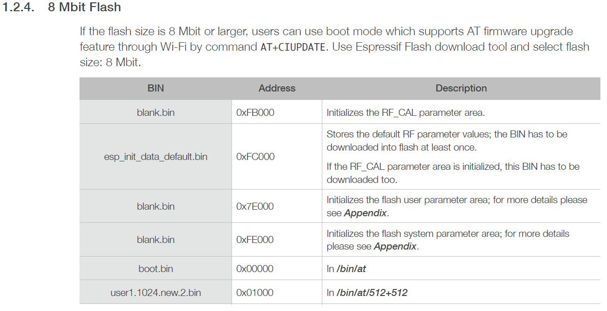
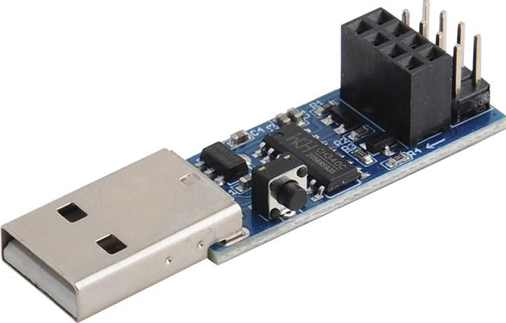
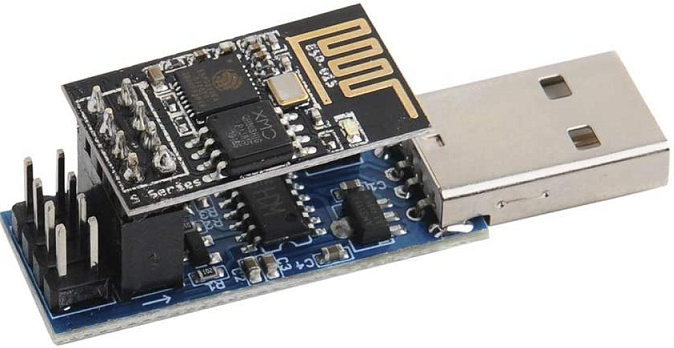
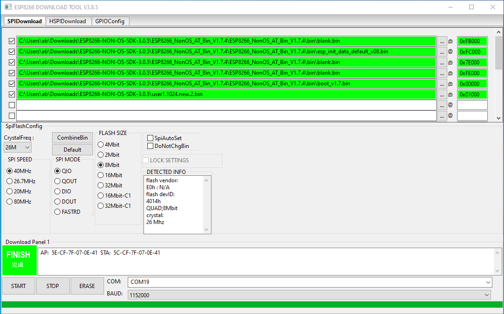

# ESP8266 AT Firmware - Last Version

Reference : <https://www.youtube.com/watch?v=wXXXgaePZX8>
This YouTube video shows how to flash the last version of officially released **AT firmware**.

There are *several discrepancies* in what Espressif is providing.

This is as on `2023-04-23 16:25.48-627`, **Espressif has stopped allowing people** to download `ESP8266 NON OS SDK AT Firmware`.

Here is a documented way around these limitation and hence are the solutions.

Most importantly there are no more takers for `ESP-01` the old ESP8266 module with `1MB Flash chip`.

*All latest firmware are big* and need a even bigger `2MB` chip to host.

## Getting the ESP8266 NON-OS SDK (Small Version)

Github: <https://github.com/espressif/ESP8266_NONOS_SDK/releases/tag/v3.0.5>

This was the last release so here is archive.

[ESP8266_NONOS_SDK-3.0.5.7z](./ESP8266-AT-Firmware/ESP8266_NONOS_SDK-3.0.5.7z)

Inside this the `bin` directory contains all the Binary files.

## Flashing the AT Firmware in ESP8266

> Now which ones to flash ?
> And how was not easy to find !

Fortunately we found an old [help document PDF](./ESP8266-AT-Firmware/4a-esp8266_at_instruction_set_en.pdf).

It not only helps us with AT Commands, but also the Flashing instructions.

Like the ones below for `ESP8266` based `ESP-01 module` which has the **`8 Mbit`** or *`1MB`* Flash:



We have converted this instructions into a table:

> If the flash size is 8 Mbit or larger, users can use boot mode
> which supports AT firmware upgrade feature through Wi-Fi by
> command **AT+CIUPDATE**.
> Use Espressif Flash download tool and select flash size: 8 Mbit.

| BIN                       | Address | Description                                                                                                  |
| ------------------------- | ------- | ------------------------------------------------------------------------------------------------------------ |
| blank.bin                 | 0xFB000 | Initializes the RF_CAL parameter area.                                                                       |
| esp_init_data_default.bin | 0xFC000 | Stores the default RF parameter values <br /> the BIN has to be downloaded into flash <br />  at least once. |
| blank.bin                 | 0x7E000 | Initializes flash user parameter area                                                                        |
| blank.bin                 | 0xFE000 | Initializes flash system parameter area                                                                      |
| boot.... .bin             | 0x00000 | In /bin/at                                                                                                   |
| user1.1024.new.2.bin      | 0x01000 | In /bin/at/512+512                                                                                           |

## Getting the Flashing tool v3.8.5

It seams the new tool has some issues.

So we found a work around that.

[flash_download_tool_v3.8.5.7z](./ESP8266-AT-Firmware/flash_download_tool_v3.8.5.7z)

This version works.

## Flashing Hardware used

Its called **CH340C WIFI Module Adapter Download Debug for ESP8266 ESP-01/01S**

<https://robu.in/product/ch340c-wifi-module-adapter-download-debug-for-esp8266-esp-01-01s/>

It was a worth investment if you have good number of `ESP-01` modules.





Just make sure to connect the **GPIO01 to GND** pin for **Boot mode**.

## Snapshot of the working settings



## Notes on AT Commands

Reference Video: <https://www.youtube.com/watch?v=hP4YxjG9t3g>

```sh
AT
# Check the operation. It would reply with OK

AT+RST
# Reset the Module

AT+GMR
# Show the Version of the Firmware installed in Module

ATE0
# Disable Local Echo - this helps in application use

ATE1
# Enable Local Echo - Good for debugging

AT+UART_DEF=9600,8,1,0,0
# Change Baudrate of Module to 9600BAUD

AT+UART_DEF=115200,8,1,0,0
# Restore Baudrate of Module back to 115200BAUD

AT+CWMODE_DEF=1
# Set mode of Module to STATION mode to connect to WiFi access point.
# Note _DEF is for storing to Flash and _CUR is for not saving for testing only.

AT+CWLAP
# Show all the available WiFi Access Points around

AT+CWJAP_DEF="abc","0123456789"
# Where "abc" is the Access point name
# and "0123456789" is the password.
# In case the password has '"' character or '\' charanter the same should be escaped.
# Eg. for password 0123456789"\ we need to send "0123456789\"\\"
# Note _DEF is for storing to Flash and _CUR is for not saving for testing only.

AT+CWQAP
# Disconnect from the Access Point currently online
# This might be needed to change the number of connection or parameters.

AT+CIFSR
# Gets the Local IP Address and MAC Address

AT+CIPMUX=0
# Setting this to '0' will make the Single connection only mode.
# This is generally good for Polling kind of devices.
# For devices acting as Server '1' or Multiple connections is needed.

## Connect with OpenWeatherMap
AT+CIPSTART="TCP","api.openweathermap.org",80$0D$0A

## Send Number of Bytes to Send - This would give the '>' prompt to enter the next commands.
AT+CIPSEND=87$0D$0A
# Note the size 87 is the data size that we are going send in the next request.
# This also includes the line end CR LF characters, GET and whole URI.

## Send HTTPS Get Request to get Weather information of London
GET /data/2.5/weather?q=London,uk&APPID=fbd756d6387c660e650b533ff585c70e&units=metric$0D$0A

AT+CIPSTART="TCP","api.openweathermap.org",80$0D$0A
AT+CIPSEND=87$0D$0A
GET /data/2.5/weather?q=Shimla,in&APPID=fbd756d6387c660e650b533ff585c70e&units=metric$0D$0A


AT+CIPSEND=86$0D$0A
GET /data/2.5/weather?q=Delhi,in&APPID=fbd756d6387c660e650b533ff585c70e&units=metric$0D$0A
AT+CIPSEND=89$0D$0A
GET /data/2.5/weather?q=new york,us&APPID=fbd756d6387c660e650b533ff585c70e&units=metric$0D$0A
```

----
<!-- Footer Begins Here -->
## Links

- [Back to ESP8266 Hub](./README.md)
- [Back to Hardware Hub](../README.md)
- [Back to Root Document](../../README.md)
