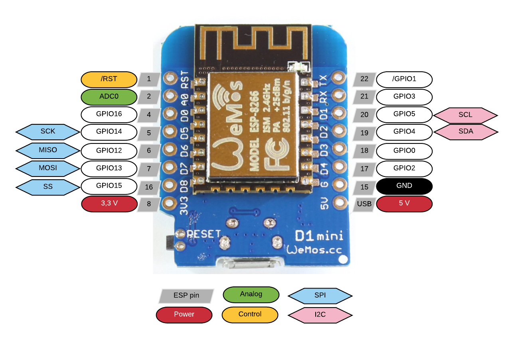

# Wemos D1 Mini R2 ESP8266 Board

One of the most famous ESP8266 Boards.

Its called `Wemos D1 Mini (R2)` or `D1 Mini Clone`.

It consist of a `ESP-12F` module with `4MB` Flash built In.
It also use the `CH340` based USB to UART chip providing power and serial
connection over a `USB-B Micro` Port as shown in the above picture.

## Pinout with Features of D1 Mini Board

Arduino / NodeMCU `lua` Compatible pinout:

Chip Level `ESP-12F` Pins and `ESP8266` GPIO Compatible pinout:

## Schematics for D1 Mini Board (R2)

## Board Dimensions for D1 Mini

In `mm` with Bottom Side:

In `mils` with Bottom Side:

## **Latest v2.2 Version** of D1 Mini Boards

Top:

Bottom:

Schematics:

----
<!-- Footer Begins Here -->
## Links

- [Back to ESP8266 Hub](./README.md)
- [Back to Hardware Hub](../README.md)
- [Back to Root Document](../../README.md)

