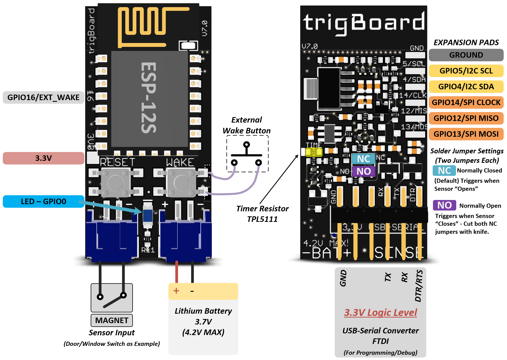
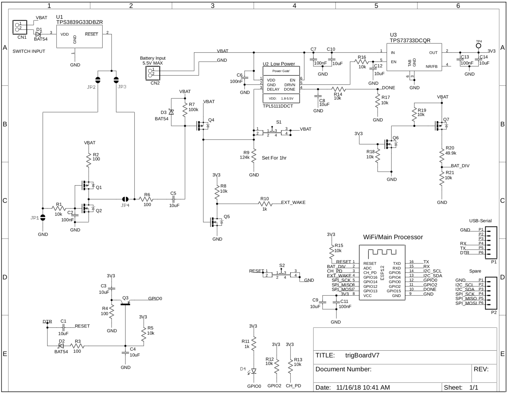

# ESP8266 Board with `nA` sleep and Triggered Wake-up

Found from : <https://hackaday.com/2018/11/13/low-energy-esp8266-based-board-sleeps-like-a-log-until-triggered/>

> Inspiration from Amazon Dash buttons.

**[YouTube Video by Kevin Darrah](https://www.youtube.com/watch?v=TSbEN4bdt7I)**

Homepage : <http://www.kevindarrah.com/wiki/index.php?title=TrigBoard>

TrigBoard V7 (ESP8266) : <https://www.kevindarrah.com/wiki/index.php/TrigBoardV7>

Latest TrigBoard v8 (ESP32) : <https://trigboard-docs.readthedocs.io/en/latest/index.html#>

Primary Reference:
<https://hackaday.com/2018/11/13/low-energy-esp8266-based-board-sleeps-like-a-log-until-triggered/>

## Project Documentation `TrigbordV7` ESP8266

<https://www.kevindarrah.com/wiki/index.php/TrigBoardV7>

[**PDF Version**](./trigBoard-nA-sleep-board/TrigBoardV7-Kevin-Darrah-Wiki.pdf)

## Schematics for `TrigBoardV7`

[**PDF Version**](./trigBoard-nA-sleep-board/TrigBoardV7.pdf)

**MOST THINGS ARE INVALID IN THIS SCHEMATICS !!!**

#### What is trigBoard

#### Schematics for TrigBoard V7

## Combination of Wake-up

There are 2 sources of Wake-up for ESP32 or ESP8266 :

1. From button connected to **[TPS3839G33](https://www.ti.com/product/TPS3839)**.
2. From hourly wake-up by **[TLP5111](https://www.ti.com/product/TPL5111)**

**Note:** The power regulator here has an Enable pin to control the Power ON.

## TPS3839G33DBZR - Specialty of No Pull-up Button

<https://lcsc.com/product-detail/Monitors-Reset-Circuits_Texas-Instruments-TPS3839G33DBZR_C485802.html>

Ultra Low Power Supervisor Chip that can be used for button press or open detection.

Use of **TPS3839G33** Supervisory reset chip.

TI Home Page : <https://www.ti.com/product/TPS3839>

## Primary IoT Push notification service `PushSafer`

<https://www.pushsafer.com/>

**Note** Need to find out more about this service.

## Project latest Version TigBoardV8 ESP32

<https://trigboard-docs.readthedocs.io/en/latest/index.html>

*NO Schematics*

## Pushover Service IoT Notifications

<https://trigboard-docs.readthedocs.io/en/latest/supportedServices.html#pushover>

----
<!-- Footer Begins Here -->
## Links

- [Back to ESP8266 Hub](./README.md)
- [Back to Hardware Hub](../README.md)
- [Back to Root Document](../../README.md)
