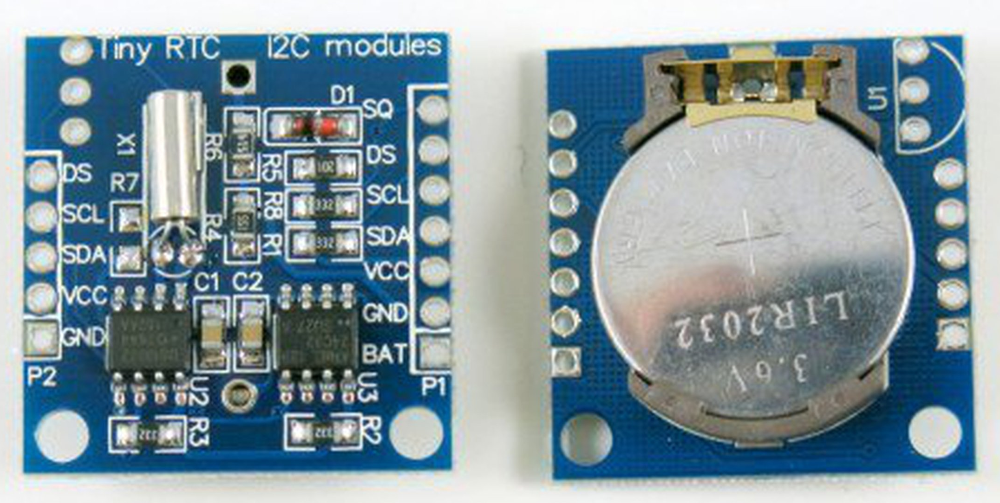
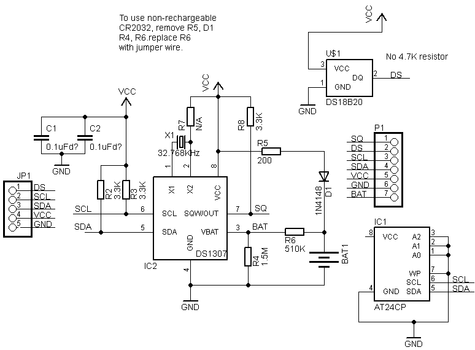
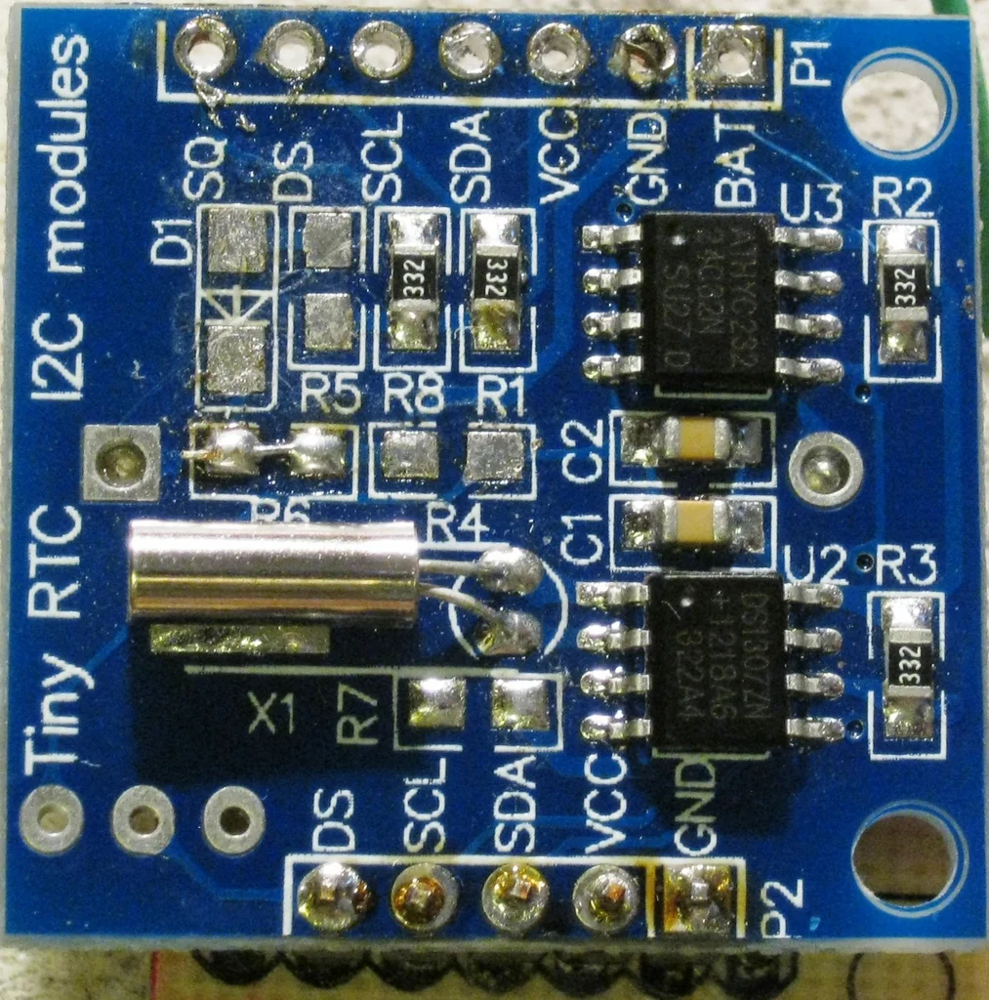
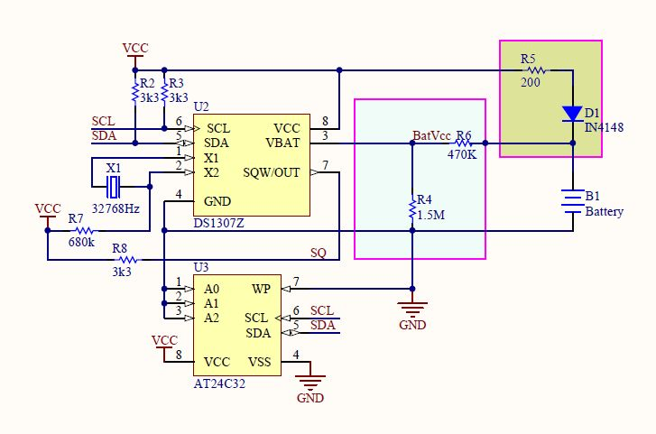

# DS1307 - RTC Chip only for 5V operation over I2C

## I2C Address : 0x68 (104)

This is an important info always hidden in the [datasheet](https://www.analog.com/media/en/technical-documentation/data-sheets/DS1307.pdf).

## Low Power Modifications to DS1307 Module

The common DS1307 Module is as shown:

This module has several parts that cause dissipation.

Here is a schematics for this Module:

- We can clearly see the Removal of **R5** and **D1** is needed. This would disable a charge circuit which we would never use.
- Next **R6** and **R4** are not useful at all. They drain the battery. Instead we need to short the **R6** to have better connection to Battery.

Here is a picture showing these modifications:

Figure shows the area modified:

## Reference

- <https://www.instructables.com/Arduino-Shower-Monitor-2/>
- <https://thecavepearlproject.org/2014/05/21/using-a-cheap-3-ds3231-rtc-at24c32-eeprom-from-ebay/#RTClowPowerMod>

----
<!-- Footer Begins Here -->
## Links

- [Back DS3231 Article](./DS3231.md)
- [Back to Modules and Devices Hub](./README.md)
- [Back to Hardware Hub](../README.md)
- [Back to Root Document](../../README.md)
