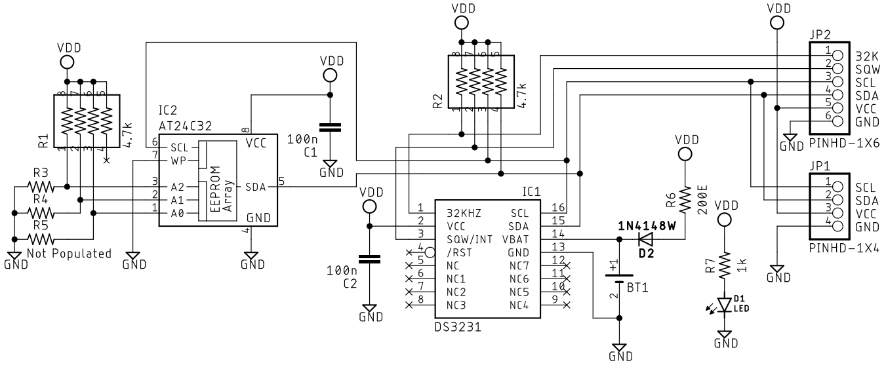
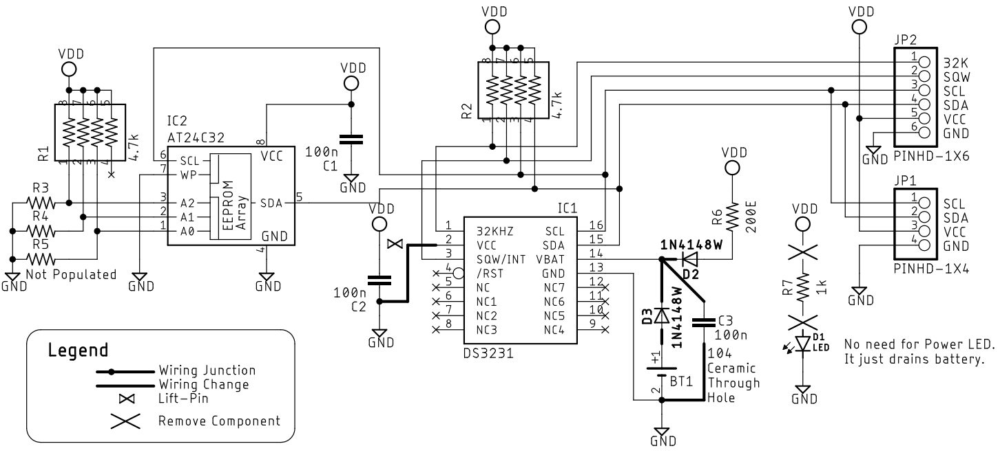
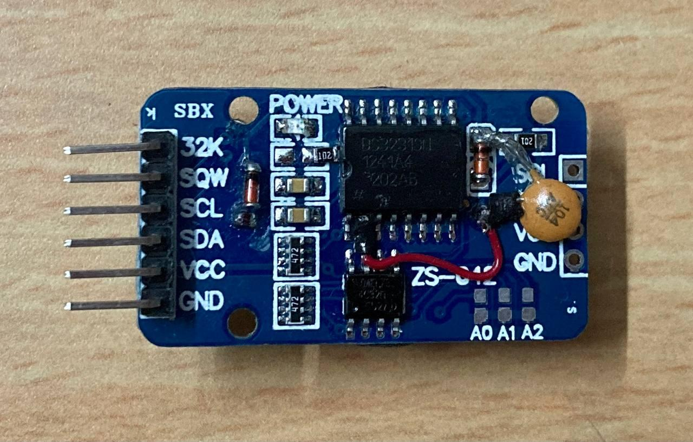

# DS3231 - TCXO RTC Chip with 5V to 3.3V Compatibility over I2C

**DS3231** has a `32.768KHz` **TCXO** output that is *by default ON* = `32KHz` pin.
It does not require any external crystal since it has internal **TCXO**.
**TCXO** = Temperature Compensated Oscillator.

**DS3231** also has an RTC similar to [DS1307](./DS1307.md) and interrupt pints.
Once can configure the output for generating either alarm or clock with `32.768Khz` time base.

This is commonly used to drive *MSP430 clocks* that support direct clock inputs.
It helps to make the **SuperFrame based RF Communications** easier.

## I2C Address : 0x68 (104)

This is an important info always hidden in the [datasheet](https://www.analog.com/media/en/technical-documentation/data-sheets/DS3231.pdf).

And yes its same as [DS1307](./DS1307.md).

## Low Power Modifications to DS3231 Module

The Normal `VDD` pin of **DS3231** dissipates more power.

Alternatively if its powered using the `VBAT` pin it consumes far less power.
Also it becomes *possible to communicate via I2C* even when its `VBAT` powered.

### Initially the **DS3231 Module Circuit** Looks like this

- Here is PDF Copy [ds-3231-module.pdf](./DS3231/ds-3231-module.pdf)

### Modifications
We perform the following set of Modification:

1. Lift the `VDD` Pin of the **DS3231** chip and connect to the **board Ground**.
2. Cut trace of Battery and add `1N4148` Diode in series.
3. Add `100nF` Capacitor at the junction of the Battery charger(`R6` and `D2` in *schematics* above) and battery input diode in step 2.
4. Remove the Power LED (`D1` in *schematics* above) resistor(`R7`in *schematics* above).

These modifications would help to **make the module low power**.

Here is how the modifications would look like the schematics:

- Here is PDF Copy [ds-3231-module-improved.pdf](./DS3231/ds-3231-module-improved.pdf)

### Actual Hardware Modifications

This picture shows the Modifications together:

- Here is the file [ds-3231-module-modifications.jpg](./DS3231/ds-3231-module-modifications.jpg)
- The red wire is actually the Ground connection with the pin lifted and covered using heat-shrink sleeve.
- The Additional diode on the Battery path hides the trace cut at the bottom.
- The `102` resistor removed helps to disable to Power LED.
- The `104` Ceramic capacitor is at the Junction of the diodes, this helps to avoid any memory issues.

## Reference

- Article: https://thecavepearlproject.org/2014/05/21/using-a-cheap-3-ds3231-rtc-at24c32-eeprom-from-ebay/#RTClowPowerMod
    - **[PDF Copy](./DS3231/using-a-usd-1-ds-3231-real-time-clock-module-with-arduino-underwater-arduino-data-loggers.pdf)**
- Video explaining the MOD: <https://www.youtube.com/watch?v=rG50U6bQhYo>

----
<!-- Footer Begins Here -->
## Links

- [Back DS1307 Article](./DS1307.md)
- [Back to Modules and Devices Hub](./README.md)
- [Back to Hardware Hub](../README.md)
- [Back to Root Document](../../README.md)

