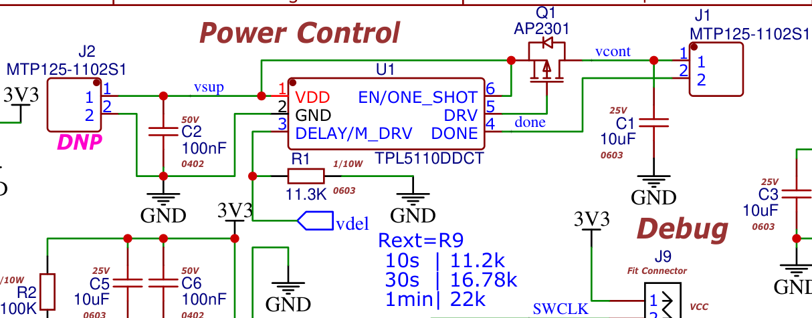
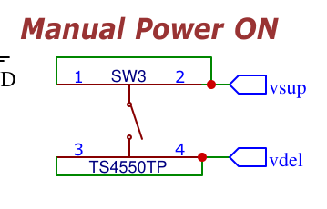

# Low Power Timers

## TPL5110 Low Power Timer

TI Product Page: <https://www.ti.com/product/TPL5110>

Its basically a *current controlled* **One Shot reset-able timer** with optional *force ON*.

The output `DRV` is ***Active-Low*** and used to control **MOSFET gates**.

## TPL5111 Low Power Timer

TI Product Page: <https://www.ti.com/product/TPL5111>

This is similar to the earlier in terms of functionality.

Except the `DRV` is ***Active High*** and used to control **Power supply EN** pins.

## From WSense project

`U1` is the famed `TPL5110`.

It controls the `Q1` to Turn-ON / OFF the power.

The Resistance `R1` Determines the actual power cycle time.

Here is table of `R1` values that sets the respective time periods.

| R1 Value | Time Period |
| :------: | ----------- |
|  11.2K   | 10 seconds  |
|  16.78k  | 30 seconds  |
|   22k    | 1 Minute    |

.. and so on ..

The `SW3` shorts the `DELAY` inputs to Voltage and this can cause the `U1` to initiate a Turn-ON.
If one keeps pressing the `SW3` It would force the `U1` to remain ON continuously without running the time loop.

As the current flowing through `R1` (a.k.a `Rext`) is used to control the internal oscillator.

The `DONE` signal is internally pulled down.
A high or *Active-High pulse* on the `DONE` signal indicates that the working time is over and that `U1` can *turn OFF the power*.

----
<!-- Footer Begins Here -->
## Links

- [Back to Modules and Devices Hub](./README.md)
- [Back to Hardware Hub](../README.md)
- [Back to Root Document](../../README.md)
