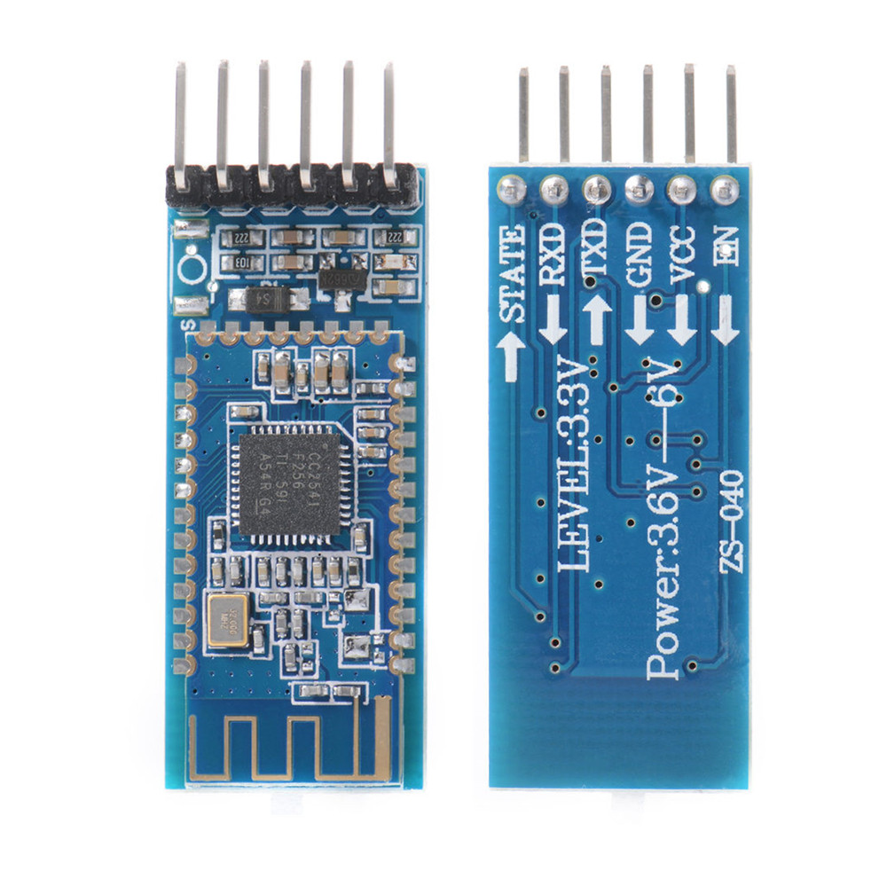
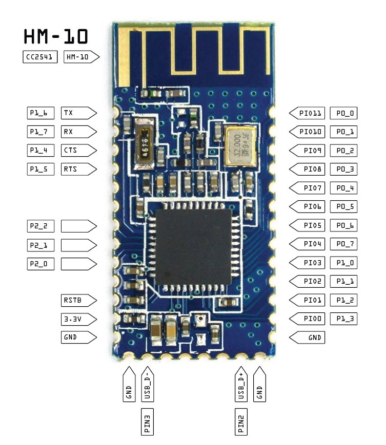
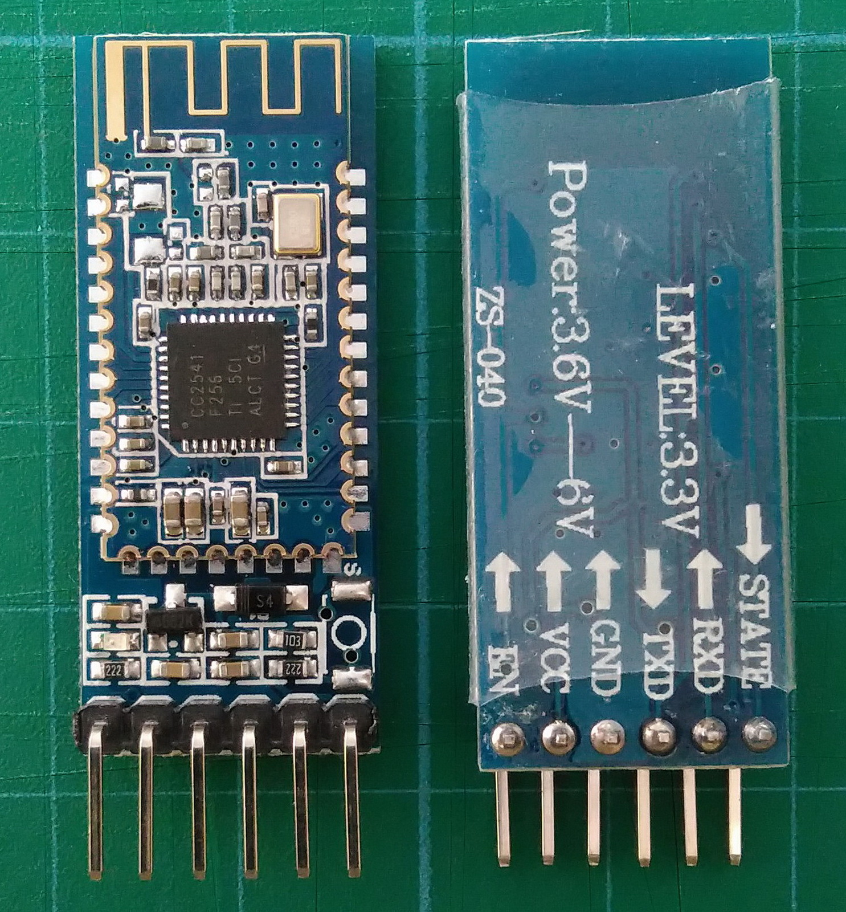
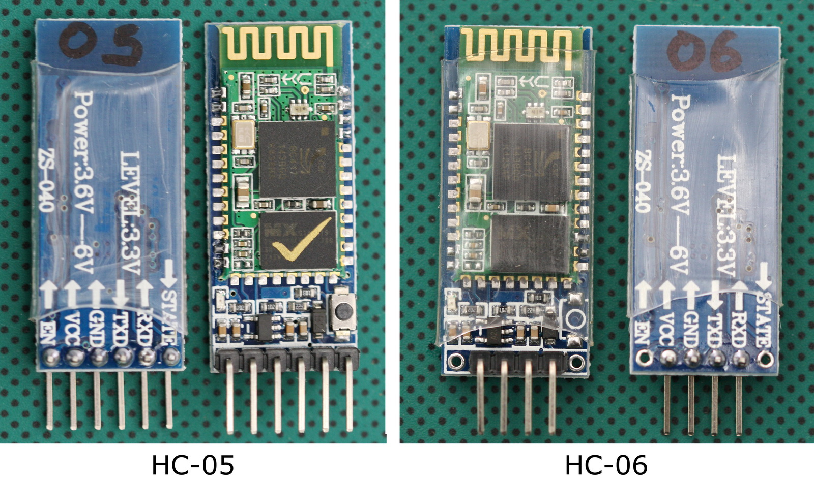
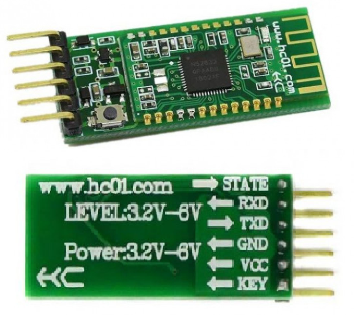
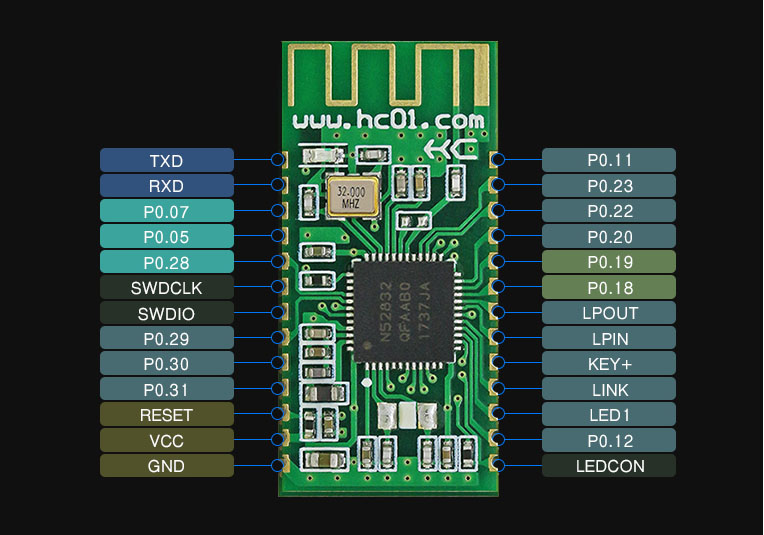

# Bluetooth Serial Modules

Study of the BLE and Bluetooth 2.0 modules.

Reference:

- **Original Fully Detailed Article by Martyn Currey**:   <https://www.martyncurrey.com/bluetooth-modules/>
    - [**PDF** of the same](./bluetooth-serial-modules/Bluetooth-Modules-Martyn-Currey.pdf)

## Serial Apps on Phone

### iPhone - LightBlue
<https://apps.apple.com/us/app/lightblue/id557428110>

### Android - Serial Bluetooth Terminal
<https://play.google.com/store/apps/details?id=de.kai_morich.serial_bluetooth_terminal&hl=en&gl=US>

### Android - Bluetooth Terminal
<https://play.google.com/store/apps/details?id=ru.sash0k.bluetooth_terminal&hl=en&gl=US>

## Serial Terminal Apps for PC

### Hercules SETUP utility - PC based config
<https://www.hw-group.com/software/hercules-setup-utility>

## Bluetooth Modules

Here are the commonly available Modules :

### HM-10 Module based on [CC2541](../8051/CC2541-Bluetooth.md)

- `115200` Possible
- Tested with `LightBlue App`
- Should not touch the `STATE` pin after configuring `115200`

#### [More Details on CC2541](../8051/CC2541-Bluetooth.md) , HM-10 and its Firmware

[CC2541 Bluetooth Document](../8051/CC2541-Bluetooth.md)

### AT-09 (MLT-BT05)

- `115200` possible (`AT+BAUD8` / `AT+HELP`)
- `AT+BAUD4` for `9600`
- No need to touch the `STATE` Pin after configuring `115200`

### HC-05 / HC-06 (with Button)

- iPhone use not possible
- To *Enter AT Command mode*
    - Set Baud rate `38400` (This is special Baud for AT Command Mode)
    - Hold Module `EN` pin High (`3.3V`) and Insert Power (`5V`)
- 115200 Possible `AT+UART=115200,0,0$0D$0A`
- After configuration no need to touch `EN` Pin

### HC-42 based on nRF52832

- No need to Touch the Key Pin If not Connected it responds directly to AT Commands
- Firmware and Datasheet don't match
- Version commands not working
- Might need re-flashing

----
<!-- Footer Begins Here -->
## Links

- [Back to Modules and Devices Hub](./README.md)
- [Back to Hardware Hub](../README.md)
- [Back to Root Document](../../README.md)
