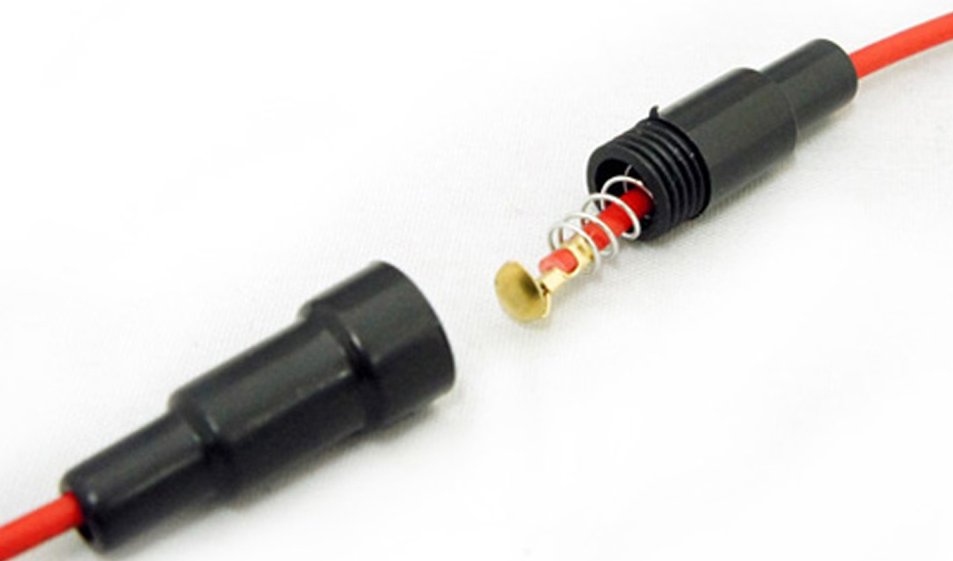
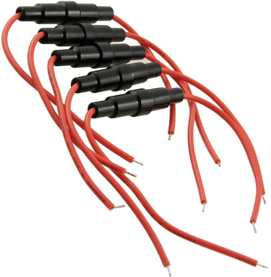
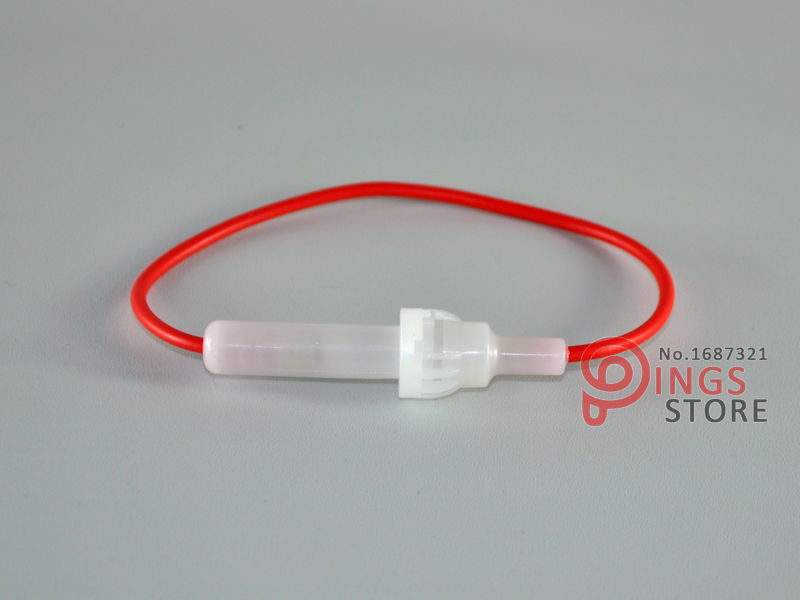
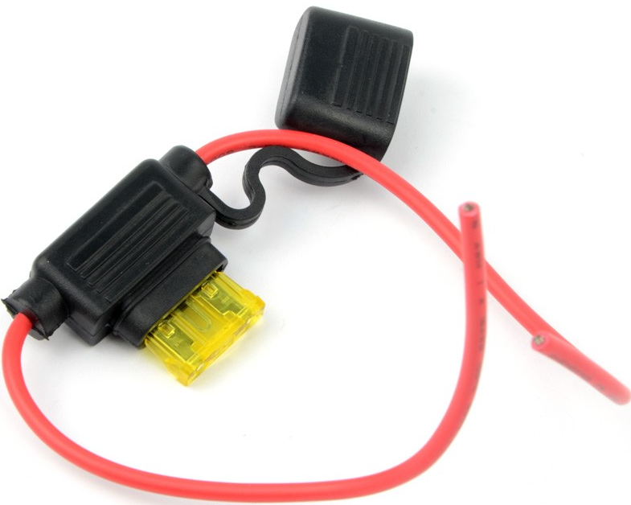

# Inline Fuse for Automotive and Solar

This document details the use and procurement details of Inline fuses.

## Pictures of Inline Fuse Holders

!!! note "*Fig1: Shows the Insides of a Inline fuse holder*"
    

??? note "*Fig 2: Shows cables containing Inline Fuse Holders*"
    

??? note "*Fig 3: Shows a High temperature Nylon type Fuse holder*"
    

??? note "*Fig 4: Shows an Automotive fuse - Inline fuse holder in the wire.*"
    

The inline fuse shown in **Fig1** and **Fig 2** is what is good for normal electrical applications.

## Here are few locations on Aliexpress to Buy the same

<https://www.aliexpress.com/item/100Pcs-Screw-Type-22-AWG-Wire-5-x-20mm-Inline-Fuse-Holder/32690452530.html>

<https://www.aliexpress.com/item/100PCS-5-20mm-Screw-Type-Wire-Inline-Fuse-Holder-automotive-fuse-holder-flame-retardant/32305116143.html>

----
<!-- Footer Begins Here -->
## Links

- [Back to Modules and Devices Hub](./README.md)
- [Back to Hardware Hub](../README.md)
- [Back to Root Document](../../README.md)
