# ATX Power Supply

References:

- <https://www.smpspowersupply.com/connectors-pinouts.html>
    - <https://www.smps.us/atx12vo-connectors.html>
    - <https://www.smpspowersupply.com/atx3connectors.html>
- How to Power ON
    - <https://bhentertainmentworld.blogspot.com/2020/10/pc-power-switch-connector-ground.html>
- <https://computerexploration.blogspot.com/2011/05/smps.html>
- <https://www.etechnog.com/2022/03/atx-power-supply-pinout-diagram.html>

## ATX Mother Board Connector Pinout

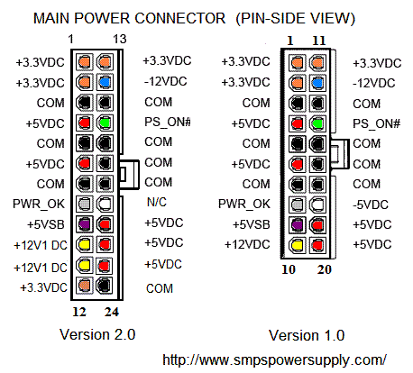

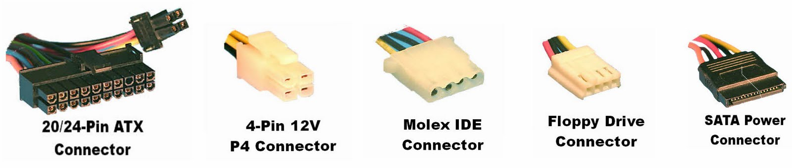

**#PS_ON Pin** connected to **COM** turns on the ATX power supply.
We need to keep this shorted to keep the power supply ON all the time.

## Floppy Disk , Peripheral and Auxiliary connectors

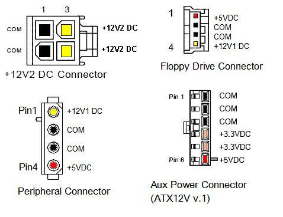

## SATA Power Connector

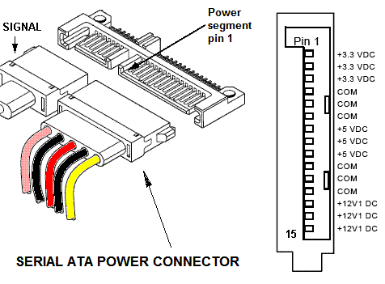

## PCI-E Power Connector

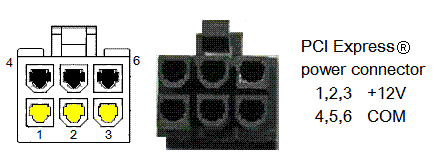

## ATX12VO Latest 2022 Mother board power connector

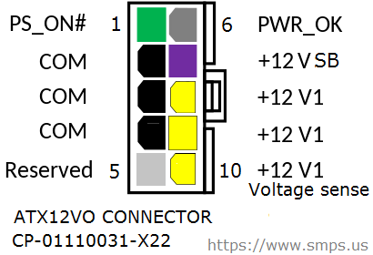

## ATX2 System 2022 Power Connector

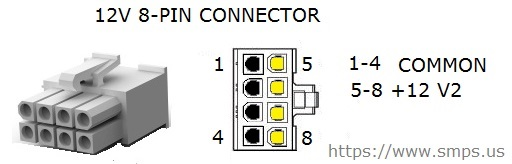

## PCI-E Graphics Card Power Connector

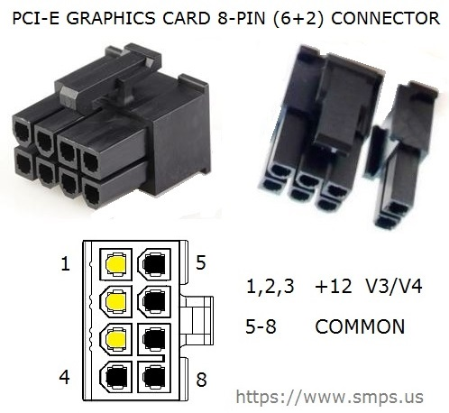

## ATX 3.0 Power Connector

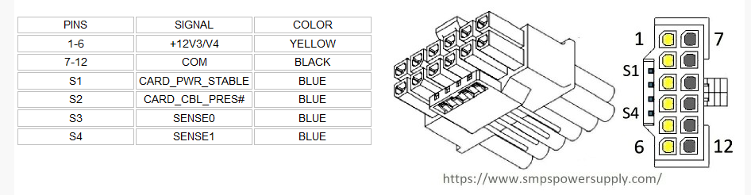

## How to Turn ON ATX Power Supply

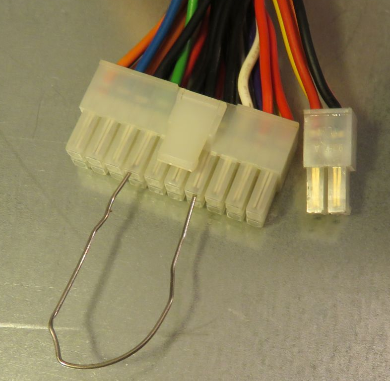

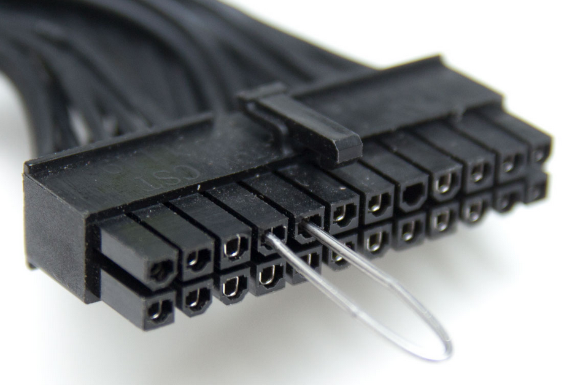

----
<!-- Footer Begins Here -->
## Links

- [Back to Power Supply Hub](./README.md)
- [Back to Hardware Hub](../README.md)
- [Back to Root Document](../../README.md)
