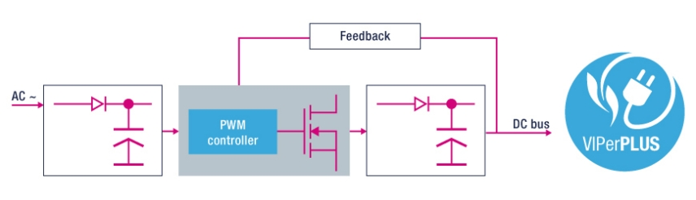
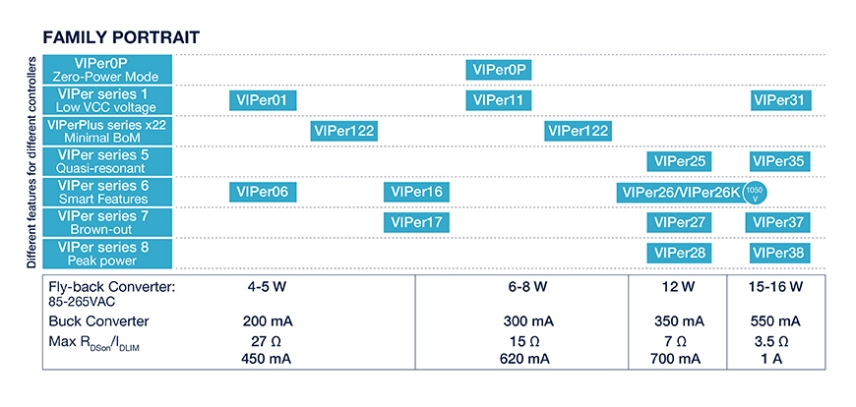
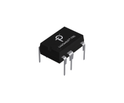
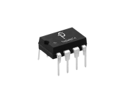

# Flyback Power Supply Topology

We are always scared to prepare something on this technology.
Its mainly due to fact that one needs to be extremely careful about design or things can get scary easily.
But, no more. We have decided to study this and make this common place.

Flyback is a Topology of switching power supply.
It is mainly used to convert the line voltage 220VAC into some lower DC voltage.

Based on the type of Flyback there are 3 main types:

1. Isolated Converters - Where mains voltage is optically isolated from the DC side.
2. Partially Isolated Converters - Where most of the control is done using optical isolation but there is a small capacitor that is used to compensate for drift.
3. Non-Isolated Converters - Where the reference is line voltage on both sides.

Typically most of the converters are `Partially isolated`.
These include Adapters used for charging, and devices.
Laptop adapters and SMPS modules being special that they use fully isolated converters.

Here are the major Supplier chip families that dominate the market:

### 1. ST Microelectronics [VIPerPlus][1]

It stands for **V**ertical **I**ntelligent **P**ower **E**nhanced **R**egulator.

These are 800V rugged MOSFET based PWM controllers. They need very less components. They can be Isolated and Non-Isolated configuration.

Based on the requirements the correct converter can be chosen.

### 2. Power Integration [LinkSwitch][2]
They support both Isolated and Non-Isolated topologies as well as various feedback mechanisms.

> The LinkSwitch families of ICs are low power offline switchers that incorporate both a high-accuracy controller and high voltage MOSFET into a single low pin-count package. LinkSwitch devices use simple ON/OFF controllers, which are highly suitable for applications where light-load/no-load efficiency is a key specification requirement. They are optimized for isolated flyback power supplies and, in a non-isolated variant, for low-current offline buck applications. The LinkSwitch families leverage a variety of feedback strategies such as Primary Side Regulated (PSR), classical opto feedback and direct measurement of the output voltage.
> *From Power Integration Website*.

### 3. Power Integrations [TinySwitch][3]
They are even Higher efficiency converters with Overload protection.

> The TinySwitch families of products combine a high voltage power MOSFET and ON/OFF flyback power supply controller in a single 7 pin SO or PDIP package. Suitable for small open-frame offline power supplies or power adapters up to 25 W, TinySwitch devices have excellent no-load and light load efficiency and extremely fast transient response. The external circuitry accompanying TinySwitch is simple to design and power sub-systems using the TinySwitch product are relatively insensitive to component tolerances due to manufacturing variances, aging and operating temperature.
> *From Power Integration Website*.

  [1]:https://www.st.com/content/st_com/en/products/power-management/ac-dc-converters/high-voltage-converters/viperplus.html
  [2]:https://www.power.com/products/linkswitch
  [3]:https://www.power.com/products/tinyswitch

----
<!-- Footer Begins Here -->
## Links

- [Back to Power Supply Hub](./README.md)
- [Back to Hardware Hub](../README.md)
- [Back to Root Document](../../README.md)
