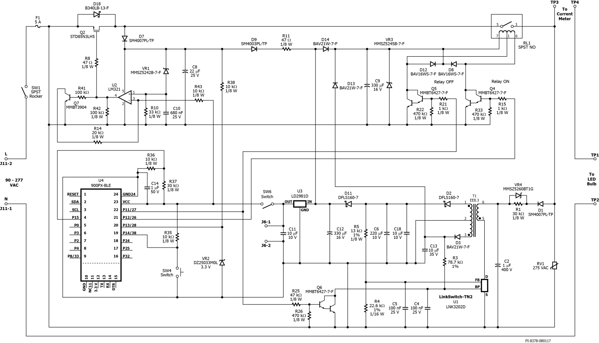
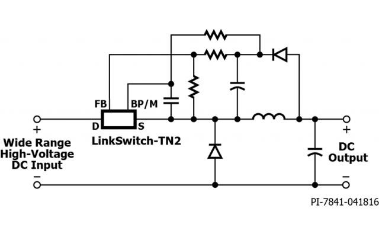

# Neutral Less Power Supply

In the **Home automation** arena due to *traditional wiring* there are *many locations for switches where neutral line is not available*.

Only the **Live line** that powers the load is available.

This makes a *major challenge* in creating systems that can control such points. **But no more!**

## [DER-622][1] - Two-Wire (No Neutral), Wide-Range, Non-Isolated Flyback, Bluetooth Wall Switch

This is [Application Note **DER-622**][1] published by **Power Integrations**.

| Specification     | Value                                                          |
| ----------------- | -------------------------------------------------------------- |
| Design Type       | Design Example Reports (DER)                                   |
| Topology          | Flyback                                                        |
| Vout 1            | 3.80 V                                                         |
| Vout 2            | 12.00 V                                                        |
| Vin (min)         | 90VAC                                                          |
| Vin (max)         | 277VAC                                                         |
| CV/CC             | CC                                                             |
| Efficiency        | 80.00%                                                         |
| Isolated?         | No                                                             |
| Number of outputs | 2                                                              |
| Output Power      | 5.00 W                                                         |
| Associated Parts  | LNK3202D                                                       |
| Gerber File       | [rd622gerber.zip](./neutral-less-power-supply/rd622gerber.zip) |
| Article           | [der622.pdf](./neutral-less-power-supply/der622.pdf)           |

The video has been also published for the same:

<https://www.power.com/community/videos/no-neutral-smart-wall-switch-linkswitch-tn2>

This uses the **[LinkSwitch-TN2][2]** family of **High voltage DC** flyback converters.

The Input Configuration used is `D1`/`R1` across `C2` provide the *fluctuating High voltage half wave DC pulses* to `T1` transformer.

The `T1` Transformer is an standard **EE8.3** switching transformer.

The design details of the same are provided in the **[PDF](./neutral-less-power-supply/der622.pdf)**.

This circuit uses a BLE module to control a latching relay.

Typically this circuit in off condition would use the bleeding power from the load.

!!! note "Solution to *ghosting* or *light flickering* Issue"

    In case *ghosting* or *light flickering* is observed then an additional `0.1uF` to `0.47uF` `X2` `475VAC` Capacitor needs to be used across the load.

## Open Source Design of a Switch using Neutral Less Power Supply

- [Livolo EU Switch][4] by Tiutiu Marius Cristian ([mtiutiu][3])
- More details **[here](../Projects/livolo-oss-neutral-less-switch.md)**.

  [1]:https://www.power.com/design-support/design-examples/der-622-two-wire-no-neutral-wide-range-non-isolated-flyback-bluetooth-wall-switch
  [2]:https://www.power.com/products/linkswitch/linkswitch-tn2
  [3]:https://github.com/mtiutiu
  [4]:https://github.com/mtiutiu/Hardware_Playground/tree/master/IOT/node/livolo_EU_switch/VL-C700X-1_Ver_C2

----
<!-- Footer Begins Here -->
## Links

- [Back to Power Supply Hub](./README.md)
- [Back to Hardware Hub](../README.md)
- [Back to Root Document](../../README.md)
