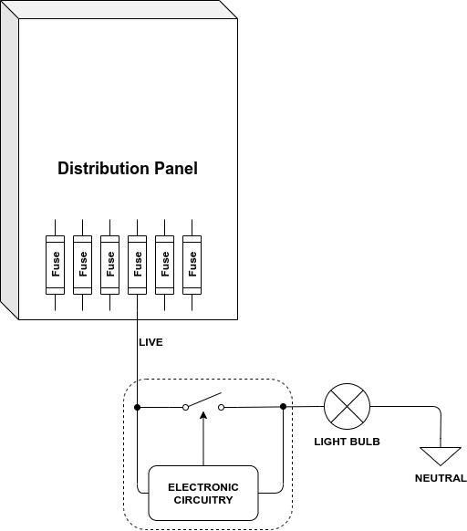
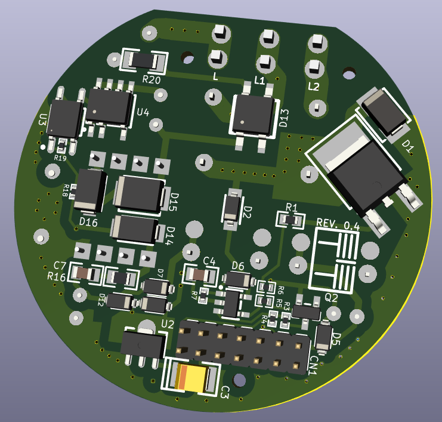
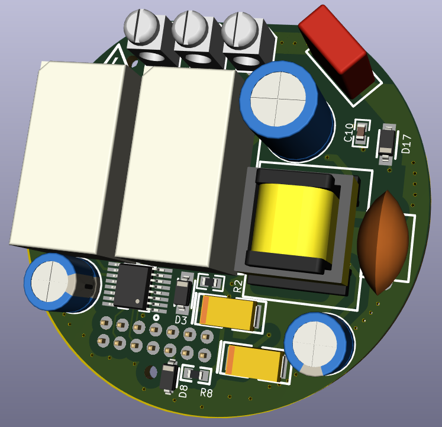
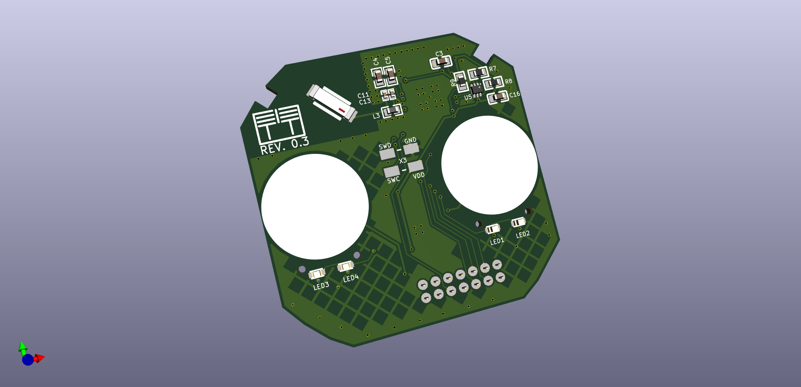
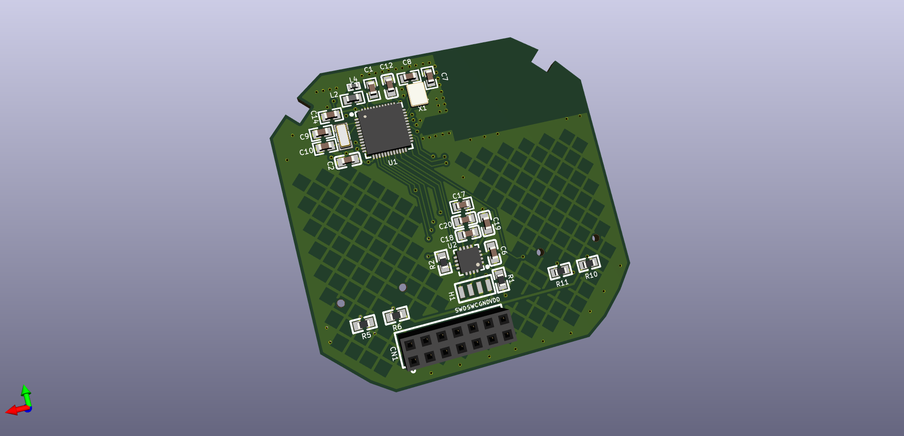
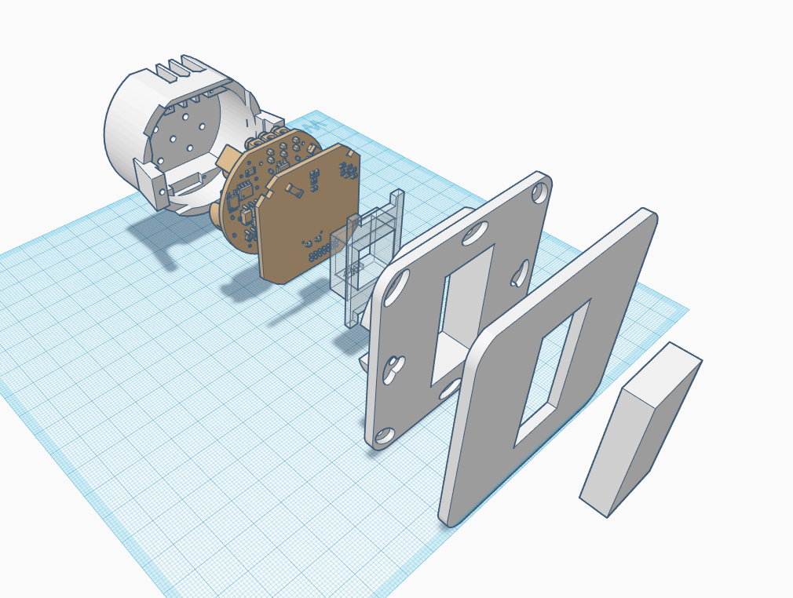
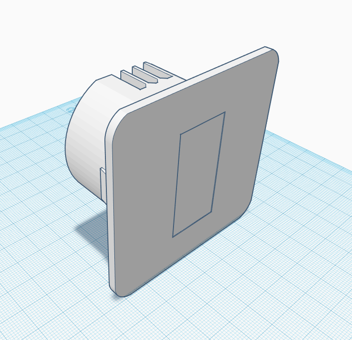

# Livolo Open Source Neutral Less IoT Switch Design

## References

- Publication:

    <https://www.openhardware.io/view/750/No-neutral-power-supplyrelay-board-for-in-wall-switch>

- Source:

    <https://github.com/mtiutiu/Hardware_Playground/tree/master/IOT/node/livolo_EU_switch/VL-C700X-1_Ver_C2>

- Discussion where we found this

    <https://forum.mysensors.org/topic/10843/no-neutral-power-supply-relay-board-for-in-wall-switch/7>

- Blog Part 1 (Introduction) **[PDF](./livolo-oss-neutral-less-switch/Intelligent-light-switches-Part-1-Cristi-Marius-Tiutiu.pdf)**

    <https://mtiutiu.design.blog/2020/05/01/intelligent-light-switches-part-1/>

- Blog Part 2 (Control Board) **[PDF](./livolo-oss-neutral-less-switch/Intelligent-light-switches-Part-2-Cristi-Marius-Tiutiu.pdf)**

    <https://mtiutiu.design.blog/2020/05/06/intelligent-light-switches-part-2/>

- Blog Part 3 (Power Supply) **[PDF](./livolo-oss-neutral-less-switch/Intelligent-light-switches-Part-3-Cristi-Marius-Tiutiu.pdf)**

    <https://mtiutiu.design.blog/2020/05/14/intelligent-light-switches-part-3/>

- Actually Hardware Repository Forked :

    <https://github.com/go-ut/Hardware_Playground>

- Here is the Snapshot of the Design At :

    `IOT/node/livolo_EU_switch/VL-C700X-1_Ver_C2`

    - Archive **[livolo_EU_switch=VL-C700X-1_Ver_C2.7z](./livolo-oss-neutral-less-switch/livolo_EU_switch=VL-C700X-1_Ver_C2.7z)**

- *Local Source* for **EE10-A transformer**

    <https://www.sunrom.com/m/7059>

- *Local Source* for **LNK364** Flyback converter

    <https://www.sunrom.com/p/lnk364-lnk364pn-dip7-smps-ic>

## Details

Basically the System works on this principle:

Designed in **EasyEDA** and Translated to **Kicad**

### Power Supply Top

### Power Supply Bottom

### Control Board Top nRF52832 Based

### Control Board Bottom nRF52832 Based

### Case Breakout

### Case Combined

----
<!-- Footer Begins Here -->
## Links

- [Back to Neutral Less Power Supply Article](../Power-Supply/neutral-less-power-supply.md)
- [Back to Projects Hub](./README.md)
- [Back to Hardware Hub](../README.md)
- [Back to Root Document](../../README.md)
