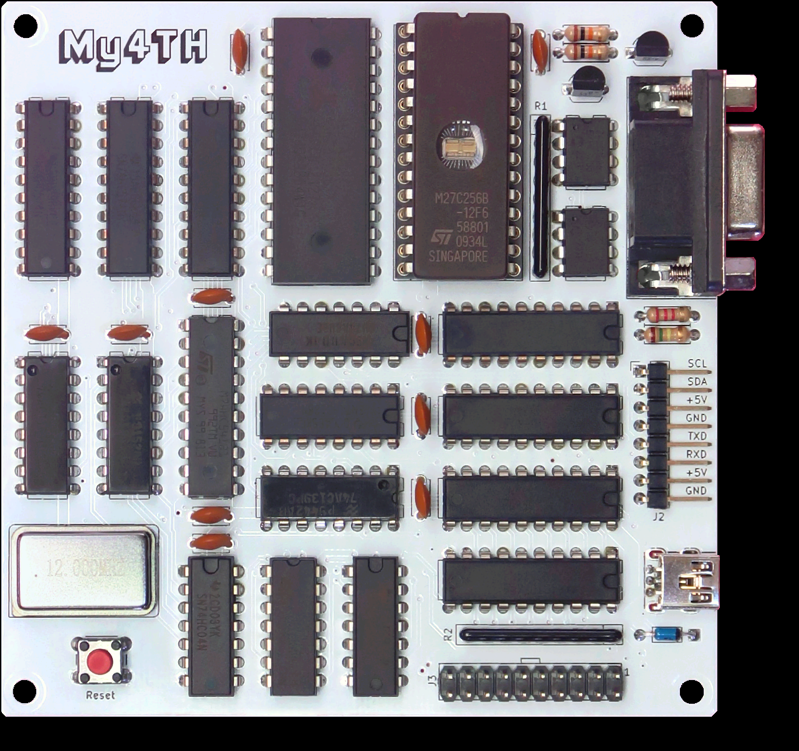
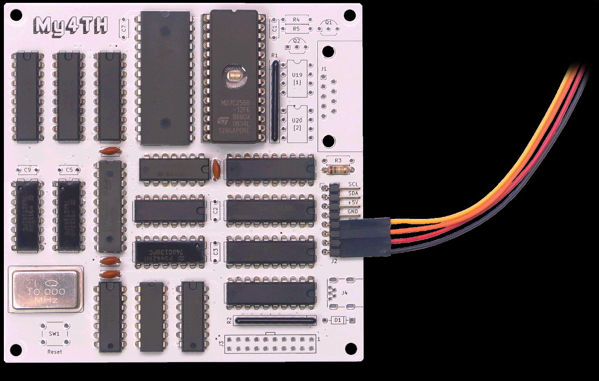
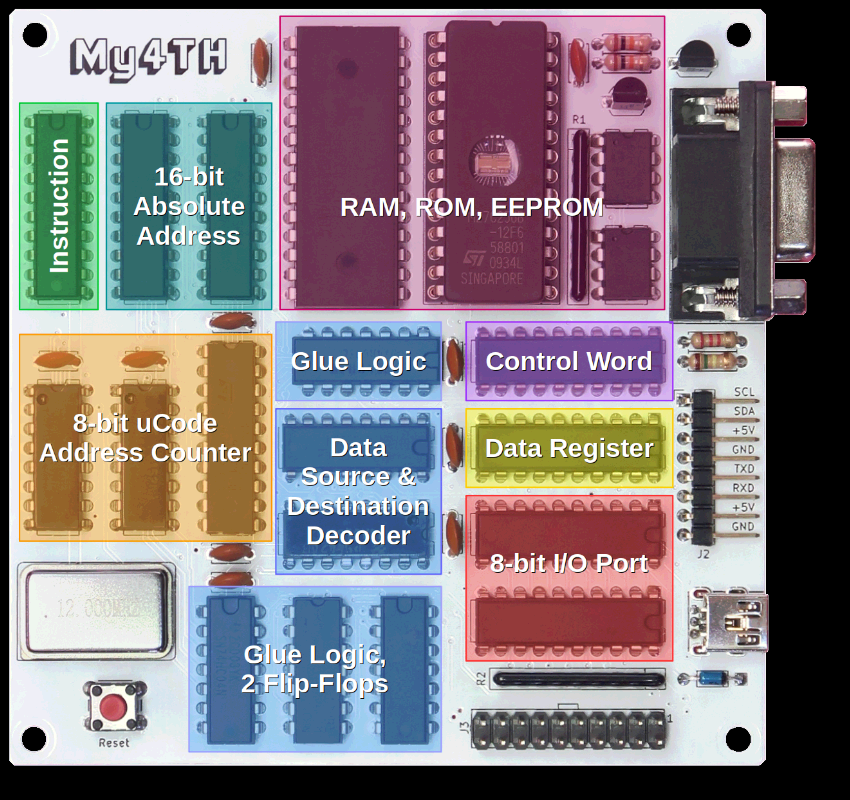
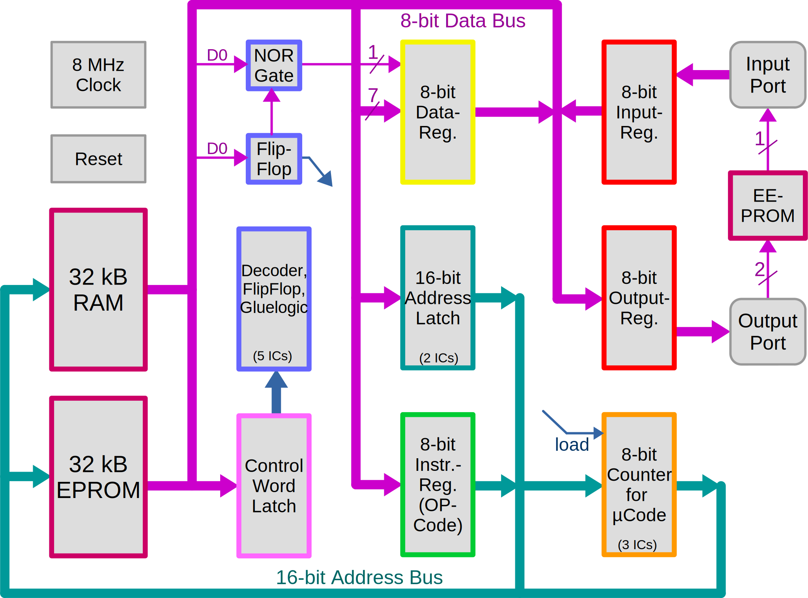
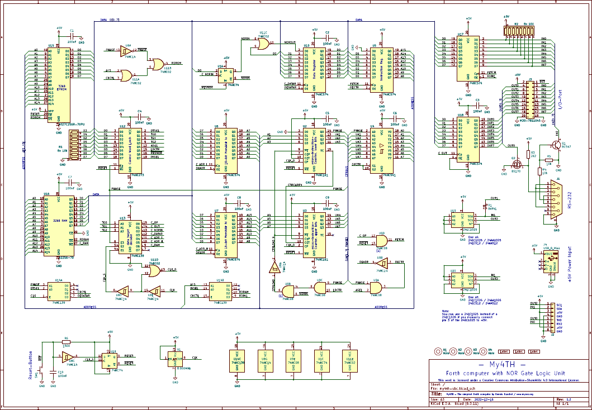

# My4TH - the Homebrew Logic Gate only Computer

Home Page : <http://mynor.org/my4th>

**My4TH** hardware features:
------------------------------------------------

- 8-bit discrete logic CPU
- 8 to 14 MHz clock frequency
- 32 KB ROM, 32 KB RAM
- up to 256 KB EEPROM
- 1-bit NOR gate "ALU"
- 6300 8-bit additions / sec
- 4 memory chips
- 16 CMOS logic chips
- RS-232 with 4800 baud
- I2C-bus for extensions
- 6 digital inputs
- 5 digital outputs
- PCB size 10 x 10 cm

My4TH software features
-----------------------------------------------

- 16-bit Forth system
- Supports the Forth 2012 standard
- Core and core extension words
- Double number word set
- Block word set
- Integrated text editor

My4TH pictures
--------------------------

My4TH Schematics
------------------------------

### CPU blocks in My4TH

### SVG For the Full CPU

### Schematics

#### PDF Schematics

**[PDF](./my4th/schematics_my4th-sbc_v1.2.pdf)**

### Full Design in KiCAD

[Design Archive](./my4th/kicad_my4th-sbc_v1.2.zip)

----
<!-- Footer Begins Here -->
## Links

- [Back to Forth Hub](../../Lang/Forth/README.md)
- [Back to Projects Hub](./README.md)
- [Back to Hardware Hub](../README.md)
- [Back to Root Document](../../README.md)

