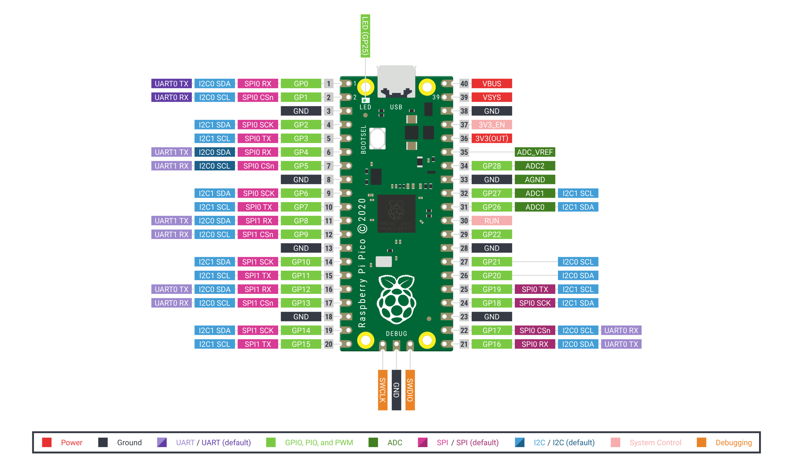
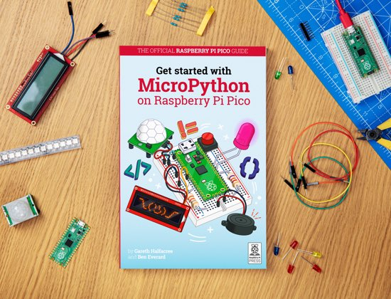

# RP2040 by RaspberryPi Foundation
``
**[Raspberry Pi Pico Board Datasheet](./RP2040/pico-datasheet.pdf)**

[](./RP2040/Pico-R3-A4-Pinout.png)

**[Raspberry Pi Pico Board Pinout PDF](./RP2040/Pico-R3-A4-Pinout.pdf)**

**[Raspberry Pi Pico Board Schematics](./RP2040/RPI-PICO-R3-PUBLIC-SCHEMATIC.pdf)**

- `RP2040` microcontroller chip designed by Raspberry Pi in the United Kingdom
  - Dual-core Arm Cortex M0+ processor, flexible clock running up to 133 MHz
  - 264KB of SRAM, and 2MB of on-board Flash memory
  - 26 × multi-function GPIO pins
  - 2 × SPI, 2 × I2C, 2 × UART, 3 × 12-bit ADC, 16 × controllable PWM channels
  - Accurate clock and timer on-chip
  - 8 × Programmable I/O (PIO) state machines for custom peripheral support
- Castellated module allows soldering direct to carrier boards
- USB 1.1 with device and host support
- Low-power sleep and dormant modes
- Drag-and-drop programming using mass storage over USB
- Temperature sensor
- Accelerated floating-point libraries on-chip

[Raspberry Pi Pico - C/C++ Getting Started Guide](./RP2040/getting-started-with-pico.pdf)

## `RP2040` Microcontroller

**[Datasheet](./RP2040/rp2040-datasheet.pdf)**

- Core – Dual Cortex M0+ cores up to 133 MHz (48MHz default)
- Memory – 264 kB of embedded SRAM in 6 banks
- Peripherals
  - 30 multifunction GPIO
  - 6 dedicated IO for SPI Flash (supporting XIP)
  - Dedicated hardware for commonly used peripherals
  - Programmable IO for extended peripheral support
  - 4 channel ADC with an internal temperature sensor, 0.5 MSa/s, 12-bit conversion
  - USB 1.1 Host/Device
- Debugging – SWD Debug interface
- Package – QFN56 7x7mm

**[Hardware Design Guide lines](./RP2040/hardware-design-with-rp2040.pdf)**

## Official Documentation of `RP2040` Pico board

<https://www.raspberrypi.org/documentation/pico/getting-started/#board-specifications>

<https://projects.raspberrypi.org/en/projects/getting-started-with-the-pico>

## Main SDK Documentation for `RP2040`

<https://raspberrypi.github.io/pico-sdk-doxygen/>

## MicroPython Help for `RP2040`

- Firmware Download: <https://micropython.org/download/rp2-pico/>

    Use `machine.bootloader()` in REPL to initiate bootloader.

- Getting Started with Micropython

    <https://www.raspberrypi.org/documentation/pico/getting-started/#getting-started-with-micropython>

    You can get the U2F file for installing MicroPython on this link.

- MicroPython Book

    

    **[MicroPython Book](./RP2040/RPi_PiPico_Digital_v10.pdf)**

- Faster MicroPython

    <https://www.youtube.com/watch?v=hHec4qL00x0>

- Extending MicroPython: Using C for good

    <https://www.youtube.com/watch?v=437CZBnK8vI>

- Goodbye Print Statements, Hello Debugger!

    <https://www.youtube.com/watch?v=HHrVBKZLolg>

## Blinky Program with Development On a Raspberry Pi for RP2040

<https://www.raspberrypi.org/blog/how-to-blink-an-led-with-raspberry-pi-pico-in-c/>

## What is on your Pico?

If you have forgotten what has been programmed into your **Raspberry Pi Pico**, and the program was built using our **Pico C/C++ SDK**, it will usually have a name and other useful information embedded into the binary. You can use the `Picotool` command line utility to find out these details. Full instructions on how to use `Picotool` to do this are available in our 'getting started' documentation.

<https://github.com/raspberrypi/picotool>

## Debugging using another Raspberry Pi Pico - `picoprobe`

It is possible to use one **Raspberry Pi Pico** to debug another Pico. This is possible via `picoprobe`, an application that allows a Pico to act as a USB → SWD and UART converter. This makes it easy to use a Pico on non-Raspberry Pi platforms such as Windows, Mac, and Linux computers where you don’t have GPIOs to connect directly to your Pico. Full instructions on how to use `Picoprobe` to do this are available in our 'getting started' documentation.

<https://github.com/raspberrypi/picoprobe>

## Resetting Flash memory

Pico's `BOOTSEL` mode lives in read-only memory inside the `RP2040` chip, and can't be overwritten accidentally. No matter what, if you hold down the `BOOTSEL` button when you plug in your Pico, it will appear as a drive onto which you can drag a new `UF2 file`. There is no way to brick the board through software. However, there are some circumstances where you might want to make sure your Flash memory is empty. You can do this by dragging and dropping a special `UF2 binary` onto your Pico when it is in mass storage mode.

<https://github.com/raspberrypi/pico-examples/blob/master/flash/nuke/nuke.c>

## Starting with C/C++ SDK

### 1. Setup SDK

```sh
git clone https://github.com/raspberrypi/pico-sdk.git
cd pico-sdk/
git submodule update --init
cd
```

### 2. Set the SDK Path

Possibly add this to `bashrc`:

```bash
export PICO_SDK_PATH=$HOME/pico-sdk
```

### 3. Get the Examples

```sh
git clone -b master https://github.com/raspberrypi/pico-examples.git
```
= AT for `Picoprobe` using pico

## How to Generate QR Code in RP2040 and Display it on TFT

https://arduino-er.blogspot.com/2021/11/arduino-nano-rp2040-connect-generate-qr.html

## References

1. Intro:

   <https://www.cnx-software.com/2021/01/21/raspberry-pi-pico-board-features-rp2040-dual-core-cortex-m0-mcu/#raspberry-pi-rp2040-microcontroller>

2. Getting Started:

   <https://www.cnx-software.com/2021/01/24/getting-started-with-raspberry-pi-pico-using-micropython-and-c/>

3. Third party Boards:

   <https://www.cnx-software.com/2021/01/21/third-party-raspberry-pi-rp2040-boards-from-arduino-adafruit-sparkfun-and-pimoroni/>

4. Details about PIO:

   <https://www.cnx-software.com/2021/01/27/a-closer-look-at-raspberry-pi-rp2040-programmable-ios-pio/>

----
<!-- Footer Begins Here -->
## Links

- [Back to Hardware Hub](./README.md)
- [Back to Root Document](../README.md)
