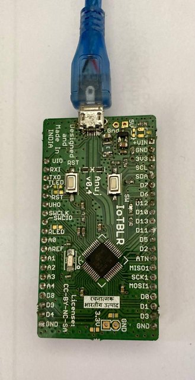

# `SAMD21` the famous M0 that wasn't

## `SAMD21` family pin-out

This document was initially prepared by `Akshay` from `AXD.io` and shared with us for **Fake collaboration**.

Here is the shared [Excel File](./SAMD21/SAMD21-Family-Pinout%20_Shared.xlsx.7z).

## Anuj-Project v0.4

Another board created in **Fake collaboration** and **deceit** with `IoT BLR`.

**[PDF Schematics](./SAMD21/AnujProject-Schematics.pdf)**

## `SAMD21 Xplained Pro` Schematics

**[PDF File](./SAMD21/SAMD21_Xplained_Pro_design_documentation_release_rev2.pdf)**

## [Flashing process](./TOOLS/samd21-flashing.md) for `SAMD21` boards

Here is the [document](./TOOLS/samd21-flashing.md) explaining how to program the boards using multiple programmers.

----
<!-- Footer Begins Here -->
## Links

- [Back to Hardware Hub](./README.md)
- [Back to Root Document](../README.md)
