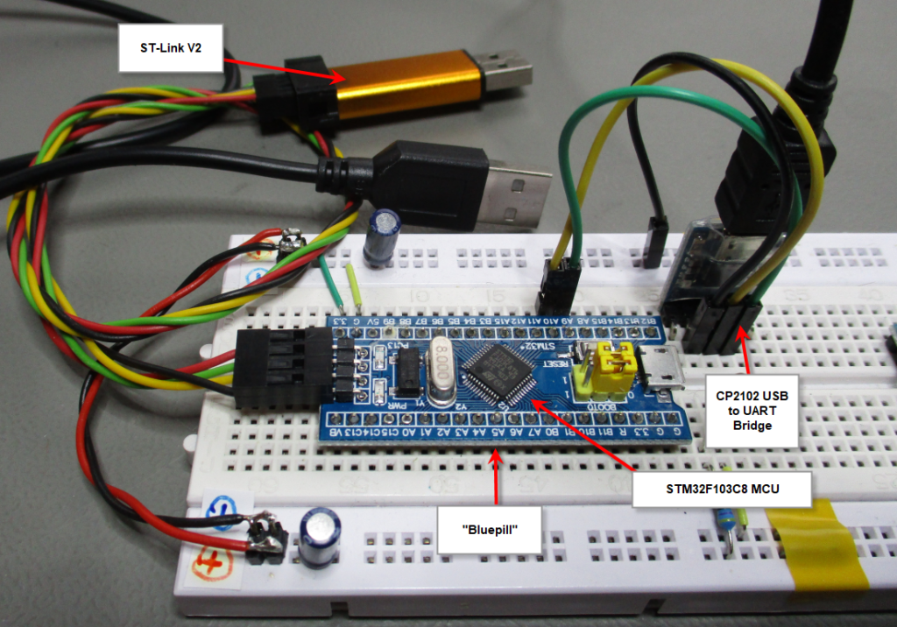
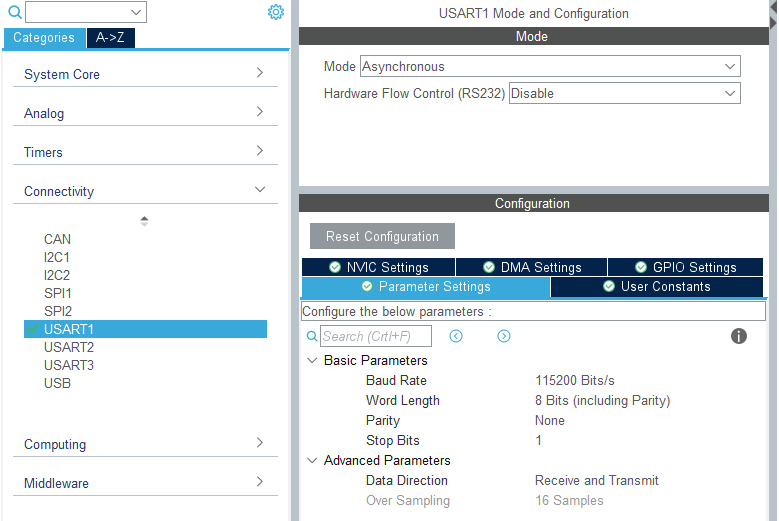
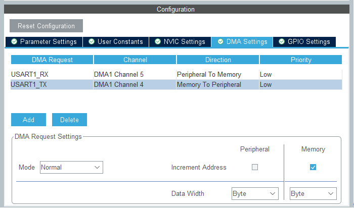
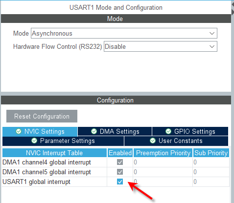
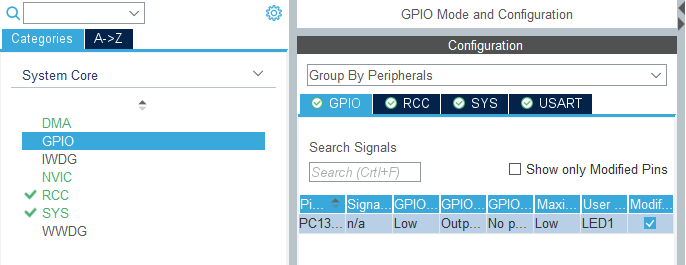
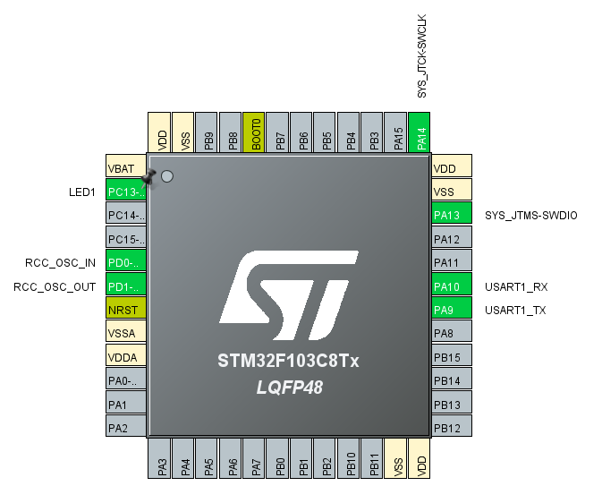

# STM32F103C8 Proper UART with DMA Buffer and Idle Detection

A much better way to receive Data on UART under STM32.

- STM32F103C8 – UART with DMA Buffer and Idle Detection
    - Source : <https://www.bepat.de/2020/12/02/stm32f103c8-uart-with-dma-buffer-and-idle-detection/>
    - The below article is sourced from the same with minor modifications.

## Abstract

In this tutorial we would look at how to:

- [X] use the U(S)ART of an STM32F103C8 MPU
- [X] with a circular DMA buffer for Rx,
- [X] a normal DMA buffer forTx,
- [X] and how to use the Idle Line Interrupt to receive messages of unknown length


<center><sub>STM32F103C8 - UART idle interrupt circular DMA tutorial - Hardware Overview</sub></center>


## Hardware Requirements

Using a “Bluepill” prototyping board, with an `STM32F103C8T6` MCU, **CubeMX** for Hardware Configuration, CubeIDE for editing and the **STM32 HAL** Hardware Abstraction Layer along with the following hardware:

- [X] a breadboard and a few jumper wires
- [X] a ST-Link V2 Clone
- [X] a simple UART to USB Converter, you can get e.g. from ebay

## Useful Links

- [RM0008][1] – STM32F10x User Manual – Chapter 13 (DMA Controller)
- [AN3109][2] – Communication peripheral FIFO emulation with DMA and DMA timeout in **STM32F10x** microcontrollers.


## Cube MX: Peripherals

In this tutorial we need **`PC13`** as GPIO Output and **`USART1`** with DMA-Channels for *RX and TX and global Interrupts enabled*:

#### 1. Enable UART

<center>Enable UART</center>

#### 2. Configure RX DMA Channel to be Circular

<center>Configure DMA for RX</center>

#### 3. Configure TX DMA Channel
This is a normal one and doesn't need the fifo since there is only one process.

<center>Configure TX DMA</center>

#### 4. Enable UART Global Interrupt
This is needed to Receive the **Idle Status** Interrupt apart from RX and TX interrupts.

<center>Enable UART Global Interrupt</center>

#### 5. Setup the GPIO for LED

<center>GPIO For LED</center>

### Final Look at things in the IOC of CubeMX

Please make sure the *RX DMA Channel* is set to `circular` and the *TX DMA Channel* is set to `normal`. Also don't forget to enable the *global interrupt for USART1*.

When you have finished the configuration in CubeMX the MCU pinout should look like this:


<center>MCU Pinout</center>

## Code : `main.c`

All functionality is implemented in the [`main.c`][3] file, except the call for the idle interrupt, which needs to be in the [`stm32f1xx_it.c`][4].

```c
/* Private includes ----------------------------------------------------------*/
/* USER CODE BEGIN Includes */
#include <stdio.h>
#include <string.h>
/* USER CODE END Includes */
```
We need and for `sprintf()` and `strlen()`. The right place for the two include statements is in the *Includes section* of the `main.c`file, between the `USER CODE Includes` tags.

```c
/* Private define ------------------------------------------------------------*/
/* USER CODE BEGIN PD */
#define RX_BFR_SIZE 16
#define TX_BFR_SIZE 64
/* USER CODE END PD */
```
We need two defines, one for the `RX Buffer Size` and another one for the `TX Buffer size`. The `RX Buffer` is intentionally very small, only `16 Bytes`. This might be way to small for a real world application, but for this tutorial it’s just right, as we want to demonstrate the buffer rollovers and if the buffer is small we don’t have to send long strings to show the effect. In a real application you might set the buffer size to a value, that reflects your expectations of the size of the incoming commands
```c
/* Private variables ---------------------------------------------------------*/

/* USER CODE BEGIN PV */
uint8_t RxRollover = 0;
uint8_t RxCounter = 0;
uint16_t RxBfrPos = 0;
uint8_t TxCounter = 0;
char TxBuffer[TX_BFR_SIZE];
uint8_t RxBuffer[RX_BFR_SIZE];
/* USER CODE END PV */
```
We need a couple of global variables. Place them in the `Private variables (user code)` section. We have made all the necessary variables global variables for this example, because it’s easier to track them with the debugger. In a real world application you would most probably not do that this way.
- `RxRollover` is a counter that counts the DMA RxComplete Interrupts
- `RxCounter` counts the incoming transmissions
- `RxBfrPos` is used to store the Buffer Position of the last transmission
- `TxCounter` counts the outgoing transmissions
- `TxBuffer` is the char buffer for outgoing transmissions
- `RxBuffer` is the U(S)ART receiving buffer

```c
/* Private user code ---------------------------------------------------------*/
/* USER CODE BEGIN 0 */
void HAL_UART_RxCpltCallback(UART_HandleTypeDef *huart);
void HAL_UART_TxCpltCallback(UART_HandleTypeDef *huart);
/* USER CODE END 0 */
```
We need the prototypes for the `UART RX Complete Callback` function and the `UART TX Complete Callback` functions. You can copy and paste them from the `stm32f1xx_hal_uart.h` heder file. You can find this file, in the `Drivers –> STM32F1xx_HAL_Driver –> Inc` folder of your **CubeIDE** project. Place them in the `USER CODE 0`section of the `main.c` file.

Both functions are declared as `__weak` in the `stm32f1xx_hal_uart.c` file and will be overwritten by your implementation in the `main.c` file.

Both functions are called by the *DMA handler (automatically)*. So you don’t have to care about where to call them.

```c
int main(void)
{
    ....
    /* USER CODE BEGIN 2 */
    __HAL_UART_ENABLE_IT(&huart1, UART_IT_IDLE);
    HAL_UART_Receive_DMA(&huart1, RxBuffer, RX_BFR_SIZE);
    HAL_GPIO_WritePin(LED1_GPIO_Port, LED1_Pin, GPIO_PIN_SET);
    /* USER CODE END 2 */
    ....
}
```
In the `USER CODE 2` section (within the `int main(void)` function) we have to:

- Enable the **UART Idle Interrupt**
- Start the `UART` in `DMA mode` to receive incoming transmissions
- and turn the `LED1` off by setting the GPIO in a high impedance state

The `LED1` is toggled with each outgoing transmission.

All the *heavy lifting* is done by the two *DMA callback* functions, which are implemented in the `USER CODE 4` section:
```c
/* USER CODE BEGIN 4 */

void HAL_UART_RxCpltCallback(UART_HandleTypeDef *huart) {
	// UART Rx Complete Callback;
	// Rx Complete is called by: DMA (automatically), if it rolls over
	// and when an IDLE Interrupt occurs
	// DMA Interrupt allays occurs BEFORE the idle interrupt can be fired because
	// idle detection needs at least one UART clock to detect the bus is idle. So
	// in the case, that the transmission length is one full buffer length
	// and the start buffer pointer is at 0, it will be also 0 at the end of the
	// transmission. In this case the DMA rollover will increment the RxRollover
	// variable first and len will not be zero.
	if(__HAL_UART_GET_FLAG(huart, UART_FLAG_IDLE)) {									// Check if it is an "Idle Interrupt"
		__HAL_UART_CLEAR_IDLEFLAG(&huart1);												// clear the interrupt
		RxCounter++;																	// increment the Rx Counter

		uint8_t TxSize = 0;
		uint16_t start = RxBfrPos;														// Rx bytes start position (=last buffer position)
		RxBfrPos = RX_BFR_SIZE - (uint16_t)huart->hdmarx->Instance->CNDTR;				// determine actual buffer position
		uint16_t len = RX_BFR_SIZE;														// init len with max. size

		if(RxRollover < 2)  {
			if(RxRollover) {															// rolled over once
				if(RxBfrPos <= start) len = RxBfrPos + RX_BFR_SIZE - start;				// no bytes overwritten
				else len = RX_BFR_SIZE + 1;												// bytes overwritten error
			} else {
				len = RxBfrPos - start;													// no bytes overwritten
			}
		} else {
			len = RX_BFR_SIZE + 2;														// dual rollover error
		}

		if(len && (len <= RX_BFR_SIZE)) {
			// create response message
			sprintf(TxBuffer, "ACK RxC:%d S:%d L:%d RO:%d RXp:%d >>", RxCounter, start, len, RxRollover, RxBfrPos);
			TxSize = strlen(TxBuffer);
			// add received bytes to TxBuffer
			uint8_t i;
			for(i = 0; i < len; i++) *(TxBuffer + TxSize + i) = *(RxBuffer + ((start + i) % RX_BFR_SIZE));
			TxSize += i;
		} else {
			// buffer overflow error:
			sprintf(TxBuffer, "NAK RX BUFFER OVERFLOW ERROR %d\r\n", (len - RX_BFR_SIZE));
			TxSize = strlen(TxBuffer);
		}

		HAL_UART_Transmit_DMA(&huart1, (uint8_t*)TxBuffer, TxSize);						// send a response

		RxRollover = 0;																	// reset the Rollover variable
	} else {
		// no idle flag? --> DMA rollover occurred
		RxRollover++;		// increment Rollover Counter
	}
}

void HAL_UART_TxCpltCallback(UART_HandleTypeDef *huart) {
	// UART Tx Complete Callback;
	TxCounter++;
	HAL_GPIO_TogglePin(LED1_GPIO_Port, LED1_Pin);									// toggle LED1
}

/* USER CODE END 4 */
```

## Code : `stm32f1xx_it.c`

Only a small change to the [`stm32f1xx_it.c`][4] is necessary:

```c
void USART1_IRQHandler(void)
{
  /* USER CODE BEGIN USART1_IRQn 0 */

  /* USER CODE END USART1_IRQn 0 */
  HAL_UART_IRQHandler(&huart1);
  /* USER CODE BEGIN USART1_IRQn 1 */
  	  if(__HAL_UART_GET_FLAG(&huart1, UART_FLAG_IDLE)) {
	  HAL_UART_RxCpltCallback(&huart1);
  	  }

  /* USER CODE END USART1_IRQn 1 */
}
```
When the general **UART IRQHandler** is called, we need to check if it is the **Idle Interrupt**, and if yes, we call the **RxComplete Callback** Function.

## How does it work?

This code in general works as follows:

- There are 3 interrupts:
    1. Rx Complete Interrupt (created by DMA)
    2. Tx Complete Interrupt (also created by DMA)
    3. Idle Line Interrupt, coded manually in the `stm32f1xx_it.c`.

- The Rx Complete Interrupt always occurs, when the Rx Buffer rolls over. To demonstrate this, the Rx buffer size was intentionally made very low (16 bytes) for this example. We use this interrupt to count the `Buffer rollovers`.
    - A Buffer may *only roll over once* before an Idle Interrupt occurs for a valid reception.
    - If it *rolls over two or more times*, we can assume, that some data have been overwritten and the reception is corrupted.

- The incoming data is checked when the idle interrupt occurs. The **start position** of the new incoming data stream is the **last end position**, which *can be calculated* from querying the **DMA `CNDTR`** register (which tells us, how many *bytes are left until the buffer is full / rolls over*). Then *subtracting that value* from *the (known) buffer size*. This information needs to be consistent over the whole runtime of the program, so you have to store it “in a safe place” 😉 – don’t lose it.

- With the information of the *last known buffer* position and the *current buffer position* we can *calculate the length of the received data*. We have to check, if a buffer rollover occurred during the transmission and have to take that into account. See the source code for details.

- The *Tx Complete Interrupt* is used here only to *toggle the LED* of the Bluepill.


  [1]:https://www.st.com/resource/en/reference_manual/cd00171190-stm32f101xx-stm32f102xx-stm32f103xx-stm32f105xx-and-stm32f107xx-advanced-arm-based-32-bit-mcus-stmicroelectronics.pdf
  [2]:https://www.st.com/resource/en/application_note/cd00256689-communication-peripheral-fifo-emulation-with-dma-and-dma-timeout-in-stm32f10x-microcontrollers-stmicroelectronics.pdf
  [3]:./uart-dma-correct/F103C8-UART-idle-interrupt-circular-DMA-main.c
  [4]:./uart-dma-correct/F103C8-UART-idle-interrupt-circular-DMA-stm32f1xx_it.c

----
<!-- Footer Begins Here -->
## Links

- [Back to STM32 Hub](./README.md)
- [Back to Hardware Hub](../README.md)
- [Back to Root Document](../../README.md)
