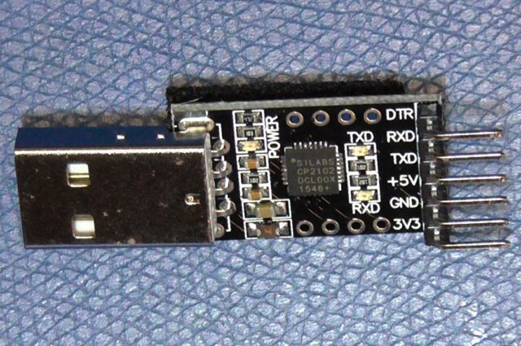
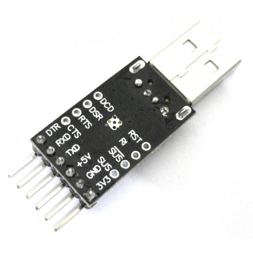

# Silab's `CP2102` based Module Connector

CP2102 Black module Pinout
-----------------------------------------------

### CP2102 Module Top Side

#### Side Pins
| Pin | Function   |
| --- | ---------- |
| 1   | DTR        |
| 2   | RXD        |
| 3   | TXD        |
| 4   | +5V        |
| 5   | GND        |
| 6   | 3V3 (50mA) |

### CP2102 Bottom Side View

#### Top Pins
| Pin      | 1   | 2   | 3   | 4   |
| -------- | --- | --- | --- | --- |
| Function | DCD | DSR | RTS | CTS |

#### Lower Pins

| Pin      | 1   | 2   | 3    | 4   |
| -------- | --- | --- | ---- | --- |
| Function | RST | RI  | nSUS | SUS |

----
<!-- Footer Begins Here -->
## Links

- [Back to `avrdude` Main Article](./avrdude-AVR-programming-utility.md)
- [Back to IDEs, PCB, ECAD and Programming Tools Hub](./README.md)
- [Back to Hardware Hub](../README.md)
- [Back to Root Document](../../README.md)
