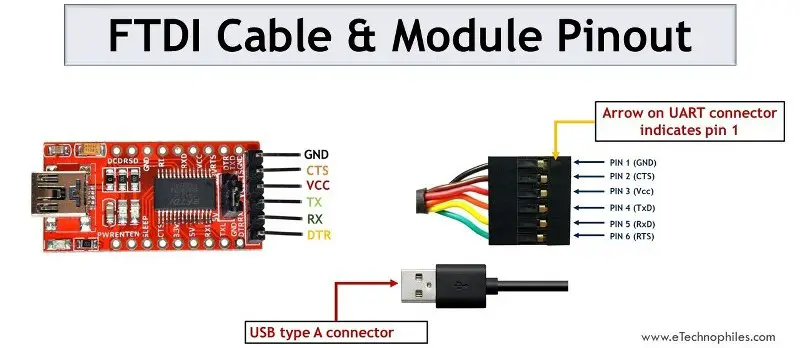

# FTDI Connector

FTDI Based Module and FTDI Cable Pinout

| Color  | Pin        |
| :----: | ---------- |
| Black  | GND        |
| Brown  | CTS        |
|  Red   | VCC (+5V ) |
| Orange | TXD        |
| Yellow | RXD        |
| Green  | RTS        |

----
<!-- Footer Begins Here -->
## Links

- [Back to Main `avrdude` Article](./avrdude-AVR-programming-utility.md)
- [Back to `ATtiny10` Article](../AVR/attiny10.md)
- [Back to `avrdude` FT232 Bit Bang Article](./avrdude-FT232-Bit-Bang-Programmers.md)
- [Back to IDEs, PCB, ECAD and Programming Tools Hub](./README.md)
- [Back to Hardware Hub](../README.md)
- [Back to Root Document](../../README.md)
