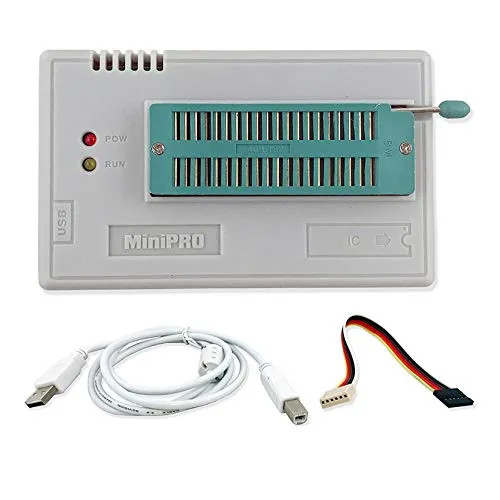

# TL866II Plus Programmer

Home Page : <http://www.xgecu.com/en/TL866_main.html>

References:

- <https://proghq.org/wiki/index.php/TL866>
    - **[PDF Document](./TL866II-Plus/TL866 - Proghq.pdf)**

## TL866II Plus ICSP Connector

## User Guide

[PDF Document](./TL866II-Plus/T56_TL866II USER GUIDE.pdf)

## Instructions on How to Program

[PDF Document](./TL866II-Plus/TL866II_Instructions.pdf)

## Reverse engineered schematics

[PDF Document](./TL866II-Plus/TL866II_Schematic-Reverse-Engg.pdf)

----
<!-- Footer Begins Here -->
## Links

- [Back to IDEs, PCB, ECAD and Programming Tools Hub](./README.md)
- [Back to Hardware Hub](../README.md)
- [Back to Root Document](../../README.md)
