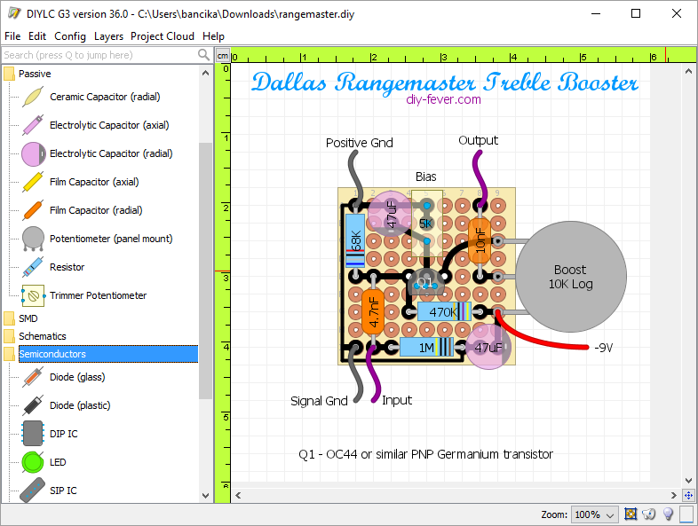

# DIY Layout Creator

> DIY Layout Creator (`DIYLC` in short) is a freeware drawing tool developed with help of the large online community of DIY electronics enthusiasts.

Home Page <https://bancika.github.io/diy-layout-creator/>

Github Sources <https://github.com/bancika/diy-layout-creator>

Its more of a free hand way to document your PCB rather than a design tool.
Its JAVA Based so it works on its own time and freedom.

## User Manual

<https://github.com/bancika/diy-layout-creator/blob/wiki/Manual.md>

## YouTube Tutorials

<https://www.youtube.com/watch?v=mzje3eHqi2E>

----
<!-- Footer Begins Here -->
## Links

- [Back to IDEs, PCB, ECAD and Programming Tools Hub](./README.md)
- [Back to Hardware Hub](../README.md)
- [Back to Root Document](../../README.md)
