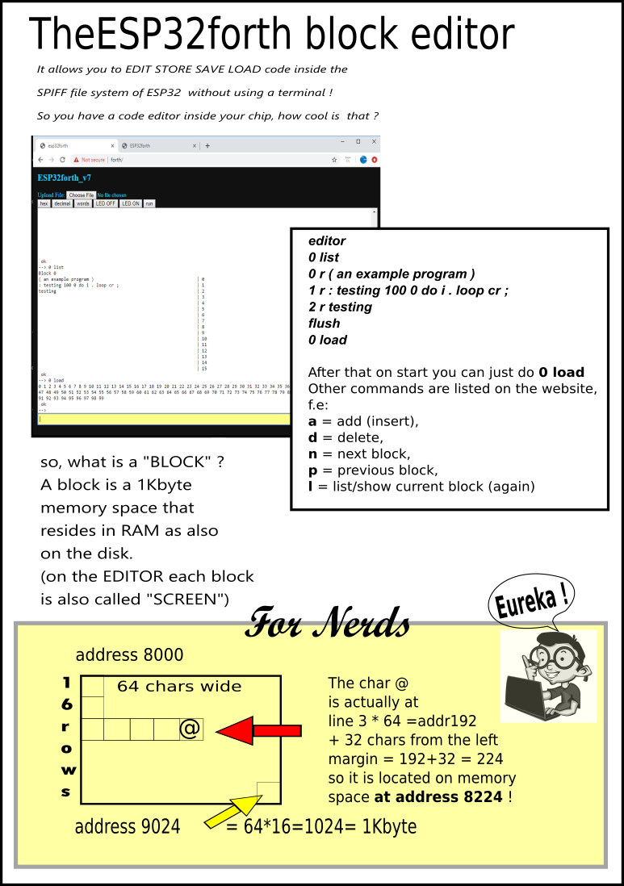
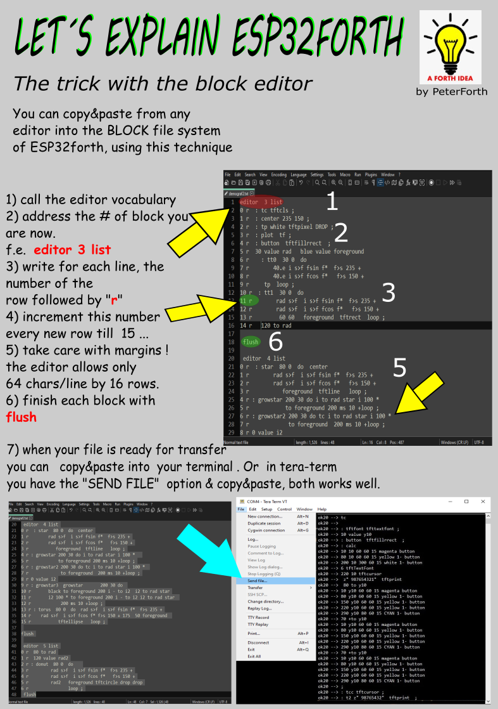

# ESP32Forth Notes

## Useful Snippets

[Program Code](./esp32forth/esp32forth-words.forth.txt)

## Types of Forth Clarification

Here are the Links different Forth implementation in question:

1. Online `uEForth` <https://eforth.appspot.com/web.html>

2. `ESP32Forth` <https://esp32forth.appspot.com/ESP32forth.html>

    Use the latest 7.0.6.19 version on Arduino IDE 2.0.3
    ESP32 framework version 2.0.6

Both **`ESP32Forth`** and **`uEForth`** are maintained by the *same person* - **[Brad Nelson](https://github.com/flagxor)**
but are essentially different *Forth* implementations.

## Important Steps to install ESP32Forth

1. Use the **NodeMCU DOIT DEV Kit V1** hardware
2. Select **`ESP32 Dev Module`** in older *Arduino IDE 1.18...* versions.

Here are the Per Board Settings:

### All Configuration Details are shown in the `ESP32Forth` main Site

<https://esp32forth.appspot.com/ESP32forth.html>

> Make sure to scroll down the page to get to desired hardware.

### ESP32-WROOM Based Hardware

The **NodeMCU DOIT DEV Kit V1** hardware is an example of this type.

```config
Board: ESP32 Dev Module
Partition Scheme: No OTA (2M APP, 2M SPIFFS)
Upload Speed: 921600
CPU Frequency: 240MHz
Flash Frequency: 80MHz
Flash Mode: QIO
Flash Size: 4MB (32Mb)
Core Debug Level: None
PSRAM: Disable
Arduino Runs On: Core 1
Events Run On: Core 1
```

### ESP32-WROVER Based Hardware

```config
Board: ESP32 Dev Module
Partition Scheme: No OTA (2M APP, 2M SPIFFS)
Upload Speed: 921600
CPU Frequency: 240MHz
Flash Frequency: 80MHz
Flash Mode: QIO
Flash Size: 4MB (32Mb)
Core Debug Level: None
PSRAM: Enabled
Arduino Runs On: Core 1
Events Run On: Core
```

## Hardware Notes

1. Should use the **NodeMCU DOIT ESP32 Kit** its easier for Beginners.
2. Do not worry about the `autoexec.fs` initially, it does not concern the Beginners.
3. Practice the use of `BLOCKS` initially they are the Forth way to storage.

    [Use `TeraTerm` and the Text File Technique in section](#block-editor-introduction)

    [Additionally there is an advanced section](#trick-of-the-block-editor-and-teraterm-to-load-forth-code-fast)

## How to Include files with Forth Words

```forth
s" /spiffs/poor-mans-case.fs" included
```

This would include or execute the words in the file `spiffs/poor-mans-case.fs`.

## BLOCK Editor Introduction

[Tips on Block Editor **Original**](https://drive.google.com/file/d/1rRwPlnmUsgytyl3k86NyKq0TYX45_Z14/view?usp=sharing)

??? note "Block Editor for ESP32Forth"
    


## Trick of the Block Editor and `TeraTerm` to Load Forth Code fast

[Trick of the Block Editor and using `TeraTerm` **Original**](https://drive.google.com/file/d/1HxtH9wlTQxx4aIYZ2rL37-J3KKnErSng/view?usp=sharing)

??? note "Trick to Quickly Upload Files using the Block Editor via TeraTerm"
    


----
<!-- Footer Begins Here -->
## Links

- [Back to Forth Hub](../../Lang/Forth/README.md)
- [Back to IDEs, PCB, ECAD and Programming Tools Hub](./README.md)
- [Back to Hardware Hub](../README.md)
- [Back to Root Document](../../README.md)