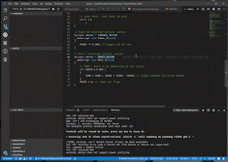
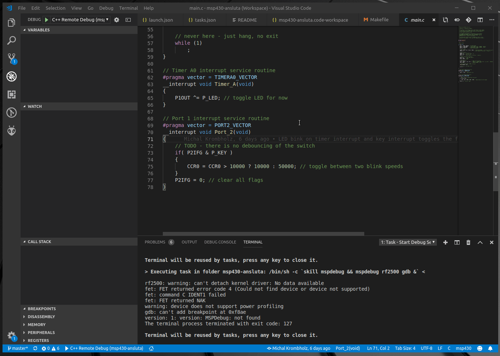

# MSP430 Development using VSCode IDE

This was a surprise to many that `VS Code` can be used for development of  `MSP430` devices.

And a piece of advice don't go the #PlatformIO route.
They only provide `Energia` support which again is a broken way of `MSP430`.

## msp430-gcc DOES NOT WORK for MSP430FR

<https://www.ti.com/tool/MSP430-GCC-OPENSOURCE>

There is a strange installer from TI that install the open-source toolchain.

Best way is to run this program using `fakeroot`.

```sh
sudo pacman -S --needed fakeroot
```

Run the Installer `.run` file:

```sh
fakeroot ./msp430-gcc-full-linux-x64-installer-9.3.1.2.run
```

This should give you GDB, GCC and all other host of tools needed.

**Note:** Don't forget to Map the toolchain to path or set some environment variable to help here.

### For MSP430FR devices use CCS

Yes using `CCS` or **Code Composer Studio** from TI is a better alternative for `MSP430FR` devices.

<https://www.ti.com/tool/CCSTUDIO>

## Makefile

Yes you would need a `Makefile` for this to work:

<https://github.com/go-ut/msp430-ansluta/blob/master/Makefile>

The whole repository has been forked to help keep these in check.

## Example Project

Ikea Ansluta Hacking was done by [michkrom a.k.a brobit](https://github.com/michkrom).

The project has been forked here:
<https://github.com/go-ut/msp430-ansluta>

There are 2 articles that explain how this hacking was done:

- Ikea Ansluta Hacking - target control via TI's lunchpad
    - Link:  <https://minkbot.blogspot.com/2019/01/ikea-ansluta-hacking-system-via-tis.html>
    - **[PDF version](./msp430-development-in-vscode/anything-goes-ikea-ansluta-hacking-target-control-via-t-is-lunchpad.pdf)**
- Ikea Ansluta Hacking - reverse engineering the firmware
    - Link: <https://minkbot.blogspot.com/2019/01/ikea-ansluta-hacking-reverse.html>
    - **[PDF Version](./msp430-development-in-vscode/anything-goes-ikea-ansluta-hacking-reverse-engineering-the-firmware.pdf)**

### CC2500 Arduino Repository

<https://github.com/go-ut/arduino-msp430-compat/tree/master/cc2500>

### References

- Project Repository containing the files : <https://github.com/go-ut/msp430-ansluta>
- <https://minkbot.blogspot.com/2019/03/vscode-and-msp430-debugging.html>
    - **[PDF Article](./msp430-development-in-vscode/anything-goes-vs-code-and-msp-430-debugging.pdf)**
    - Image showing the VS Code operation

        

    - Here is the Playable Image:

        

----
<!-- Footer Begins Here -->
## Links

- [Back to IDEs, PCB, ECAD and Programming Tools Hub](./README.md)
- [Back to Hardware Hub](../README.md)
- [Back to Root Document](../../README.md)
