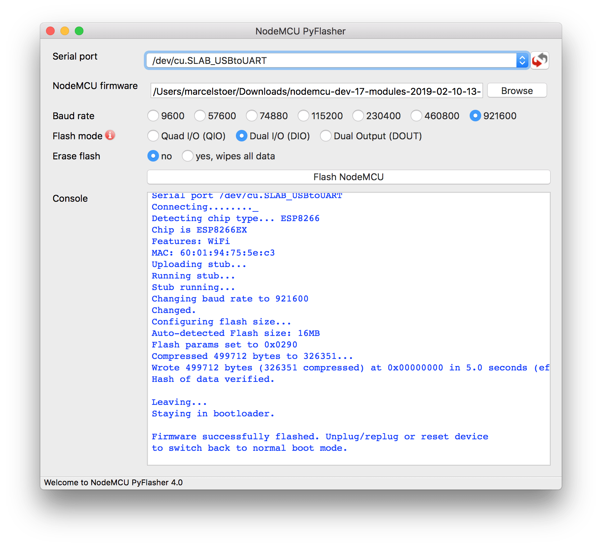

# NodeMCU PyFlasher

Self-contained `NodeMCU` flasher with GUI based on `esptool.py` and `wxPython`.

Its an Easy to use tool to flash **[ESP8266](../ESP8266/README.md)** and **ESP32** with Bin files.

<https://github.com/marcelstoer/nodemcu-pyflasher>

This can be installed under **Manjaro** using a AUR package:

<https://aur.archlinux.org/packages/nodemcu-pyflasher>

One of the most unique feature is that it can **Fully Erase** the Flash.

----
<!-- Footer Begins Here -->
## Links

- [Back to ESP8266 Hub](../ESP8266/README.md)
- [Back to IDEs, PCB, ECAD and Programming Tools Hub](./README.md)
- [Back to Hardware Hub](../README.md)
- [Back to Root Document](../../README.md)
