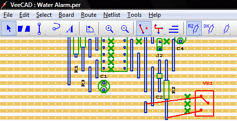
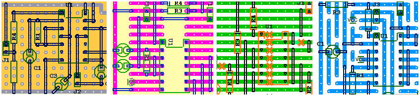

# VeeCAD Vero Board Designer

Home Page <https://veecad.com/index.html>

Its very useful for Prototype designs when full blown PCBs are not needed.

There is a companion tool called **TinyCAD** that can be used to create schematics to generate **NetList** to be imported into *VeeCAD*.

### **TinyCAD** Program Home Page
<https://www.tinycad.net/>

## This also works with [KiCAD](./kicad.md) as a schematics tool !!

Board Variant Support
------------------------------------------

Training Videos
-------------------------

Simple walk through <https://veecad.com/walkthrough.html>

### Basic Operations Playlist

<https://www.youtube.com/watch?v=x_a7Dxq8nbM&list=PLCa04ZJPYZQ9P7fn887LG5DslisrSY_R9>

### Layout Tips

<https://www.youtube.com/watch?v=9OkAp-4FMUU&list=PLCa04ZJPYZQ-ilDiv3G_AowrehqQApJCt>

### CAD Flow with VeeCAD

<https://www.youtube.com/watch?v=_1eMAL59VIc&list=PLCa04ZJPYZQ-eBOGecKHesKhuiDWSIbk5>

----
<!-- Footer Begins Here -->
## Links

- [Back to IDEs, PCB, ECAD and Programming Tools Hub](./README.md)
- [Back to Hardware Hub](../README.md)
- [Back to Root Document](../../README.md)

