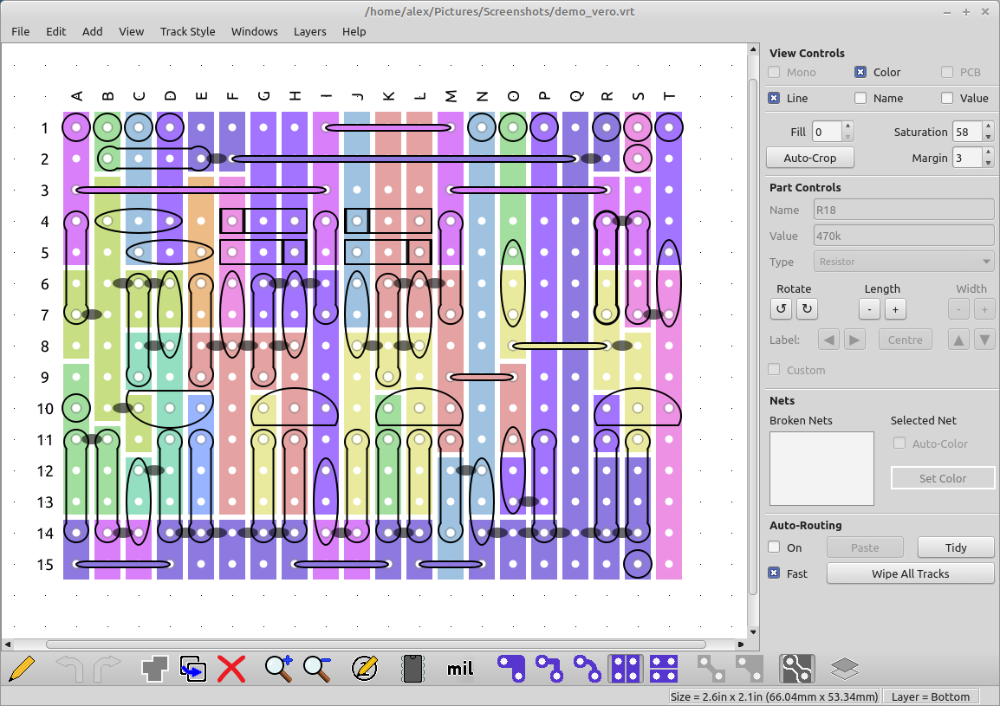
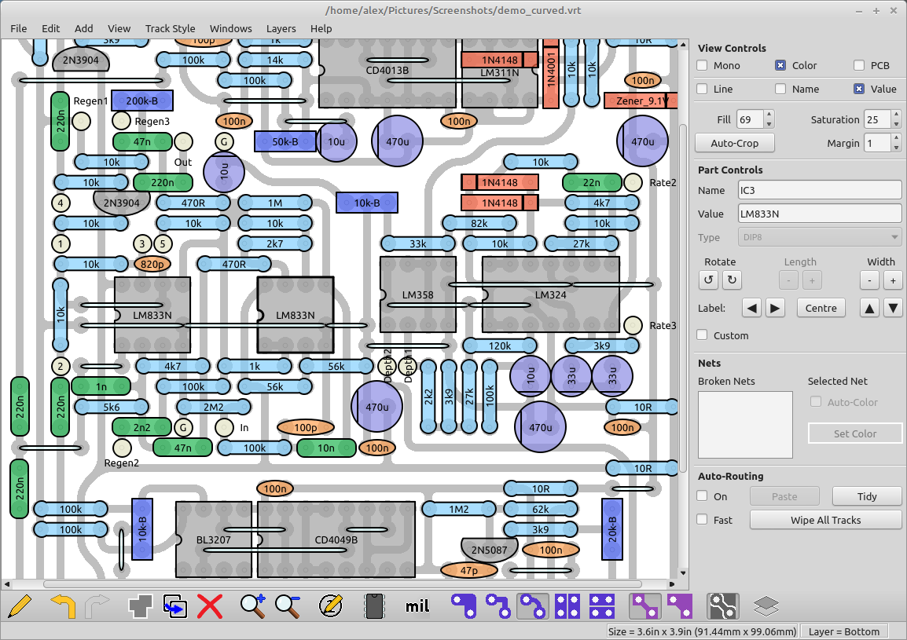
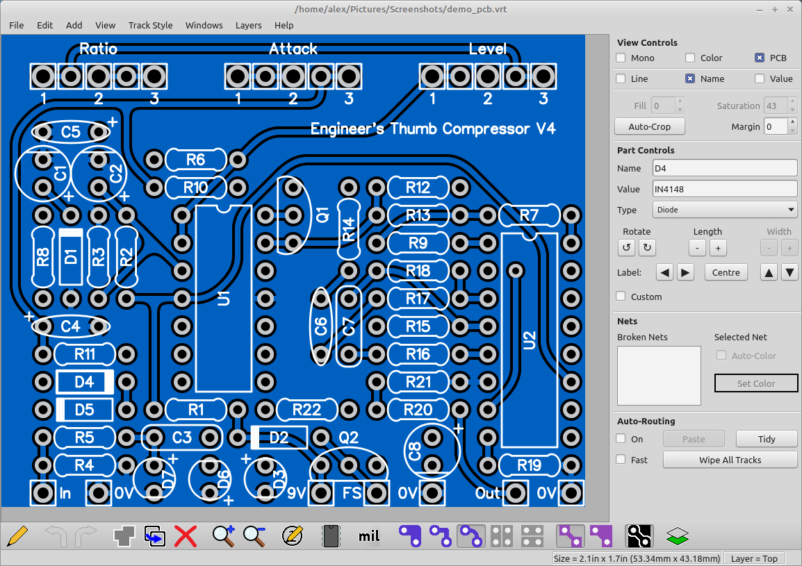
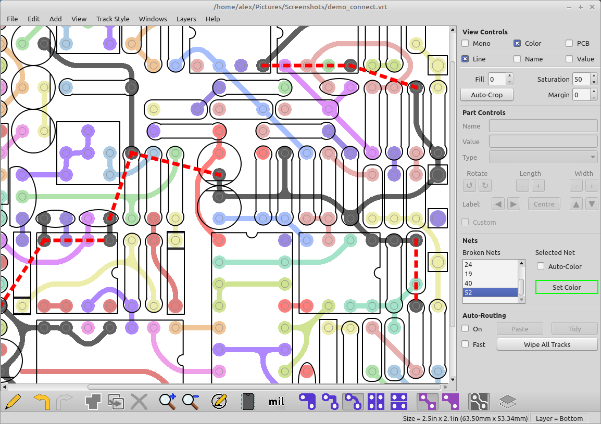

# VeroRoute

Qt based Veroboard, Perfboard, and PCB layout and routing application

Home Page <https://sourceforge.net/projects/veroroute/>

Mainly targets Linux user but has a copy for Windows and Android.

## Supports all types of Layouts

## This also works with [KiCAD](./kicad.md) !!

## This Also works on Android as an APK !

----
<!-- Footer Begins Here -->
## Links

- [Back to IDEs, PCB, ECAD and Programming Tools Hub](./README.md)
- [Back to Hardware Hub](../README.md)
- [Back to Root Document](../../README.md)