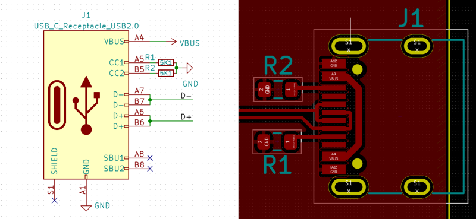

# USB-C Hub

The most common or so, USB Connector and its Shenanigans.

- Search Item for USB-C Pins

    <https://www.youtube.com/results?search_query=USB-C+all+pins+tutorial>

- Very detailed #Video of USB-C and Transactions, PD, CFG Controllers.

    <https://www.youtube.com/watch?v=V1OiQoyjDOo>

- USB-C Certification from LeCroy

    <https://www.youtube.com/watch?v=8J6ktHbilKY>

- Details from SeeedStudio

    <https://www.seeedstudio.com/blog/2020/04/22/why-should-we-use-usb-c-in-our-oshw-design/>

- Schematics of USB-C Arduino Micro board

    <https://cdn.hackaday.io/files/1674547164351936/Schematic.pdf>

## Topics

- **[Find our Device USB Protocol Version](./version-check.md)** - Find out if we are really running a USB3.0 device or not. It also helps to determine the capabilities of a given USB Hub.

## Introduction to USB-C Standard by Microchip

[AN1953 - Application Note](./README/USB-C_Datasheet-1534377.pdf)

## Good USB-C Connector

```
Mfr. No: 105450-0101
Mfr.: Molex
Mouser No: 538-105450-0101
```

Mouser Link: <https://www.mouser.com/ProductDetail/Molex/105450-0101?qs=sGAEpiMZZMvlX3nhDDO4AFIItd6H0sxyxkwmTtw6zvc%3D>

Description: `USB Connectors USB Type C Recep R/A TOPMNT GLD Flash`

Documents:

- [Datasheet](./README/1054500101_IO_CONNECTORS.pdf)
    - [Datasheet another Version](./README/1054500101_IO_CONNECTORS-1315421.pdf)
- [Drawing](./README/1054500101_sd.pdf)
- [Picture of the Top](./README/1054500101_top.jpg)
- [Picture of the Bottom](./README/1054500101_bottom.jpg)

## USB-C Port Connection to deliver Power + USB2.0 Functionality

Reference: <https://hackaday.com/2022/12/06/usb-c-introduction-for-hackers/>

This is also called as **USB-C Power Delivery**.

Figure Showing the USB-C Connection on Device

[](./README/usbc_USB2-Fix.png)

There are 3 Main Details that need to taken Care off:

1. Make sure to connect `5.1 KOhm` Resistors to /Ground/ on each
   of the `CC1` and `CC2` pins
2. Connect Both the `USB-D+` and `USB-D-` pins
3. *Do Not* connect the *`SHIELD`* pins.
4. Use any one of the `VBUS` pins but make sure to connect both
   `GND` pins to system ground.

Do the above steps and you can be sure to have a good USB-C experience.
Else things can get complicated soon.

## Open-source Chip based Power Delivery Project

### P42 USB-C Power Sink Project

[Schematics - SBC-Sink_ver5.sch](./README/P42-USBC-Sink_ver5.pdf)

Github Link: <https://github.com/wolfgangfriedrich/P42-USB-C-PD-Sink>

IT uses the `CYPD3177` Chipset.

----
<!-- Footer Begins Here -->
## Links

- [Back to Hardware Hub](../README.md)
- [Back to Root Document](../../README.md)
