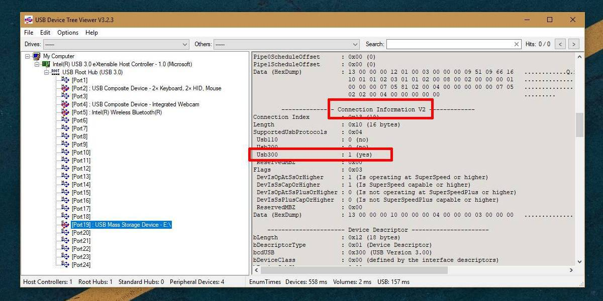
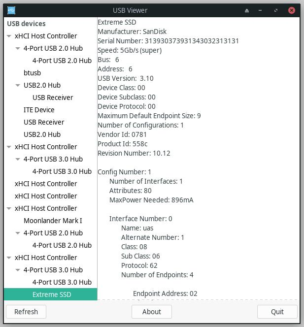

# How to check if the USB device is USB3.0 or USB2.0 ?

Reference Links checking USB 3.0 or USB 2.0 devices:

- For Windows
    - <https://www.addictivetips.com/windows-tips/check-if-device-is-usb-3-0-or-usb-2-0/>
    - <https://docs.microsoft.com/en-us/windows-hardware/drivers/debugger/usbview?redirectedfrom=MSDN>
    - <https://www.uwe-sieber.de/usbtreeview_e.html>
- For Linux
    - <http://www.kroah.com/linux/usb/>
    - <https://archlinux.org/packages/community/x86_64/usbview/>

## Checking in Windows
Download the `USBView` Tool from (Latest x64 edition):
<https://www.uwe-sieber.de/files/UsbTreeView_x64.zip>

In case you would need the x32 edition Visit:
<https://www.uwe-sieber.de/usbtreeview_e.html>

Open the `USBview` tool and select the Device.
On the *information pane* on the right - scroll down to `Connection Information V2` section:



-   If the `USB300` says `: 1 (yes)` then it means it is **USB3.0** connection indeed. And the device is using the **USB3.0** protocol.
-   If the `USB200` says `: 1 (yes)` then it is using **USB2.0** connection and protocol.

## Check for Linux

Install the `USBView` Utility: <https://archlinux.org/packages/community/x86_64/usbview/>
Its a repository package in **Arch Linux**.

Run the Program with `sudo` permissions from the terminal:
```sh
sudo usbview
```
It can also be started from the system menu, the program would automatically ask for `sudo` password.

Here is how the device connected would look like:



As you can see on the *Right side* it shows the `USB Version`. This gives the information about **USB3.0** or **USB2.0** connection.

----
<!-- Footer Begins Here -->
## Links

- [Back to USB-C Hub](./README.md)
- [Back to Hardware Hub](../README.md)
- [Back to Root Document](../../README.md)
