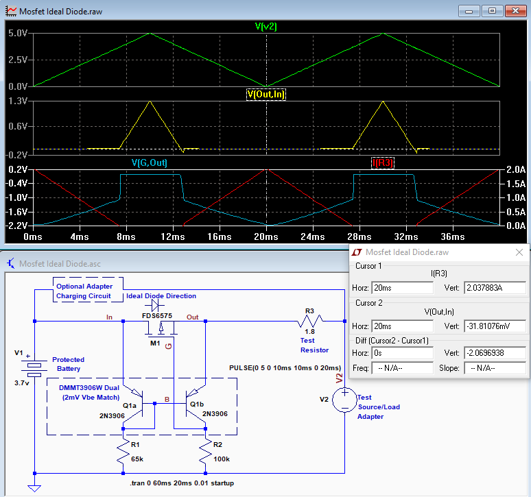
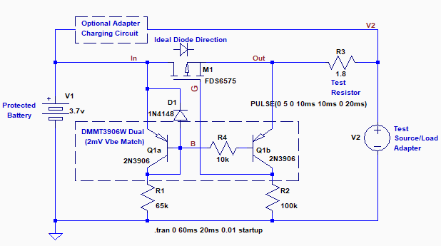
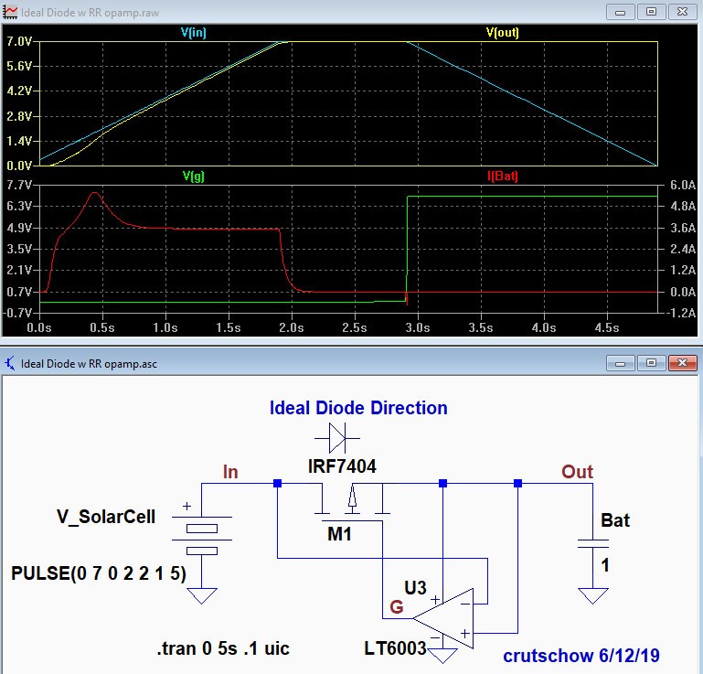

# MOSFET Ideal Diode

## Simple & Inexpensive Ideal-Diode MOSFET Circuits 2017-09-19

<https://www.electro-tech-online.com/articles/simple-inexpensive-ideal-diode-mosfet-circuits.817/>

## Details

Got Across this Its very interesting.

The components are inexpensive, consisting of a P-MOSFET (for use in the positive rail) with a dual PNP transistor and two resistors.

Q1 and Q2 form a current mirror circuit that act as a differential amplifier which responds to the voltage drop across the MOSFET. The indicated values of R1 and R2 cause Q2 to be on and thus M1 off (Vgs near 0V), when there is no voltage difference between the drain and source of M1.
The mirror has a gain of ≈130 from the two emitter's voltage difference input to Q2's collector voltage change output.

In the forward direction (output voltage lower than the battery voltage) the current mirror becomes unbalanced due to the difference in emitter voltages, causing Q2 to turn off, which puts the P-MOSFET gate near ground potential, turning it on. This allows current to flow from the battery to the output (left to right) with a low drop.
(MOSFETs conduct equally well in either direction when on.)

When the output voltage becomes equal to or higher than the battery voltage this voltage reversal across the MOSFET unbalances the current mirror in the opposite direction, causing Q2 to turn on.
This causes the MOSFET gate voltage to rise, reducing `Vgs` `{ V(G,Out) in plot }`, which turns it off and prevents reverse current flow.

This can be seen in the simulation, as the current only goes out of the V1 battery when the V2 output voltage is lower than the battery voltage, and doesn't flow in the reverse direction when the output voltage is greater than the battery voltage.
The maximum voltage drop, when the battery is providing 2A current is ≈32mV with the MOSFET shown, demonstrating the near ideal diode operation.

The current mirror operation is fairly sensitive to any offset between the two transistor base-emitter voltages, which could possibly allow some current conduction in the reverse direction. It is thus recommended that a matched transistor pair be used, such as the `DMMT3906W` shown on the schematic (basically two 2N3906's in one package), which have their Vbe matched to within 2mV max and are thermally connected together.
(The simulation was done with `2N3906`'s which are perfectly matched in the simulation, unlike real life.)
The **`DMMT3906W`** pair are quite inexpensive, selling for U$0.37 [here](http://www.mouser.com/ProductDetail/Diodes-Incorporated/DMMT3906W-7-F/?qs=gU%252bgVA%252b5zAAufMs218tfkw%3D%3D), for example.

One of these circuits can be used at the output of each battery for however many are in parallel.

If it is desired to charge the battery, such as from an alternate power adapter voltage at the output, that can be done by paralleling the charging circuit (which may be just a resistor for some battery types) with the ideal diode circuit.
That way the battery can apply power with no voltage drop without the adapter, but the adapter can provide the load current and the desired charge current to the battery when connected.

-------------------------------

The circuit can also be used for momentary brownout protection of circuits, such as from a transient motor load on a supply also powering the electronics.
Typically this is done with a diode and capacitor to the electronics, but that can drop the normal operating voltage by a forward diode drop which may be unacceptable.
The ideal-diode allows the circuit to operate at full voltage, but still blocks the transient, allowing the capacitor to momentarily supply the electronics power during the supply voltage dip.

-------------------------------

**Note** that there is a reverse voltage limit of the circuit due to the 5V maximum reverse Vbe that can be applied to the BJTs.
This should not affect the discussed applications for this circuit which normally would not have the output be more than 5V above the battery/source voltage.
If a reverse voltage block greater than 5V is needed, then the circuit below can be used. It adds a resistor and diode to protect transistor Q1a from excess Vbe reverse bias.
It does add 10k of leakage in reverse bias, but that likely is not a problem for most applications.

### Op Amp Mosfet Circuit

As an alternate design, here's an ideal diode circuit that uses a rail-rail op amp to control the P-MOSFET.
It has an advantage at higher voltages (over 5V) over the above circuit, in that there is no leakage in the reverse direction,(through R4).
The opamp monitors the voltage across the MOSFET source and drain, and when it reverses, indicating current is trying to reverse direction, its output goes high, reducing the MOSFET Vgs to zero, and shutting it off.

The LTspice simulation is shown for a solar panel application where it allows a low forward drop when charging the battery (simulated here by a 1F capacitor), but blocks any battery discharge current when the light falls, and the panel voltage drops.
The charging voltage (yellow trace) is very close to the panel voltage (blue trace) with the difference due to the MOSFET on-resistance. During that time the op amp output to the the MOSFET gate is at ground potential, turning the MOSFET fully on.
When the battery is charged and the panel voltage starts to drop (at 3 seconds), the op amp output rises to the battery voltage and turns the MOSFET off (Vgs=0), blocking any return current to the panel (red trace), and the battery stays charged (Vout).

If the battery voltage is <10V, the the MOSFET needs to be a logic level type (Vgs threshold <2V max.).

The op amp must be an input/output rail-to-rail type.
The one shown is a relatively inexpensive, rail-rail, micropower (1μA) op amp, so draws negligible power from the circuit, and has an 18V maximum rating.

----
<!-- Footer Begins Here -->
## Links

- [Back to Useful Circuits and Solutions Hub](./README.md)
- [Back to Hardware Hub](../README.md)
- [Back to Root Document](../../README.md)
