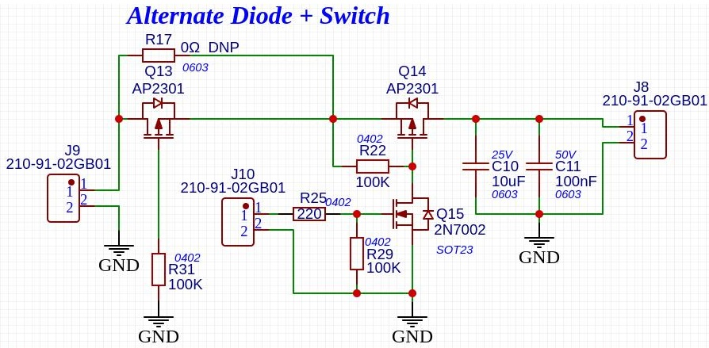

# MOSFET Polarity Protection and Power Control Circuit

Found and tested a complete MOSFET based low power System power control options that works.
Here is the circuit:

- Here `Q13` is the Polarity protection
- `Q14` and `Q15` forms the switch that can be controlled.

Exd `DCVal1 V1.0 - SPRNK project`

----
<!-- Footer Begins Here -->
## Links

- [Back to Useful Circuits and Solutions Hub](./README.md)
- [Back to Hardware Hub](../README.md)
- [Back to Root Document](../../README.md)
