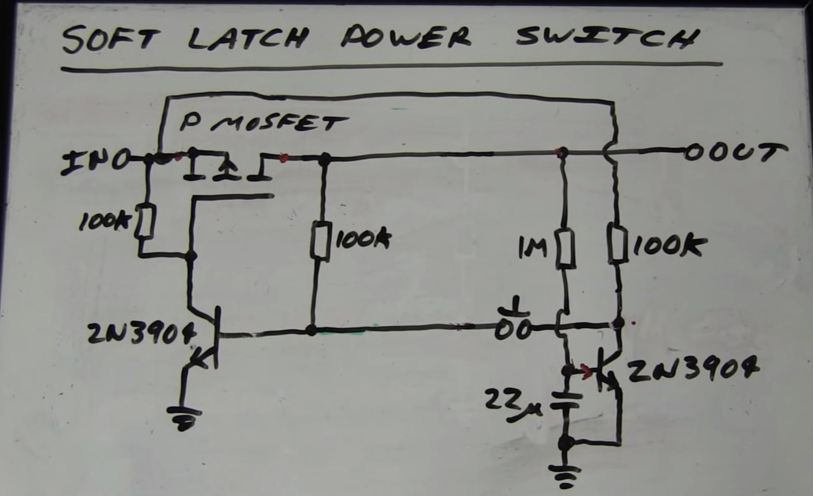
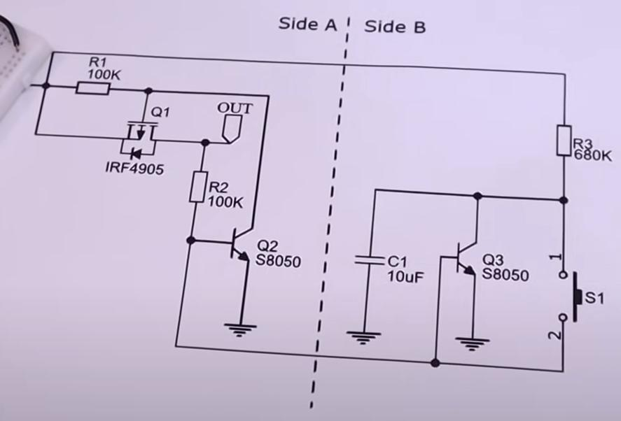
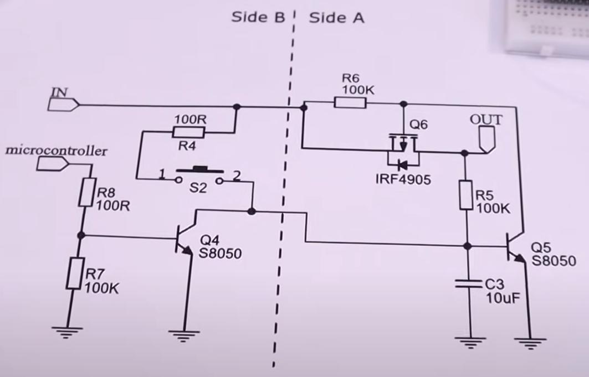
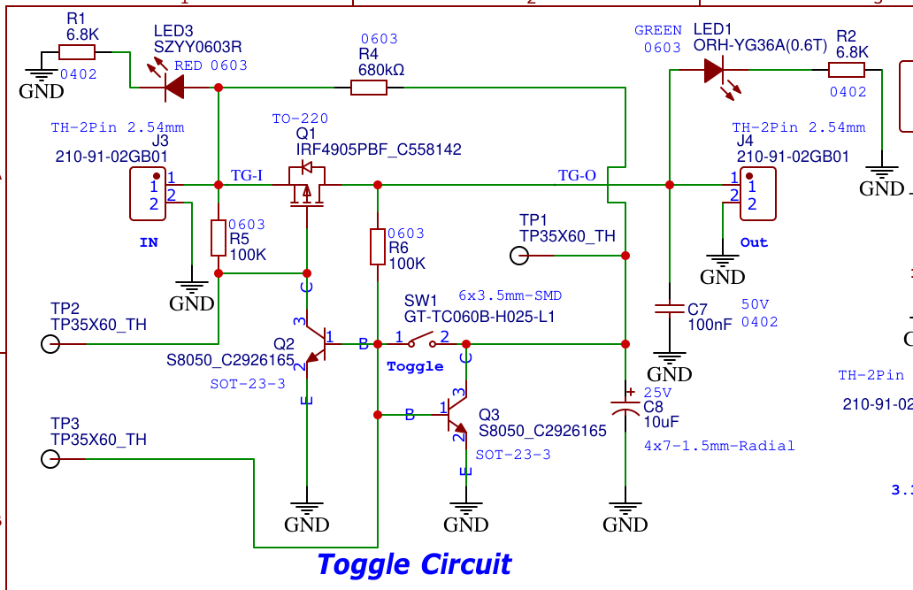
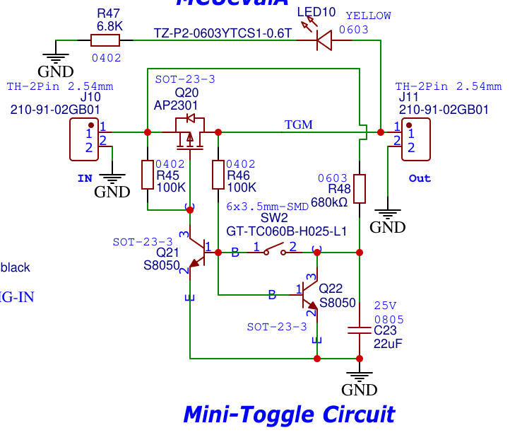

# MOSFET Soft-Latching Power Switches

!!! note "**Bonus Low-Power**"
    **These are also LOW POWER circuits !!**

## EEVBlog's : World's Simplest Soft Latching Power Switch Circuit

This was part of a Video Posted long time back.

> EEVblog #262 - World's Simplest Soft Latching Power Switch Circuit
> <https://www.youtube.com/watch?v=Foc9R0dC2iI>

## Single MOSFET 2 BJT Solutions from Electronoobs

This was originally from a **video**:

> Latch Circuit - Wake up + 0 Power Consumption (useful circuit) by Electronoobs
> <https://www.youtube.com/watch?v=Er8fSoeaZD0>

He also provides a circuit that can be controlled from the MCU.

Here is a Link to his website: <https://electronoobs.com/eng_circuitos_tut60.php>

## High Power Output version from TestBoostA Board

## Low Power Output version from TestBoostA Board

----
<!-- Footer Begins Here -->
## Links

- [Back to Useful Circuits and Solutions Hub](./README.md)
- [Back to Hardware Hub](../README.md)
- [Back to Root Document](../../README.md)
