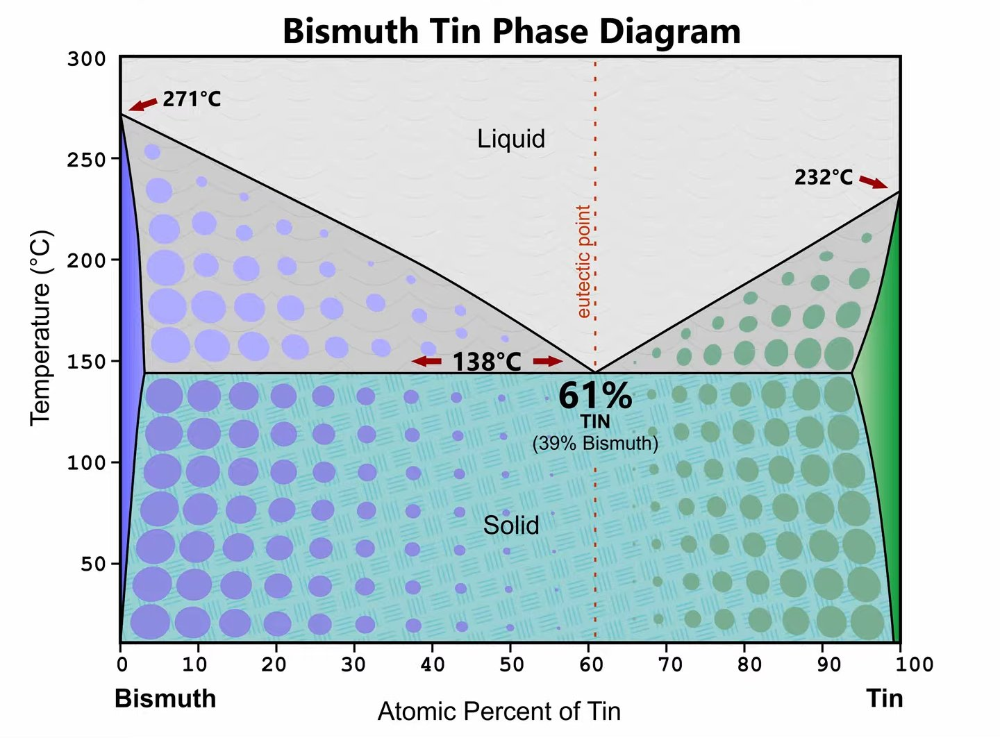

# Desoldering of SMD Components using Bismuth

## Intro and Reference

<https://hackaday.com/2021/06/02/make-your-desoldering-easier-by-minding-your-own-bismuth/>

Make Your Desoldering Easier By Minding Your Own Bismuth

Any video that starts with a phase diagram has instantly earned our attention. Admittedly, we have a pretty low bar for that kind of stuff, but eye candy aside, Robin Debreuil's (quick outline of his technique for desoldering with the help of bismuth <https://www.youtube.com/watch?v=prw8smYuAIc> is worth watching.

His Video <https://www.youtube.com/watch?v=prw8smYuAIc>

## Phase Plot For Alloy between Bismuth and Tin

## Details

Aside from its use in those pink gloopy solutions one takes for an upset stomach, bismuth has a lot of commercial applications. For the purposes of desoldering, though, its tendency to lower the melting point of tin and tin alloys like solder is what makes it a valuable addition to the toolkit. {Robin} starts with a demonstration of just how far a little bismuth depresses the melting point of tin solder &#x2014; to about 135°. That allows plenty of time to work, and freeing leads from pads becomes a snap. He demonstrates this with some large QFP chips, which practically jump off the board. He also demonstrates a neat technique for cleaning the bismuth-tin mix off the leads, using a length of desoldering braid clamped at an angle to the vertical with some helping-hands clips. The braid wicks the bismuth-tin mix away from the leads along one side of the chip, while gravity pulls it down the braid to pool safely on the bench. Pretty slick.

Lest leaded solder fans fret, {Robin} ensures us this works well for lead-tin solder too. You won't have to worry about breaking the bank, either; bismuth is pretty cheap and easily sourced. And as a bonus, it's pretty non-toxic, at least as far as heavy metals go. But alas &#x2014; it apparently doesn't machine very well.

----
<!-- Footer Begins Here -->
## Links

- [Back to Useful Circuits and Solutions Hub](./README.md)
- [Back to Hardware Hub](../README.md)
- [Back to Root Document](../../README.md)
