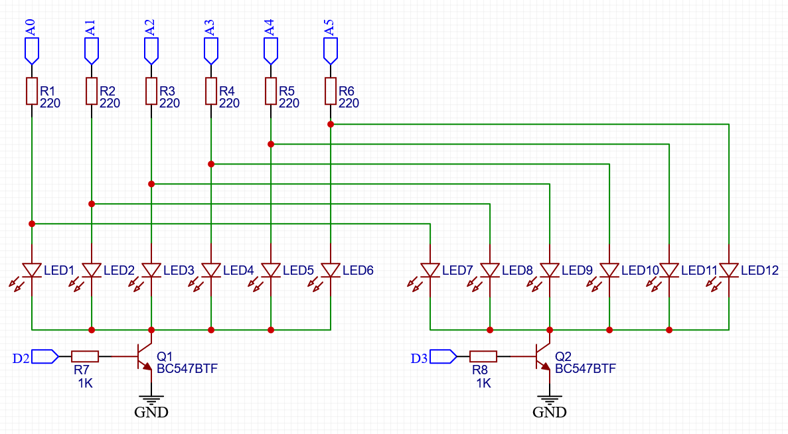
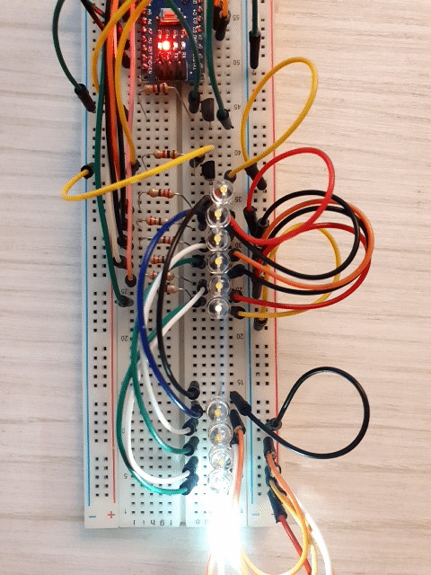
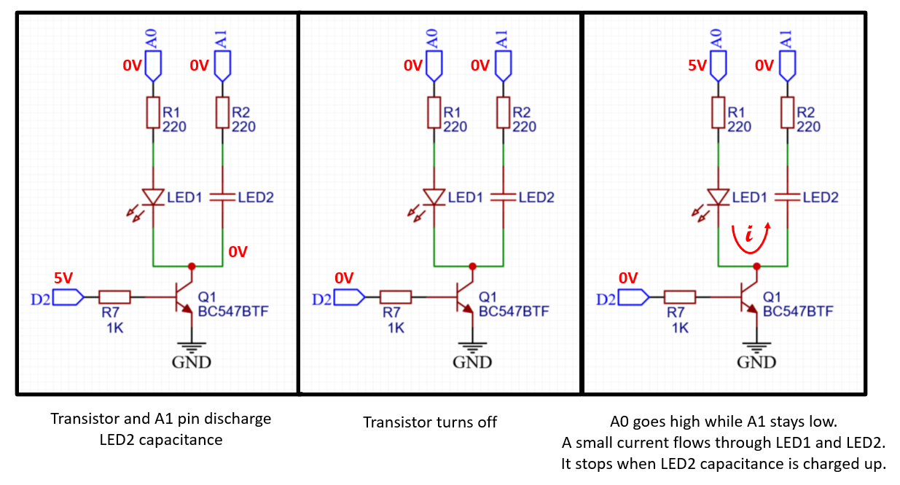
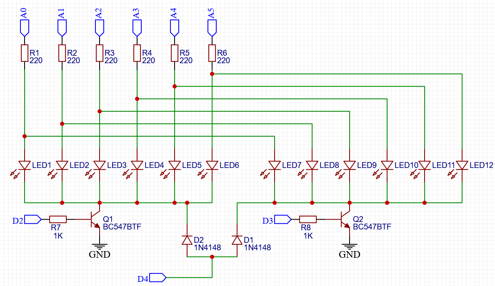

# Capacitive Effects and Ghosting in Modern High Efficiency LEDs

**Reference:** https://hackaday.io/project/182520-deghosting-multiplexed-leds/details

Here is a **PDF Version [deghosting-multiplexed-le-ds.pdf](./capacitive-effects-and-ghosting-LEDs/deghosting-multiplexed-le-ds.pdf)**

Blinking LEDs should be a simple task. At least that's what we initially thought so. Even multiplexing should have been easy.
Just add Pull down transistors.

But not quite. That was the case when we found this article.

Let's first look at the circuit in question.

Fig. Simple schematics of 6 LED x 2 multiplex

Assume that the *Port labels* are actually an **Arduino UNO** pins.

## What is Ghosting ?

Now if **`A0`** is **HIGH** and **`D2`** is **HIGH** The **`LED2`** should light up.
And if **`D2`** is **LOW** then what ever the state of **`A0`** the **`LED2`** should be Off, Right ?
Yes but why then does the **LED7** show a faint glow.

Fig. Animation Showing the Faint Glow

This **Faint Glow** is called the **Ghosting Effect**.

## Why Does this happens ?

Well ***Diodes also have Capacitance !!!***

Yes true.

Lets look at another picture on whats going on:

Fig. Capacitance causing LED Glow

Due to the presence of empty series capacitors in LEDs , the charging action happens.
Additionally there is leakage via series resistance through the LEDs.
Hence the current through and lights up the one thats forward biased.

## What can we do to prevent this ?

- Well using higher series resistances can be a starting point.
- Using some way to pre-charge the Capacitors can be another option.

Here is one such solution:

Fig. Pre-Charging configuration for the LED Banks

Evert tune a bank turns off the LEDs can be pre-charged using **`D4`**. We are increasing the pin count. But if thats what is takes to remove ghosting we might need to do that.
Additionally one Needs to turn OFF all the LEDs to perform the *pre-charging operation*.
After all the LEDs or their internal series capacitors are charged up there is no easy path left. The leakage via series resistance might not be enough to light up.

Problem solved. No more ghosting.

----
<!-- Footer Begins Here -->
## Links

- [Back to Useful Circuits and Solutions Hub](./README.md)
- [Back to Hardware Hub](../README.md)
- [Back to Root Document](../../README.md)
