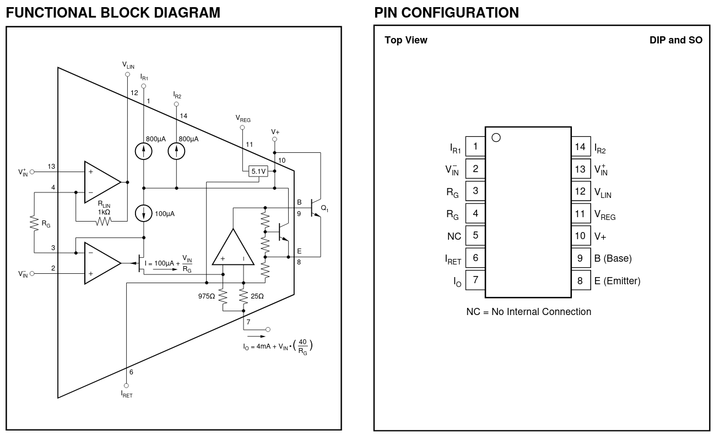
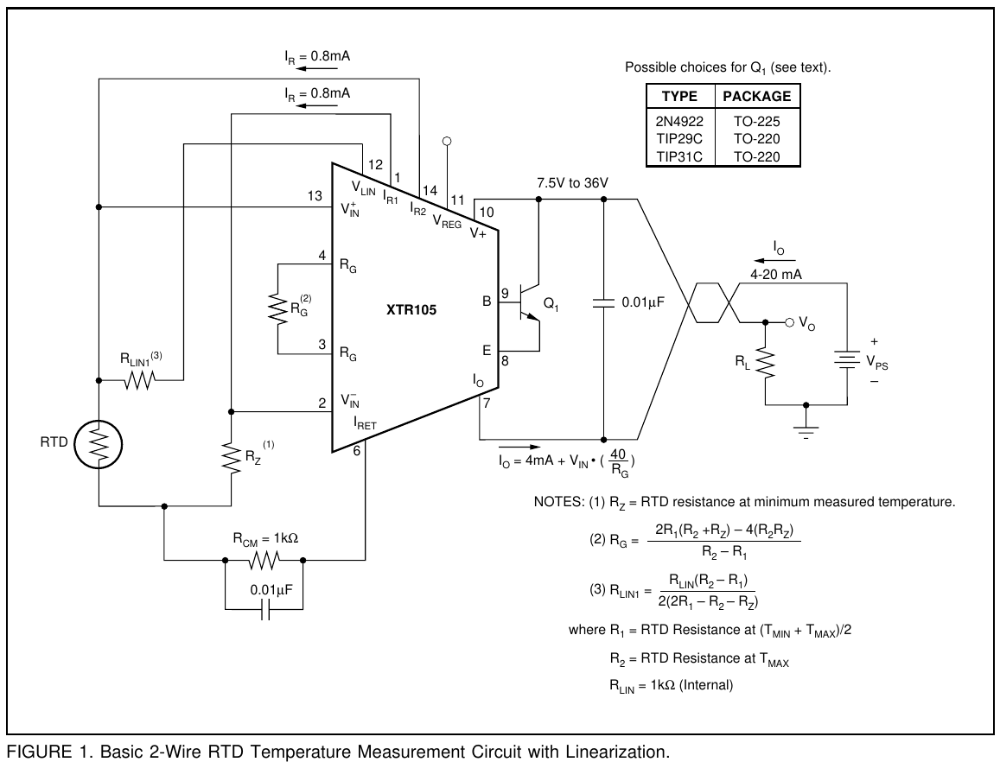
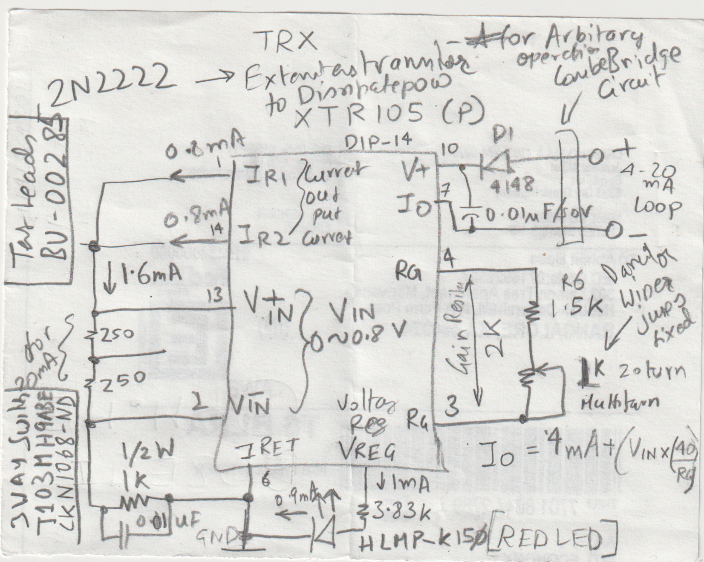

# Industrial 4-20mA Circuits

Video for Circuit:
<https://www.youtube.com/watch?v=68JOFEr4AWg>

## XTR105 4-20mA Transmitter

[Datasheet](./industrial-4-20mA-Circuits/xtr105.pdf)

### Typical Circuit

## Other Notes

## Traditional Receiver - RCV420

Needs +/-12V or +/-15V Supplies !!!

[Datasheet](./industrial-4-20mA-Circuits/rcv420.pdf)

## Isolated Sigma-Detal ADC - AMC1303E2510

±250 mV-Input, Reinforced Isolated Modulator with 10 MHz Internal Clock and Manchester-Encoded CMOS

[Datasheet](./industrial-4-20mA-Circuits/amc1303e2510.pdf)

## XTR117 - Small Voltage Oriented Transmitter

[Datasheet](./industrial-4-20mA-Circuits/xtr117.pdf)

----
<!-- Footer Begins Here -->
## Links

- [Back to Useful Circuits and Solutions Hub](./README.md)
- [Back to Hardware Hub](../README.md)
- [Back to Root Document](../../README.md)
