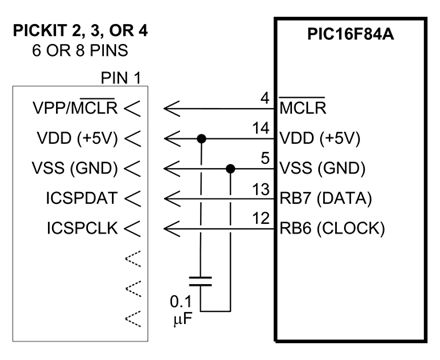
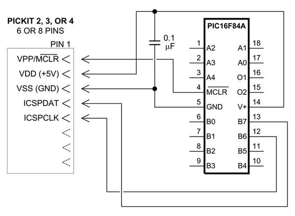

# PIC16F84A The Legendary PIC Microcontroller

## Datasheet

**[PDF PIC16F84A-Last](./pic16f84a/PIC16F84A-Last.pdf)**

## Programming

<http://www.covingtoninnovations.com/mc/alcor/PICkit-PIC16F84A/>

## Table for Pin Connection:

| Pin Name | Pin No | Connection | TL866II Pin |
| :------: | :----: | :--------: | :---------: |
|  #MCLR   |   4    |   #MCLR    |      1      |
|   VCC    |   14   |     V+     |      2      |
|   GND    |   5    |    GND     |      3      |
|   RB7    |   13   |    PGD     |      4      |
|   RB6    |   12   |    PGC     |      5      |

## TL866II - ICSP connector

----
<!-- Footer Begins Here -->
## Links

- [Back to Hardware Hub](./README.md)
- [Back to Root Document](../README.md)
