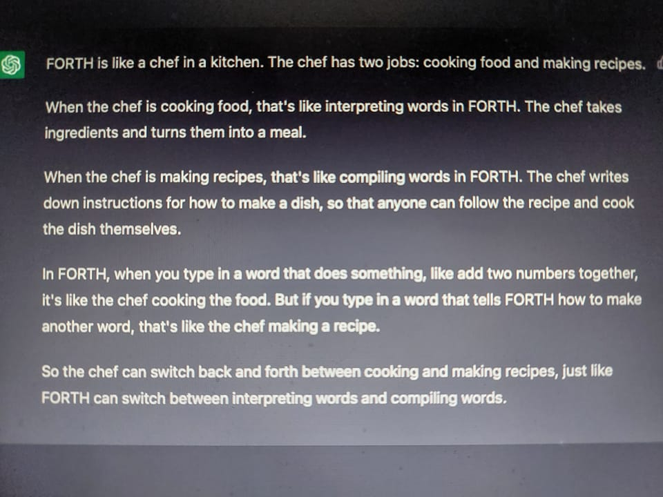

# ChatGPT Explains Forth with Analogies

## Inspiration

It's a FB post by `Jimmy Söderman Sers` where he asks *ChatGPT* about Forth:

> So I asked him to explain FORTH to me what do you think? I kind of like it actually.
>
> If you take into consideration that you might want to make a topping for your cake, that would be one additional recipt and it fits the analogy perfectly if you ask me. You cook and you <cook> while you cook.

## "explain FORTH to me"

> FORTH is a stack-based programming language that was first developed in the late 1960s. It is known for its small size and simple, minimalist syntax, which makes it easy to implement on a wide range of computing devices. The core of FORTH is a set of words that perform simple operations, such as arithmetic, data manipulation, and control flow. Programs are constructed by combining these words in a linear sequence, with the results of each operation being pushed onto a stack. The stack-based architecture of FORTH makes it particularly well-suited for embedded systems, where memory and processing resources are limited. Despite its age, FORTH is still in use today for a variety of applications, including control systems, microcontrollers, and other specialized embedded devices.
`2023-02-08 07:28.23-752`

## "explain FORTH to me like a cook"

> Think of FORTH as a recipe for making a dish. Each "word" in FORTH is like an ingredient, with a specific purpose and role in the final outcome. Just like how ingredients are combined in a specific order to make a dish, words in FORTH are combined in a specific order to form a program. The "stack" in FORTH is like the mixing bowl where ingredients are combined and transformed. You can think of pushing values onto the stack as adding ingredients to the bowl, and popping values off the stack as removing ingredients from the bowl. Finally, the finished program is the completed dish, ready to be served to the computer. Each step of the recipe must be followed in the right order, just like each word in a FORTH program must be executed in the right order, to ensure the final result is correct and tasty, just like the final output of a FORTH program must be correct.
`2023-02-08 07:28.35-638`

## "explain FORTH with cooking"

> FORTH can be explained using a cooking analogy as follows:
> - The "words" in FORTH are like recipes. Just as a recipe tells you how to make a dish, a word in FORTH tells the computer what to do.
> - The "stack" in FORTH is like the collection of ingredients that you are using to make your dish. You can think of pushing values onto the stack as putting ingredients into a bowl, and popping values off the stack as taking ingredients out of the bowl.
> - The "program" in FORTH is like a menu. Just as a menu lists the dishes that will be served, a FORTH program lists the words that will be executed.
> - Executing a word in FORTH is like following a recipe. Just as you would follow the steps in a recipe to make a dish, the computer follows the instructions in a word to perform an operation.
>
> By combining words in a specific order, you can create a program in FORTH, just like by combining recipes, you can create a menu. And just as a menu will produce a meal, a FORTH program will produce output.
`2023-02-08 07:29.21-503`

----
<!-- Footer Begins Here -->
## Links

- [Back to Forth Hub](./README.md)
- [Back to Computer Programming Languages Hub](../README.md)
- [Back to Root Document](../../README.md)
