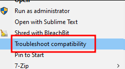
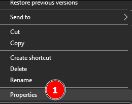
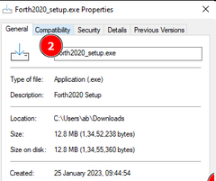
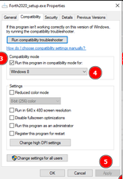
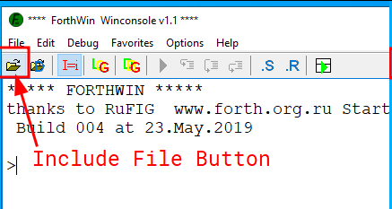

# ForthWin Insights

## Foreword

Thanks to the [Forth2020](https://www.forth2020.org/) group and [Peter Forth](https://github.com/PeterForth) personally, for such a warm welcome. Thank you Peter Forth for answering our email.

## Source Link

Here is the Link to download the **`ForthWin`** as `Forth2020_setup.exe` file from *Github*:

<https://github.com/PeterForth/ForthWin-Download/raw/master/Forth2020_setup.exe>

## My Words

[Program Code](./forthwin/ForthWin-File.forth.txt)

## What is the Difference between `ForthWin` and `Win32Forth` ?

*Are Win32Forth and ForthWin the same ?*

I got `ForthWin` from Peter Forth repository :

<https://github.com/PeterForth/ForthWin-Download>

But searching for `Win32Forth` brought me to this link:

<https://win32forth.sourceforge.net/>

In essence `Win32Forth` is a very old project and much different than `ForthWin`.

Here is what Peter Froth Said:
> `Win32forth` is a >30 year Project.
> `ForthWin` was started 4 years ago, is a modern Forth compatible to `Win32forth` (ANSI) but almost 10 times faster.
> `ForthWin` compiles native binary code.  `Win32forth` compiles only tokens and needs a slow interpreter.
> I do not recommend you to use a >30 years old forth to learn in 2023... but is each man´s  decision.
> `Win32forth` development stopped in 2010 ... and `ForthWin` is still developed and we give support.
>
> Technically Speaking:
> you can of course mention that  `Win32forth` is an ITC Forth , and `ForthWin` is a binary STC-DTC Forth . that is a technical description. no problem with that.

## Problem 1

The file `Forth2020_setup.exe` wont run on **Windows 10 x64** installs for some unknown reason unclear to myself.

### Solution 1

Run the *Troubleshooter* by **Right Clicking** on the file `Forth2020_setup.exe` and selecting **Troubleshoot Compatibility**.

Picture showing the option to select:



### Solution 2

Here are the steps I took to correct this:
1. Right Click on the `Forth2020_setup.exe` and Click on `Properties`. This would open up the _Properties window_ for `Forth2020_setup.exe`. <br></br> Picture showing the option to click.

  

2. Select the `Compatibility` tab in the _Properties window_.<br></br> Picture of showing the tab to click.

  


3. In the _Compatibility Tab_ under `Compatibility Mode`
  - Check the *Run this program in compatibility mode for:* option


4. Under the `Compatibility Mode` set the drop down menu to:
  - Select *Windows 8* from the drop down.


5. Click on *Apply* button to apply these settings. And next Click on *Ok* button to close this dialog.

Picture showing the steps 3 , 4 and 5.



Finally now double click on `Forth2020_setup.exe`.
This would bring out the setup dialog box.

### Ending Notes for Problem 1

Please note that the `Forth2020_setup.exe` does not create any links on desktop, might be an issue on the Windows 10, not sure. Please open *Explorer* and locate the directory `C:\Forthwin` there you can run the `ForthWin.exe`.

I am not sure if any one else would get this same issue or not,
just in case some one faces the same issue please use this fix.

## Problem 2

Copy pasting code does not work correctly in `ForthWin` Console.
This problem occurs when we have a fully documented code.
Here is an example of the code that causes the issues:
```forth!=
\ Starting Forth - Chapter 4 Problem 7
\  - Forth has 2DUP that does the `OVER SWAP DUP -ROT`
\  - Suggestion by Phillip Eaton (use EXIT)
\  - Suggestion by Christian Hinse
\    (Create a Short Version for Serial Transmission)
: Guess-num2 ( num guess -- num[wrong] )
   2DUP =               \ n g (g=n)
   IF ." CORRECT" 2DROP \ (Empty)
    EXIT
   THEN
   OVER SWAP <          \ n (n<g)
   IF ." TOO HIGH"      \ n
    EXIT
   THEN
   ." TOO LOW"          \ n
;
```
This code is fully documented for stack operation.
And its multi-line.
This causes issues in `ForthWin` console.

But, when compressed as follows:
```forth!=
: Guess-num2  2DUP = IF ." CORRECT" 2DROP EXIT THEN OVER SWAP < IF ." TOO HIGH" EXIT THEN ." TOO LOW" ;
```
It starts to work.

However this was not actually a problem but *the wrong way to use `ForthWin` in the first place*.

### Solution 1

It is possible to *directly write / edit code* into the `ForthWin` console.
That's what the **lower pane** is for.

Image Showing the lower pane of `ForthWin` Console


Then one needs to press the **Run Script** Button.

Image Showing the Run script Button of `ForthWin` Console


This allows the code written in **Lower Pane** to get executed
in `ForthWin` Console.

### Solution 2

Create a text file with all the Forth code. Include it into `ForthWin` Console.

Picture showing the include file button:




----
<!-- Footer Begins Here -->
## Links

- [Back to Forth Hub](./README.md)
- [Back to Computer Programming Languages Hub](../README.md)
- [Back to Root Document](../../README.md)