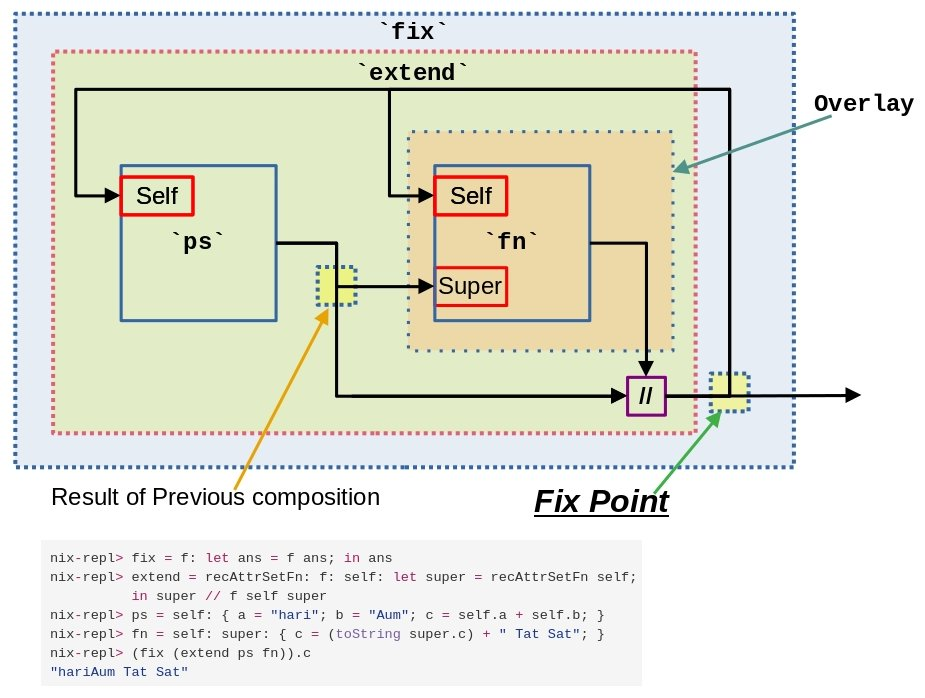

# Nix Language - Fix-Point Evaluation Concept

Lets look at one REPL expression:

```nix
nix-repl> fix = f: let result = f result; in result
```

Here is what we observe:

- `fix` is function that accepts one parameter `f` that itself is a **function**.
- In the first step if the function `fix` is accessed it takes the result
    in just produced and call itself again.
    Its like `f(f(f(...)))` and *Infinite call !!!*. And you are right.
- Remember that Nix performs **Lazy** evaluation. And It does not evaluate
    whats not needed for output.
- The end result of `fix` is a result of the repeated evaluation of `f` with
    its result.
- Another thing to note is that the result of `f` should always be
    a **Attribute Set**.

Now lets look at this evaluation in `rec` which is a **Recursive Attribute Set**
or *New scoped Attribute Set*.

```nix
nix-repl> let a = { x = "abc"; x2 = "123"; }; in a // { x = "def"; }
{ x = "def"; x2 = "123"; }
nix-repl> let a = rec { x = "abc"; x2 = x + "123"; }; in a // { x = "def"; }
{ x = "def"; x2 = "abc123"; }
```

Here is what we observe:

- In the second example of `rec` we see that `x` got modified but `x2` did not.
- This is because `x2 = x + "123";` was evaluated before `// { x = "def"; }`

This is also know as **Static Binding**. Even though Nix has *Lazy* evaluation
it still takes care of the order. And hence the evaluation.

Now in many cases we would like to alter this and have **Dynamic Binding**.
One might be very familiar with this in **closures** or
**Dependency Injection** patterns in other languages.
One might assume that Nix function which are lambda will be
closures but that is not true.

### More depth into Fix-point

Lets look at an expression where we need to `fix` it:
(we would repeat the definition of `fix` just for convenience)

```nix
nix-repl> fix = f: let result = f result; in result
nix-repl> fn = val: { a = 5; b = 3; c = val.a + val.b; }
nix-repl> fix fn
{ a = 5; b = 3; c = 8; }
```

Yes its AMAZING !!!

Let's *dry run* the whole thing broken in steps of Nix (`I = Nix`):

1. `fix =...` - Its a blob of data I will index as `fix` function and keep aside
2. `fn =....` - Its a blob of data I will index as `fn` function and keep it aside
3. `fix fn` - Oh I need to know about what do in `fix`
4. `let result = f result ..` - Oh I need to evaluate whatever `f` is with `result`.
5. What is `result` Oh its basically result of running `f` which is currently
    `fn`. So, I need to evaluate `fn(fn(fn(fn(fn...))))`
6. Let me try to run `fn` with parameter `fn(fn(fn(fn...)))` first to get
    the `result`. Note I am executing the outer most one for
    this infinite list of functions.
7. I have values of `a = 5` and `b = 3`, but `c` needs evaluating from
    the Parameters that were passed `fn(fn(fn(fn...)))`. Oh I need to evaluate
    the `fn` and pass it `fn(fn(fn...)))`  to get values for `c`.
8. I have values of `a` and `b` and for `c` I need to evaluate again.
    But I already know `a` and `b` from the previous evaluation and it
    does not change. So `a`, `b` and `c` should remain same any times
    `fn` called.
9. For all calls since `a`, `b` and `c` are already evaluated I am lazy
    and wont evaluate remaining `fn(fn(fn...)))`. I now return the result
    as `{ a = 5; b = 3; c = 8; }` from the second evaluation.
10. I got the result back `let result = { a = 5; b = 3; c = 8; }; in result`
    in the first evaluation. I am returning the same.

This is the concept of **FIX-POINT** in Nix.
It helps to create dynamic binding even though the evaluation is static.

## Overriding a Attribute Set with FIX-POINT

Lets look at how we can also override with **FIX-POINT magic**:

(We are redoing the earlier example of `fn` for convenience sake)

```nix
nix-repl> fn = val: { a = 5; b = 3; c = val.a + val.b; }
nix-repl> overrides = { a = 1; b = 2; }
nix-repl> let newFn = fn ( newFn // overrides); in newFn
{ a = 5; b = 3; c = 3; }
```

Lets again do a *dry run* on the steps Nix would take (`I = Nix`):

1. `fn = ...` - Its a blob of data I will index it as `fn` function and
    keep it aside.
2. `overrides = ...` - Its a blob of data I will index it as `overrides`
    set and keep it aside
3. `let newFn = fn...` - Oh so I need to produce `newFn` for that I need to
    Run `fn ( fn(fn(fn(....))) // overrides )`. I will run first `fn` with
    parameters `( fn(fn(fn(....))) // overrides )`
4. I have `a = 5`, `b = 3` , but I need to evaluate `c` from the Parameters
    `( fn(fn(fn(....))) // overrides )`. I need to call the `fn` this time
    with `overrides` applied.
5. I have `a = 1` and `b = 2`, Hence `c = 3` for previous stage. For previous
    stage I have all values. I am lazy and I would not evaluate `c` for this
    second stage. I will return this result of `c` to previous stage.
6. So we have `let newFn = { a = 5; b = 3; c = 3; }; in newFn` in the first
    evaluation. I am returning the same.

So the Evaluation of the `fn` happens 2 times. But in the second evaluation
it returns the override values used for evaluating the first stage.
This way the result `c` gets overridden.

If we want to further the override and apply it to even the returned set then:

```nix
nix-repl> let newFn = fn ( newFn // overrides); in newFn // overrides
{ a = 1; b = 2; c = 3; }
```
In this case after *step 6* the overrides would be again applied on the result.
And hence the final values are completely modified.

## Fix-Point Definition

Fix-point is the stage in the evaluation of a *recursive function*, when
the *function* and *its evaluated result* - **are one and the same**.

## Recursive Package Set - Overlays

Reference video <https://www.youtube.com/watch?v=TDnZsBxqeBM&t=1764s>

Let's looks at this Nix code:

```nix
nix-repl> fix = f: let ans = f ans; in ans
nix-repl> extend = recAttrSetFn: f: self: let super = recAttrSetFn self;
          in super // f self super
nix-repl> ps = self: { a = "hari"; b = "Aum"; c = self.a + self.b; }
nix-repl> fn = self: super: { c = (toString super.c) + " Tat Sat"; }
nix-repl> ps { a = "Jai "; b = "Sri Ram"; }
{ a = "hari"; b = "Aum"; c = "Jai Sri Ram"; }
nix-repl> (fix ps).c
"hariAum"
nix-repl> (fix (extend ps fn)).c
"hariAum Tat Sat"
nix-repl> (fix (extend (extend ps fn) fn)).c
"hariAum Tat Sat Tat Sat"
```

```nix
nix-repl> fix = f: let ans = f ans; in ans
nix-repl> extend = recAttrSetFn: f: self: let super = recAttrSetFn self;
          in super // f self super
nix-repl> ps = self: { a = "hari"; b = "Aum"; c = self.a + self.b; }
nix-repl> fn = self: super: { c = (toString super.c) + " Tat Sat"; }
nix-repl> (fix (extend ps fn)).c
"hariAum Tat Sat"
```

Here is what we observe:

- `ps` is a **recursive attribute set function**. Ideally it should have used
    `rec`. But to keep it flexible we produce recursion into `self`.
    If it were to be done with `rec` then it would become fixed and can't
    be manipulated easily due to the pure nature of the single expression
    evaluation. In normal sense the `self` argument is an Attribute set
    containing the items `a` and `b`. But with recursion its completely
    different. `fix` point and lazy evaluation helps us arrive at the
    Fixed output in time when then evaluation no-longer refers to `self`.
    Or it does not need any further evaluation. Hence, we call `ps` as
    a **Recursive Attribute Set Function**.

- In the first evaluation of `(fix ps).c` we quickly arrive at the fix point
    within 2 evaluation runs of Nix expression.
- The `extend` function is special. It allows us to apply transformations on
    the evaluation of the input, which again should be a recursive attribute
    set function.
- In `extends` takes in the transformation function `f`.
- The first parameter `recAttrSetFn` is actually the
    **recursive attribute set function** on which the transformation
    is applied using `f`.
- The parameter `self` is used to create the second level of
    **Recursive Attribute Set Function** which would be returned to the
    `fix` function to calculate the **Fix-point**.

#### Digging deeper into 1-Level extension or Overlay

Let's now carefully look at whats happening here at:
`(fix (extend ps fn)).c`

or to simplify it:

```nix
let result = fix (extend ps fn); in result.c
```

Here is what we observe in step by step evaluation like the earlier *dry-run*.
We would look at what Nix would do here (`I = Nix`):

- I am aware of the following that were previously indexed

    - `fix` function
    - `extend` function
    - `ps` function
    - `fn` function

- I need to compute `result`. For that I need to call `fix`
    with parameter `(extend ps fn)`
- But before that I need to evaluate `extend ps fn`. So, I will call
    `extend` with parameters `ps` and `fn`.
- Now in `extend` we have:

    - Parameter `recAttrSetFn` = `ps`
    - Parameter `f` = `fn`
    - I don't have `self` This means I need to return a function.
    - Let me evaluate by substituting the values.
    - `self: let super = ps self; in super // fn self super`
    - I will return this to the `result` evaluation stage.

- Now I have the following expression to work with:

    ```nix
    let
        returned =  self: let super = ps self; in super // fn self super;
        result = fix returned;
    in
        result.c
    ```

    This means the `returned` or the function from the previous stage needs to
    be evaluated. I need to still find `result`. Hence I will call `fix` with
    `returned` function as the parameter.

- Now in `fix`, I need to compute `ans`. But to calculate it I would need
    to evaluate `f` passing the parameter `ans`.
- What is `ans` Oh its basically result of running `f` which is currently
    `returned`.
    So, I need to evaluate `f(f(f(f(f(...))))` or
    `returned(returned(returned(returned(...))))`.
- I will run the fist `returned` with arguments
    `(returned(returned(returned(...))))`.
- On in `returned` **first evaluation** I need to compute `super`.

    - For that I need to intern evaluate `ps self`. In this case
        I would be passing `(returned(returned(returned(...))))` as
        argument to `ps`.

- Now in `ps` I already have `a = "hari";` and `b = "Aum"`.

    - But, I need to compute `c` from Input `self` which is currently
        `(returned(returned(returned(...))))`.
    - Oh, I need to evaluate `returned` and pass it `(returned(returned(...)))`.
    - This would be the **second evaluation** of `returned`.

- In `returned` second time need to calculate `super` again.

    - Hence I need to call `ps` with argument `(returned(returned(...)))`.

- Now in `ps` the second time, I already have `a` and `b` that does not change.

    - But now I can calculate the value of `c` for the previous stage.
    - So, `c = "hariAum"`.
    - I have all values for first stage of the call and I am lazy.
    - Let me return the values `{ a = "hari"; b = "Aum"; c = "hariAum"; }`

- Back to the **First Stage** of evaluation of `returned`.

    - I have `super = { a = "hari"; b = "Aum"; c = "hariAum"; }`
    - Lets see next I need to find `super // fn self super` or `super // fn returned super`.
    - So I need to first evaluate `fn` with arguments `returned` and `super`

- Now in `fn` I need to calculate `c` using `super.c`

    - So I have `{ c = "hariAum Tat Sat"; }`
    - Let me return this to the previous stage.

- Back in **First Stage** of evaluation of `returned` I have got the value of
    `fn returned super`. Let me do the union operations.

    - So I have `{ a = "hari"; b = "Aum"; c = "hariAum"; } // { c = "hariAum Tat Sat"; }`
    - Finally I have `{ a = "hari"; b = "Aum"; c = "hariAum Tat Sat"; }`
    - Now I don't need to evaluate any further so I return this to `fix` stage.

- Back to `fix`, I now have `ans = { a = "hari"; b = "Aum"; c = "hariAum Tat Sat"; }`

    - Let me return this value to the above stage.

- Back to the `result` expression, I have

    `result = { a = "hari"; b = "Aum"; c = "hariAum Tat Sat"; }`

    - I need to return the `c` in the `result`
    - So I will return `"hariAum Tat Sat"`

- Evaluation complete - Print `"hariAum Tat Sat"`

From the long story above we find the following:

1. Original function that we were evaluating `ps` should have produced the result
   `{ a = "hari"; b = "Aum"; c = "hariAum"; }`
2. Our modification function `fn` works on the results of output of `ps`
3. The `fix` helps to recursively evaluate the result of `ps`
4. The `extend` function helps to apply the `fn` to `ps` but returns a
    function intern which then gets evaluated using `fix`.

The `fn` function is called an **Overlay**.
And the `ps` can actually be a **NixOS Module**.

This is how **Overlays** work. The diagram explains further.



For more usage information on **[Overlays](./overlay.md)**

## References

- Actual Article :

    <http://r6.ca/blog/20140422T142911Z.html>

- From Nix Pills :

    <https://nixos.org/guides/nix-pills/nixpkgs-overriding-packages.html#idm140737319686880>


----
<!-- Footer Begins Here -->
## Links

- [Back to Nix Language Hub](./README.md)
- [Back to Computer Programming Languages Hub](../README.md)
- [Back to Root Document](../../README.md)
