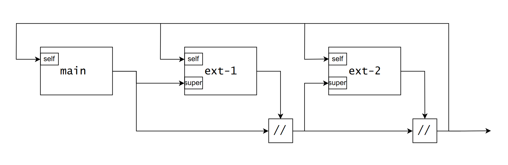
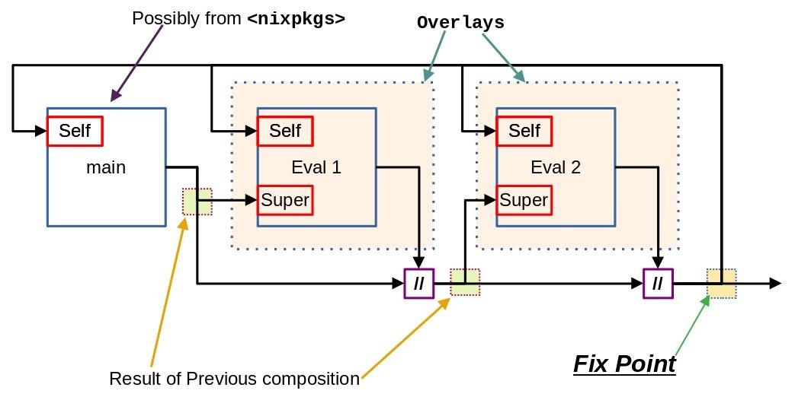

# Nix Language `overlay` on Packages

Manipulate the package without modifying it.

`overlay.nix`:

```nix
import <nixpkgs> {
    overlays = [
        (self: super: {
            hello-example = self.hello;
        })
    ]
}
```

```sh
$ nix-build ./overlay.nix -A hello-example
/nix/store/cccsr.....lid-hello-2.10
```

Better Explanation in video <https://www.youtube.com/watch?v=W85mF1zWA2o>

Important understanding:
- Overlays are ordered, as opposed to NixOS modules.
- Don't Use `rec` instead refer using `super`

## `self:` use almost always

`super:` is the "previous" version of the package. Only use when overriding the package being defined.

`self:` is the "final" version of the package.

Good:
```nix
   (self: super: {
       hello-example = self.hello;
   })
```

Bad or if the Good one fails:
```nix
   (self: super: {
       hello-example = super.hello;
   })
```

## Overlay Arguments

There are 2 main Arguments #video refer to <https://www.youtube.com/watch?v=W85mF1zWA2o&t=514s>

- **self** - [Fix-point](./fix-point.md) result
- **super** - Result of the composition before this file.

Reference from https://nixos.wiki/wiki/Overlays





### The above picture explains the following : **[More about Fix-Point and Overlays](./fix-point.md#recursive-package-set---overlays)**

[Recursive Package Set - Overlays with Fix-Point](./fix-point.md#recursive-package-set---overlays)

#### Self

- Used for derivation Result nothing else.

#### Super

- Used for functions. (callPackage, lib ...)
- Used to Override recipes

#### Overlay conventions

- `{ /* reproducible packages */ }`
- `{ lib = /* utility functions */; }`
- `{ latest = /* imports from derivations */; }`
- `{ devEnv = /* nix-shell e */; }`
- `nixpkgs-<org>` = Package Naming
  - `nixpkgs-mozilla`
  - `nixpkgs-dapphub`
- `<program>-overlay.nix` = Overlay file
  - `firefox-overlay.nix`
  - `rust-overlay.nix`
- `nixpkgs-<org>/default.nix` is an overlay.

#### Updated or Easier representation for Overlays

```nix
final: prev: {
    firefox = prev.firefox.override { ... };
    myBrowser = final.firefox;
}
```

Here `self:` is replaced by `final:` and `super:` is replaced by `prev`.
This presents a more understandable context for the way we are adding overlay in between.

Reference Link:
- <https://nixos.wiki/wiki/Overlays#Data_flow_of_overlays_.28alternative_explanation.29>
- <https://discourse.nixos.org/t/how-to-exclude-packages/13039/4>

#### Using Overlays Manually

Typically used for `sh.nix` kind of projects:
```nix
let
   overlay1 = ... ;
   overlay2 = ... ;
in
  import <nixpkgs> { overlays = [ overlay1 overlay2 ]; }
```

It helps to modify the things into a `nix-shell` instead of the whole system.

#### Using Overlays in NixOS

This can be added in the `/etc/nixos/configuration.nix` to use the `nixpkgs.overlays` *option*.
Remember that `configuration.nix` is a **NixOS module**.

```nix
{ config, pkgs, lib, ... }:
{
   # [...]
   nixpkgs.overlays = [ (self: super: /* overlay goes here */) ];
}
```

#### Overlays with `home-manager`

This would be in the `~/.config/nixpkgs/home.conf`. We use the `nixpkgs.overlays` *option* again.

```nix
{ config, pkgs, lib, ... }:
{
   # [...]
   nixpkgs.overlays = [ (self: super: /* overlay goes here */) ];
}
```

### Location of Overlays
#### On the user level
A list of overlays placed into `~/.config/nixpkgs/overlays.nix` will be
automatically loaded by all nix tools run as your user
(hence not `nixos-rebuild`).

Alternatively, you can put each overlay in its own `.nix` file
under your `~/.config/nixpkgs/overlays` directory.

#### On the System Level

If you want your overlays to be accessible by nix tools and also in the
system-wide configuration, add `nixpkgs-overlays` to your `NIX_PATH`:

```sh
NIX_PATH="$NIX_PATH:nixpkgs-overlays=/etc/nixos/overlays"
```

Currently nixos-rebuild only works with a <nixpkgs-overlays> path that is a directory.

## Examples of overlays

### Shift the Nix Directory using Overlay

```nix
self: super:
{
  nix = super.nix.override {
    storeDir = "${<nix-dir>}/store";
    stateDir = "${<nix-dir>}/var";
  };
}
```

This is specially useful for #docker based evaluations.

#### References for shifting Nix directory

- How to relocate `/nix` directory

    <https://yann.hodique.info/blog/nix-in-custom-location/>

- Slide from the Talk

    <https://nbp.github.io/slides/NixCon/2017.NixpkgsOverlays/?full#p2-examples-nix>


### Overlays to replace a dependency

```nix
import <nixpkgs> {
    overlays = [
        (self: super: {
            btar = super.btar.override {
                librsync = self.librsync_2;
            };
        })
    ];
}
```

We are replacing the `librsync` with override on the previous step version using `super:`.
This is so that we apply the changes in a sequence and not every time.


----
<!-- Footer Begins Here -->
## Links

- [Back to Nix Language Hub](./README.md)
- [Back to Computer Programming Languages Hub](../README.md)
- [Back to Root Document](../../README.md)
