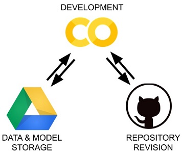

# Jupyter - Python Notebook Interface

Home Page : <https://jupyter.org/>

Only playground: <https://jupyter.org/try>

There are 3 ways to run the Jupyter:

1. JupyterLab - More modern notebook interface.

    Main workhorse used for AI and Data analysis.

    <https://jupyter.org/try-jupyter/lab?path=notebooks%2FIntro.ipynb>

2. JupyterNotebook - Classic notebook

    Its lite and simple interface.

    <https://jupyter.org/try-jupyter/retro/notebooks/?path=notebooks/Intro.ipynb>

3. JupyterLite (Latest) - More focused on Web Output

    <https://jupyterlite.github.io/demo>

## Quick-start on Jupyter

Install the Dependencies:

```sh
python -m venv venv
source ./venv/Script/activate
# For JupyterLab
pip install jupyterlab
# For JupyterNotebook
pip install notebook
```

Finally activate the Interface:

```sh
# For JupyterLab
jupyter lab
# For JupyterNotebook
jupyter notebook
```

!!! note "Location of Notebook files `.ipynb` extension"
    By default the current directory with *virtual environment* denoted `venv`
    would be used to store the notebook files with `.ipynb` extension.

## [How to use a Jupyter Notebook: A Beginner's Tutorial](https://www.dataquest.io/blog/jupyter-notebook-tutorial/)

Very good guideline on how to use Jupyter Notebooks:

<https://www.dataquest.io/blog/jupyter-notebook-tutorial/>

**[PDF version](./jupyter/dataquest-io-How-to-Use-Jupyter-Notebook-A-Beginners-Tutorial.pdf)** of the Article.

## [How to use Jupyter Notebooks with Visual Studio Code / Github Codespaces](https://visualstudio.microsoft.com/vs/features/notebooks-at-microsoft/)

Here is how to use the Jupyter Notebooks with the whole Microsoft ecosystem of
Github , Visual Studio Code, Azure Machine Learning and even **directly with just
Github alone**.

<https://visualstudio.microsoft.com/vs/features/notebooks-at-microsoft/>

## [`binder` service](https://mybinder.org/)

Home Page: <https://mybinder.org/>

This helps to turn a git repo into a collection of interactive Jupyter notebooks.

## [JupyterLite](https://jupyterlite.readthedocs.io/en/latest/) - Fully browser enabled Jupyter Notebooks

> JupyterLite is a JupyterLab distribution that runs entirely in the browser built from the ground-up using JupyterLab components and extensions.
>

Home Page: <https://github.com/jupyterlite/jupyterlite/>

Documentation: <https://jupyterlite.readthedocs.io/en/latest/>

### Jupyter websites with JupyterLite

Video Describing the method:

**Jeremy Tuloup Creating interactive Jupyter websites with JupyterLite | JupyterCon 2023**

<https://www.youtube.com/watch?v=8LfnsmtXHNU>

The `jupyter-lite` CLI is a Static Site Generator:

```sh
# Install the CLI
pip install jupyterlite-core

# Build the website
jupyter lite build
```

### [Deploy JupyterLite website on GitHub Pages](https://jupyterlite.readthedocs.io/en/latest/quickstart/deploy.html)

Steps to get a website working directly from Github:

<https://jupyterlite.readthedocs.io/en/latest/quickstart/deploy.html>

**Template Repository** for *Github*:

<https://github.com/jupyterlite/xeus-python-demo>

This would allow to directly create repository that can host your Jupyter notebooks.

## [How to integrate Jupyter Notebooks into Webpages or Web-Frameworks](https://thedatafrog.com/en/articles/jupyter-notebooks-web-pages/)

Learn how to integrate jupyter notebooks in a web page, and how to highlight code and show nice equations.

<https://thedatafrog.com/en/articles/jupyter-notebooks-web-pages/>

**[PDF Version](./jupyter/thedatafrog-com-Jupyter-Notebooks-in-Web-Pages.pdf)** of the above article.

## [`Jupyter{book}`](https://jupyterbook.org) - Documentation and Books from Jupyter Notebooks

Home Page: <https://jupyterbook.org/>

> Build beautiful, publication-quality books and documents from computational content.
>

## [`quarto`](https://quarto.org/) - Scientific and technical publishing system

Home Page: <https://quarto.org/>

Use Jupyter notebooks to actually create dynamic dashboards and websites.

## Google Colaboratory : Ipython environment / Jupyter Notebook

Need to Login to Google Account to work with this.

<https://colab.research.google.com/>

Videos:

- GoogleColab Introduction

    <https://www.youtube.com/watch?v=g0xu9DA4gDw>

- Using google Colab for machine learning and Deep learning

    <https://www.youtube.com/watch?v=6Xt6L1I5jSc>

- How to Install Third party package on Google Colab

    <https://www.youtube.com/watch?v=QP4F0mfiml8>

- AI VS ML VS DL VS Data Science

    <https://www.youtube.com/watch?v=k2P_pHQDlp0>

### [Python workflow for interactive projects (GoogleColab + Github + Drive)](https://medium.com/analytics-vidhya/python-workflow-for-interactive-projects-colab-github-drive-kaggle-use-case-92252ce575e2)

Leverage free cloud resources for your Jupyter Notebooks -
Best of all worlds with GoogleColab and Kaggle usecases.

<https://medium.com/analytics-vidhya/python-workflow-for-interactive-projects-colab-github-drive-kaggle-use-case-92252ce575e2>

**[PDF Version](./jupyter/Jyupter-workflow_Colab_Github_Drive_by-Aleix-Lopez-Pascual.pdf)** of the above article.

!!! note ""
    <figure markdown>
        [](./jupyter/0_4MrmkvCDllJHE1JX.png){ width="300" }
        <figcaption>Source: analytics-vidhya</figcaption>
    </figure>

### [Methods for using Git with Google Colab](https://stackoverflow.com/questions/48350226/methods-for-using-git-with-google-colab)

Here is a method of accessing your Github repositories from Colab:

<https://stackoverflow.com/questions/48350226/methods-for-using-git-with-google-colab>

### `colab-repoclone` Push Pull from Google Colab Environment

Source: <https://github.com/apolitical/colab-repoclone>

### [7 best Colab alternatives in 2023](https://deepnote.com/blog/best-colab-alternatives)

Article <https://deepnote.com/blog/best-colab-alternatives>

Here is the List:

1. Deepnote <https://deepnote.com/>
2. JupyterLab <https://jupyterlab.readthedocs.io/en/latest/>
3. Kaggle Kernels <https://www.kaggle.com/>
4. Microsoft Azure Notebooks <https://visualstudio.microsoft.com/vs/features/notebooks-at-microsoft/>
5. Databricks Community Edition <https://www.databricks.com/>
6. Amazon SageMaker Studio <https://aws.amazon.com/sagemaker/studio/>
7. Gradient by Paperspace <https://www.paperspace.com/>

----
<!-- Footer Begins Here -->
## Links

- [Back to Python Hub](./README.md)
- [Back to Computer Programming Languages Hub](../README.md)
- [Back to Root Document](../../README.md)
