# Sharing Files with KVM Guests

## In Guest VM

### Dependencies for Windows VM

- `spice-webdavd` = **Spice WebDAV daemon** Needs to be installed
- Download: <https://www.spice-space.org/download/windows/spice-webdavd/>
- Make sure to **Save Link As** the Latest file **`spice-webdavd-x64-latest.msi`**
    - Typically <https://www.spice-space.org/download/windows/spice-webdavd/spice-webdavd-x64-latest.msi>

This is apart from the **[Windows SPICE Guest Driver](./windows.md)**.

Make sure to *restart* the **Windows VM** after installing these.

### Dependencies for Linux VM

#### Ubuntu / Debian Specific

- `spice-webdavd` - Spice Driver for the WebDAV share

#### ArchLinux Specific

- There is no package as that of `spice-webdavd`
- Need to check on this TODO

#### Common Dependencies

- `davfs2` - Helps to Mount the WebDAV share like a local File System

Apart from the normal mandatory dependencies:
- `spice-vdagent` - Spice Agent for Guest VM
- `xserver-xorg-video-qxl` - Graphics Driver needed

Make sure that all these dependencies are installed and the Machine is restarted.

## In Host

### Configuring the VM in `virt-manager`

We would need to add a **Spice Channel** for `org.spice-space.webdav.0`.

This is done in the following steps explained with pictures:

#### 1. Click on the *Add Hardware* Button in the VM configuration

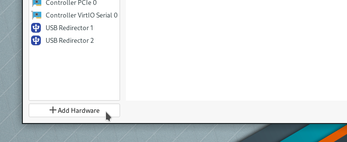

#### 2. Select *Channel* in the **Add New Virtual Hardware** Window and set the Name to `org.spice-space.webdav.0` selecting it from **drop down**.

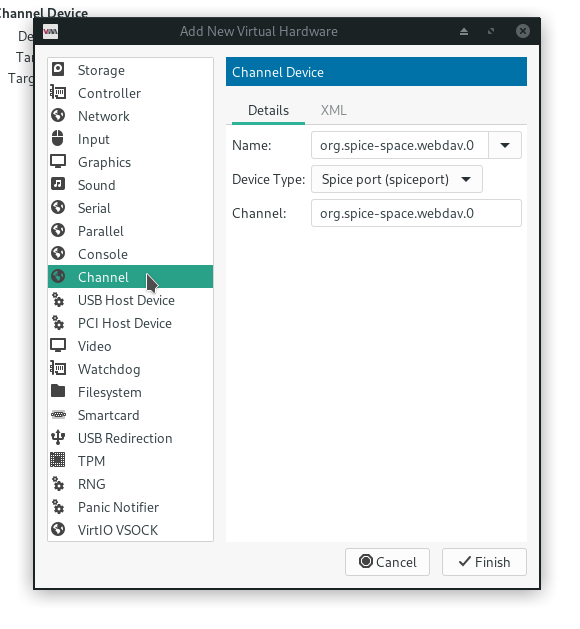

#### 3. Make sure that the `spice-webdavd` is correctly installed.

##### Download for Windows:

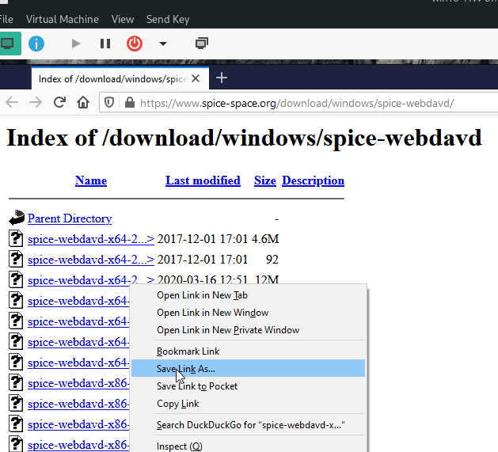

##### Save the Correct file in Windows:

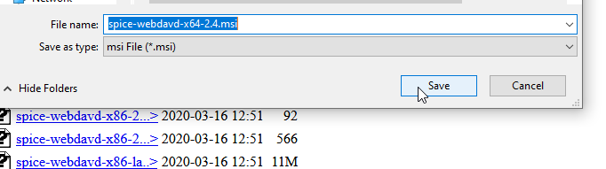

##### Make sure the Spice WebDAV service is active in Windows Task Manager

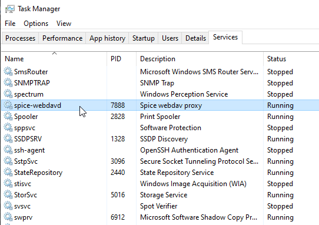

#### 4. Reboot the Guest VM to be sure

#### 5. Open the `virt-viewer` (a.k.a *Remote Viewer*)

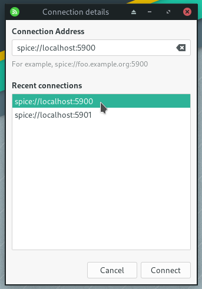

##### Select the Correct `spice` server address. And connect to the VM.

#### 6. Setup the Folder Share

##### Select *Preferences* from the **File** menu in the *Remote Viewer*

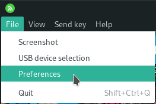

##### Observe the *Share Folder* option is now Active.

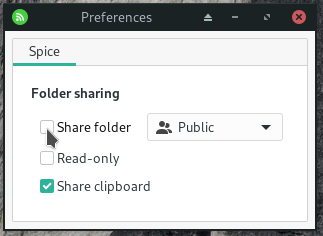

##### Select the correct directory for sharing. Or use the *Other* option to find one.

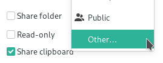

##### Finally Activate the folder sharing

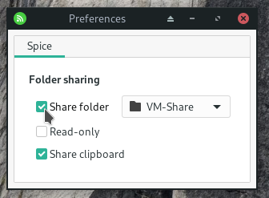

#### 7. Success - WebDAV drive should show up in the respective Guest VM

##### In #Windows Explorer

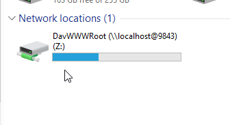

Make sure the refresh the drive using **F5** before any file action takes place.

##### In Ubuntu Nautilus - As part of *Other Locations* as *Spice client folder*

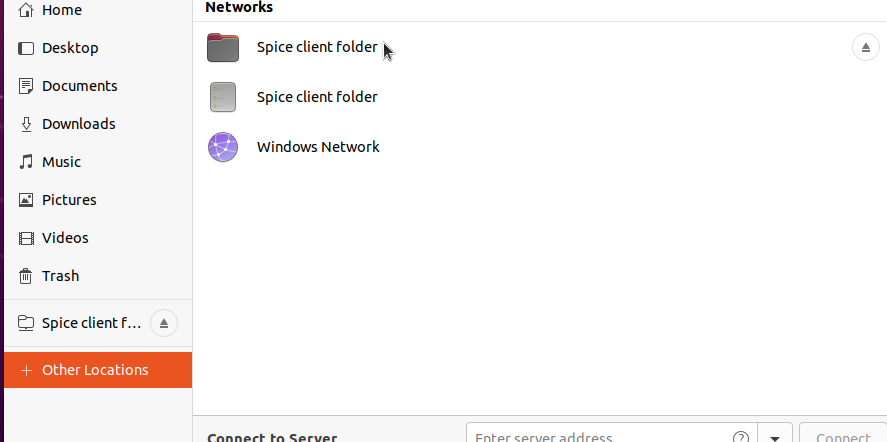

Some times the WebDAV does not mount. Just restart the PC or Logout/login to fix this.

----
<!-- Footer Begins Here -->
## Links

- [Back to KVM Hub](./README.md)
- [Back to Linux Hub](../README.md)
- [Back to Root Document](../../README.md)
